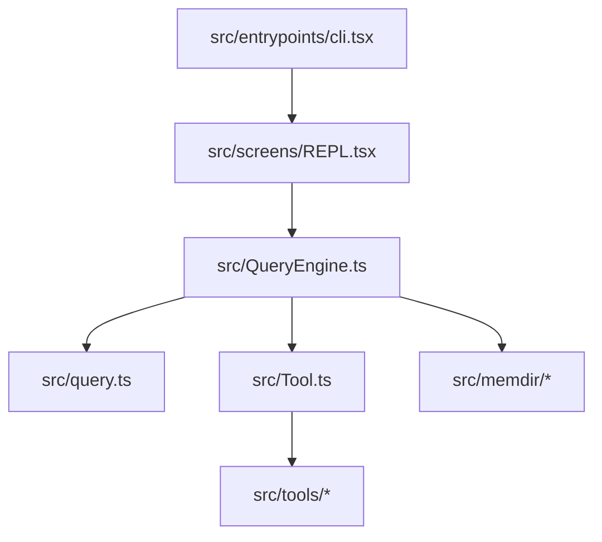

# Claude Code 源码库深度分析报告

本报告对克隆至 `D:\ClaudeCodeLeak` 的 **Claude Code** 泄漏源码库（基于 2026 年 3 月 31 日 npm 包 `cli.js.map` 还原 of TypeScript 源码）进行了深度的架构与模块分析。

---

## 一、 项目定位与核心技术栈

`Claude Code` 是 Anthropic 推出的下一代 Agentic CLI 编程助手，其核心设计理念是通过交互式命令行（REPL）与本地开发环境深度结合，支持多 Agent 协同规划、自动工具执行与双向反馈机制。

*   **项目内部代号**：`Tengu`（天狗）。在代码中随处可见 `tengu_*` 前缀的 GrowthBook 开关、事件埋点及配置字段（如 `tengu_auto_dream_fired`、`tengu_kairos_cron`）。
*   **主要技术栈**：
    *   **Runtime / Compiler**：支持 Node.js 与 Bun。编译链路集成了 **React Compiler (React Forget)**，用以优化终端组件渲染性能。
    *   **Terminal UI (TUI)**：基于 React 和 **Ink** 构建，实现富文本终端界面、进度条、动态输入状态及动画。
    *   **Feature Gating**：采用 **GrowthBook** 作为特性开关和灰度控制系统，通过编译期静态替换实现死代码消除（DCE）。

---

## 二、 核心架构设计

`Claude Code` 的架构遵循高模块化、逻辑自闭环的设计原则，主要包含以下层次：

### 1. 交互入口与 REPL 循环
*   **入口点 (`src/entrypoints/cli.tsx`)**：解析命令行参数，初始化 environment 并加载用户配置。
*   **主屏幕渲染 (`src/screens/REPL.tsx`)**：基于 Ink 的 React 组件，包含命令输入区域（`PromptInput`）、交互对话流渲染、异步任务看板及底层 Companion 动画组件。

### 2. 规划决策与主执行引擎 (`src/QueryEngine.ts`)
`QueryEngine` 是整个 Agent 系统的控制大脑：
*   **Loop 迭代**：在每一轮迭代中装配系统提示词（`fetchSystemPromptParts`）、读取项目内存（`loadMemoryPrompt`）、组合多源工具（本地工具 + MCP 服务端工具）。
*   **上下文治理 (`HISTORY_SNIP`)**：由于 CLI 运行周期长、上下文极易膨胀，代码中引入了 `snipCompact`（历史折叠）与 `snipProjection` 机制，能够在超出 Token 阈值时智能剪裁历史会话。
*   **Cost / Token 监控 (`src/cost-tracker.ts`)**：实时计算 API 响应延迟、Token 使用量与美元花费，防止 Agent 陷入死循环造成大额账单。

### 3. 工具与权限防线 (`src/Tool.ts`)
支持高度可扩展的工具体系（Bash、File Read/Write/Edit、MCP 协议等），并匹配了严密的权限控制上下文（`ToolPermissionContext`）：
*   **规则分级**：支持 `alwaysAllowRules`（始终允许）、`alwaysDenyRules`（始终拒绝）与 `alwaysAskRules`（询问用户）。
*   **自动拦截**：当检测到高风险的 Bash 执行或写操作时，能够阻断调用并向终端抛出二次确认弹窗。对于后台无交互 Worker，支持 `shouldAvoidPermissionPrompts` 降级策略（直接拒绝或根据预设规则兜底）。

---

## 三、 未公开/特色功能深度剖析

源码中包含大量受到 GrowthBook 特性标志（Feature Flags）保护的未公开功能，这些功能揭示了 Anthropic 在主动式多智能体协同、人机共生及开发者安全层面的探索：

### 1. Buddy System (终端宠物伴侣) — 门控：`BUDDY`
一个集成在终端 REPL 侧边栏（或悬浮气泡）中的虚拟伴侣宠物系统（相关代码位于 `src/buddy/`）：
*   **确定性孵化**：通过 `mulberry32` PRNG 算法，基于用户的 `userId` 确定性地生成独一无二的伴侣。
*   **稀有度与属性**：设计了五种稀有度（`common` 到 `legendary`）和多种物种（如 `duck`、`goose`、`capybara`、`chonk`、`robot` 等），以及 `DEBUGGING`、`PATIENCE`、`WISDOM`、`SNARK`、`CHAOS` 等属性。
*   **动态交互**：伴侣拥有 ASCII 骨骼动画（`sprites.ts`）与气泡台词（`SpeechBubble`），会在用户打字、Agent 执行工具、出错或完成任务时做出实时的视觉反馈（如吐心、流汗、打瞌睡）。
*   **代码避弹检测**：为了规避代码静态扫描漏出敏感词，部分物种名称（如 `duck`, `chonk` 等）在源码中通过 `String.fromCharCode` 进行动态运行时拼接。

### 2. Dream Mode (梦境整理/自动记忆整合) — 门控：`autoDream`
实现 Agent 长期记忆沉淀的异步后台任务（相关代码位于 `src/services/autoDream/`）：
*   **静默唤醒**：在凌晨时段（1 AM - 5 AM）或者当 Agent 空闲且经历了数个会话迭代后自动触发。
*   **记忆整理 (`consoldationPrompt.ts`)**：Agent 启动一个独立的后台 Subagent 对当前项目下累积的临时上下文进行“做梦”反射（Dreaming），从中提炼出非 derivable（无法直接从代码或 git 历史推导出来）的元知识。
*   **分类持久化 (`src/memdir/memoryTypes.ts`)**：将整理出的记忆写入 `.claudemd` 目录下的四种 Taxonomy 文件：
    *   `user`：用户特质与协作偏好（如“喜欢简短的回答，不要废话”）。
    *   `feedback`：用户对以往行为方案的纠偏和认可。
    *   `project`：当前的业务目标、截止时间、临时 Incident。
    *   `reference`：外部系统的地址链接（如 Grafana 监控面版、Linear 任务卡）。

### 3. Kairos (主动持久化助手) — 门控：`KAIROS`
打破“一问一答”限制的持续运行模式：
*   支持在终端会话关闭后依然在后台持久化运行，通过本地 Cron 调度工具（`ScheduleCronTool`）和消息队列管理器（`messageQueueManager.ts`）实现定时轮询。
*   支持绑定 GitHub Webhooks (`KAIROS_GITHUB_WEBHOOKS`) 监听 PR 状态，并能通过推送通知通道（`KAIROS_PUSH_NOTIFICATION`）或第三方即时通讯平台（Slack/Discord, 即 `KAIROS_CHANNELS`）与用户保持异地交互。

### 4. Undercover Mode (卧底模式) — 门控：`USER_TYPE === 'ant'`
针对 Anthropic 内部工程师在公共/开源仓库提交代码时防止泄密的安全隔离层（相关代码位于 `src/utils/undercover.ts`）：
*   **自动检测**：如果仓库的远程 Origin 地址不属于内部白名单（`INTERNAL_MODEL_REPOS`），则自动隐蔽运行。
*   **严格防泄漏指令**：向 commit/PR 提示词注入强指令，禁止输出任何可能暴露公司内部代号的文本。例如：
    *   禁止漏出未发布模型版本号（如 `sonnet-4-8`、`opus-4-7`）。
    *   禁止漏出内部开发代号（如 **Capybara** 模型版本、**Tengu** 项目名称）。
    *   禁止写入带有 AI 生成痕迹的 Co-Authored 或 "Generated by Claude Code" 署名。

### 5. Voice Mode (音频交互) — 门控：`VOICE_MODE`
*   支持终端级语音输入交互。底层需要依赖系统中安装 `SoX` (Sound eXchange) 等音频录制工具。
*   通过 `voice_stream` 协议，只有使用 Anthropic OAuth 账号登录的用户才能调用 `claude.ai` 的语音转文本（STT）流式接口。

---

## 四、 优秀工程实践亮点

1.  **死代码消除（DCE）与构建隔离**：所有的 `ant` 内部特权代码均由 `process.env.USER_TYPE === 'ant'` 或 `feature('NAME')` 保护。这保证了在生产构建中，任何关于内部代号和未发布功能的字符串、组件均不会打包入公开发布的 CLI 工具中。
2.  **React Forget (React 编译器) 的终端尝试**：使用 React 处理富文本和高性能帧动画通常会引发终端的闪烁。Claude Code 在其 REPL 状态驱动和 UI 重绘中，大规模应用了最新的 React 编译器进行微调，从而在保持声明式组件开发体验的同时，实现了媲美原生 C 语言终端应用的重绘性能。
3.  **记忆的分治法**：记忆系统不记录代码 conventions 或是 git history，将精力集中于无法从静态代码中解析出来的沟通偏好、业务场景上下文与外部映射，设计极为优雅。
