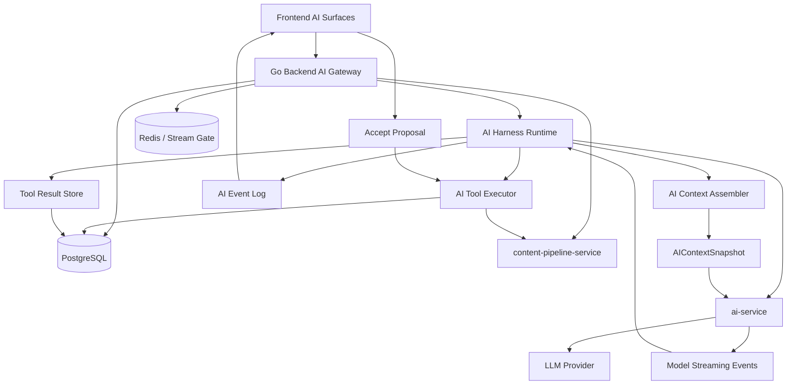

# MPP AI Business Deepening Plan

## 1. Goals And Boundaries

Goal: evolve MPP's AI capability from a reviewable local rewrite assistant into two clear product lines.

1. Black-box growth optimization mode: for creators and operators. One click optimizes an article against platform audiences, brand voice, and publishing goals, improving fit for recommendation, clicks, views, watch/read completion, and interaction signals.
2. Vibe Drafting mode: for professional content teams. A context-aware drafting workspace similar in spirit to Claude Code, Gemini CLI, and Codex, where users drive drafts, platform variants, comments, versions, and pre-publish checks through natural language.

Boundaries:

- Do not promise guaranteed increases in platform push rate or views. Product language should say "improve platform fit" and "improve potential growth performance".
- Do not let AI bypass user confirmation and directly mutate official content. Keep the default safety model: generate a proposal, review the diff, then persist only after confirmation.
- Do not move publishing execution, account authorization, or database transactions into the AI service. The Go backend remains the boundary for permissions, context, tool execution, and persistence.
- Do not rewrite the existing source editor, platform draft compiler, publish queue, or collaboration system. New AI capabilities should reuse those foundations.
- Do not build fully automated campaign learning in the first phase. Real performance data should start with manual import or incremental platform API integration when available.

## 2. Current Business Foundation

### 2.1 Implemented Capabilities

The AI editing foundation is already in place:

- `ai-service` is an independent FastAPI service that owns prompt construction, OpenAI-compatible LLM calls, streaming responses, internal Bearer Token authentication, and usage/cost metrics.
- Existing endpoints include `/content/edit`, `/content/edit/stream`, `/prepublish/edit`, `/prepublish/edit/stream`, and `/calibrate`.
- `backend/internal/services/ai/client.go` provides the backend AI service client. Dashboard routes already proxy normal and streaming AI edit requests.
- Backend AI requests already use stream leases across user, tenant, IP, and global dimensions.
- The frontend `AIEditAssistant` supports instruction input, streaming generation, preview, diff, stop, accept, and reject.
- Both the source editor and platform draft panel already use the AI proposal workflow.

The content and publishing foundation is also fairly complete:

- `Project` is the main content object. It stores title, source content, workspace, collaborative document, template reference, and brand profile reference.
- `ProjectPlatformPublication` stores platform drafts, platform account, config, publish status, draft status, review status, and remote publish result.
- `content-pipeline-service` already compiles WeChat HTML, Zhihu Markdown, X short text, and Douyin text drafts in Rust, with versioned draft/media profiles.
- `BrandProfile` stores brand voice, target audience, banned words, CTA, link strategy, and default tags.
- `ContentTemplate` stores title templates, source templates, default platforms, platform config, and tags.
- `MediaAsset` and `MediaAssetUsage` support project/workspace media ownership, object storage references, and asset usage tracking.
- `ProjectVersion`, `ProjectComment`, `ProjectActivity`, share links, and collaborators already support review, version recovery, and team collaboration.
- `Workspace`, members, invites, activity, shared platform account grants, scheduled publication, publish attempts, and notifications already exist.

### 2.2 Main Gaps

Black-box growth optimization gaps:

- Current AI requests only include `title`, current content, user instruction, platform draft, and temporary conversation. They do not include `project_id`, `workspace_id`, brand profile, template, platform audience, publishing goal, or historical performance context.
- There is no platform audience profile or growth optimization profile, such as Xiaohongshu-style title hooks, Zhihu long-form credibility, WeChat opening retention, Douyin image-text pacing, or X length and interaction CTA guidance.
- There is no optimization task/result model, so the system cannot record what context was used, which candidates were generated, which checks passed, or which version the user adopted.
- Dashboard stats still focus on project count, successful publications, failed publications, and member count. They do not capture content performance metrics such as impressions, recommendations, plays/views, clicks, completion, interactions, favorites, or conversions.
- There is no product loop for "optimize, then automatically sync platform drafts".
- There is no AI result quality score, brand consistency check, platform compliance check, or A/B version comparison.

Vibe Drafting gaps:

- Current AI is a single-shot text rewrite control, not a persistent session. The `conversation` field exists in the contract, but the UI does not productize it as a long-lived drafting session.
- There is no context assembly module. The AI service cannot proactively read projects, drafts, comments, versions, templates, brand profiles, media, publish status, or account constraints.
- There is no tool-call boundary. AI cannot propose structured operations such as changing a title, replacing a body block, updating a platform draft, creating a comment, creating a version, syncing prepublish, or generating a pre-publish checklist.
- There is no patch/operation-level proposal model. Current proposals are mostly full text replacements.
- There is no workspace memory, project summary, long-context compaction, retrieval, or context snapshot.
- There is no professional drafting panel, command history, checkpoint, tool event stream, or multi-artifact preview.

## 3. Product Mode Design

### 3.1 Mode One: Black-box Growth Optimization

Positioning: users should not need to understand prompts, platform rules, context selection, or multi-step reasoning. They choose platforms and goals, then click once to optimize.

Entry points:

- Primary "AI Optimize" button at the top of the project editor.
- "Optimize current platform draft" button inside the platform draft panel.
- Batch entry from the project list can come later and should not be part of the MVP.

User-visible inputs:

- Target platforms: default to the platforms already selected for the project.
- Optimization goal: recommendations, reads/views, CTR, completion rate, engagement, conversion/private messages.
- Optimization intensity: conservative, balanced, aggressive.
- Optional constraints: preserve original voice, keep title, keep structure, avoid clickbait.

User-visible outputs:

- Optimized title and source content proposal.
- Platform draft proposals.
- Short result summary, such as "strengthened opening hook, added platform tags, compressed X copy, enhanced WeChat CTA".
- Risk warnings, such as banned words, exaggerated claims, platform format risk, or brand drift.
- Apply to source content and platform drafts in one step, or apply only to selected platforms.

Internal black-box pipeline:

```mermaid
flowchart LR
  User["One-click Optimize"] --> BE["Backend AI Context Assembler"]
  BE --> Snapshot["Context Snapshot"]
  Snapshot --> AI["AI Growth Optimizer"]
  AI --> Checks["Brand / Platform / Safety Checks"]
  Checks --> Compiler["content-pipeline-service"]
  Compiler --> Proposal["Optimization Proposal"]
  Proposal --> Review["Frontend Review + Diff"]
  Review --> Apply["Backend Apply + Version + Prepublish Sync"]
```



Internal steps:

1. The backend reads project, brand, template, platform drafts, comment summaries, version summaries, media, publish status, and workspace information under the user's permissions.
2. The backend creates an immutable `AIContextSnapshot` and sends it to the AI service.
3. The AI service generates an optimization strategy first, then generates source content and platform candidates.
4. The backend or AI service runs quality checks: brand consistency, platform format, banned words, length, CTA, and risk statements.
5. Platform candidates are passed through `content-pipeline-service` or reused prepublish compilation so the output still conforms to platform draft contracts.
6. The frontend displays proposals, diffs, and risks.
7. After the user accepts, the backend creates a project version, updates source content or platform drafts, and records the optimization run.

### 3.2 Mode Two: Vibe Drafting

Positioning: professional users complete content production through a context-aware AI drafting panel instead of asking AI to rewrite a single text block.

The design should reference agentic runtimes in Claude Code / Codex-style products, but adapt the idea to content operations. The model does not directly "write to the database". Instead, it reads context, proposes a plan, calls controlled tools, streams progress, generates proposals, and lets the user confirm writes.

Core experience:

- The user opens a drafting panel on a project page.
- The panel automatically brings in the current project, selected body block, platform drafts, brand profile, template, comments, versions, and publishing goals.
- The user can issue natural-language tasks, for example:
  - "Turn this into a professional Zhihu long-form article, but keep the current argument."
  - "Add a stronger opening for WeChat, but do not touch the second half."
  - "Add an FAQ section based on the questions in the comments."
  - "Generate a shorter caption and 5 tags for Douyin image-text publishing."
  - "Check what risks remain before publishing."
- AI returns structured proposals: source patches, platform draft patches, comment replies, checklists, title candidates, tag candidates, and similar artifacts.
- The user accepts, rejects, or continues discussing each item.

Key interaction patterns:

- Plan mode: for broad rewrite goals, AI first produces a plan and affected-object list instead of immediately generating large text or applying changes.
- Tool timeline: the frontend shows which context the AI is reading, which artifacts it is generating, which checks are running, and which confirmations are pending.
- Permission prompt: any tool that changes a project, platform draft, comment, version, schedule, or workspace memory must enter a confirmation flow.
- Interrupt: when the user sends a new message or clicks stop, interruptible tools can be cancelled. Non-interruptible write tools must complete or roll back to a clear state.
- Checkpoint: long tasks automatically create recoverable checkpoints before and after execution. Accepting a proposal creates a project version.
- Compact boundary: when context compaction happens, the session receives a boundary message so the user knows earlier context has been summarized and retained.

Vibe Drafting vs black-box optimization:

| Dimension | Black-box Growth Optimization | Vibe Drafting |
| --- | --- | --- |
| User mental model | Click once to optimize | Work with a professional editor |
| Control granularity | Low, default strategy | High, with explicit scope, goals, and constraints |
| Output shape | Complete optimization package | Multi-turn session, patches, artifacts, tool events |
| Context transparency | Low, only summary and risks | High, shows which context was referenced |
| Target users | Creators and junior operators | Professional editors, lead writers, content owners |
| Persistence strategy | Apply all or per-platform | Confirm each proposal independently |

## 4. Target Architecture



Module responsibilities:

- Frontend: owns mode entry points, session panel, streaming event display, diffs, artifact previews, per-item acceptance, and undo/recovery entry points.
- Backend AI Gateway: owns user authentication, workspace admission, route-level rate limiting, stream leasing, and public API boundaries.
- AI Harness Runtime: owns the multi-turn model/tool loop, event sequencing, permission requests, interruption, durable tool-call state, compaction coordination, and recovery.
- AI Context Assembler: turns project-related objects into a stable, trimmable, auditable context package.
- AI Tool Executor: executes only allowlisted tools and prevents AI from writing directly to the database.
- AI Event Log: stores durable session events, model deltas, tool calls, tool results, permission decisions, compact boundaries, and proposal lifecycle events in replay order.
- Tool Result Store: stores large raw tool results and exposes stable summaries or references to the model and frontend.
- ai-service: owns model calls, prompt rendering, structured-output parsing, and quality-check prompts. It does not execute business tools.
- content-pipeline-service: continues to own deterministic platform draft compilation and media adaptation.
- PostgreSQL: stores AI sessions, context snapshots, optimization runs, proposals, tool calls, adopted results, and later performance metrics.

Key design principles:

- The backend harness is the product runtime. The AI service should be treated as a model adapter unless a later phase introduces a strictly controlled tool bridge.
- Context reading and turn orchestration happen in the backend harness; prompt rendering and model calls happen in the AI service.
- AI output becomes a proposal first, not a database write.
- Tool interfaces should be named after business actions rather than exposing table shapes.
- Every applied AI proposal creates a `ProjectVersion` or another recoverable change record.
- Black-box mode may hide process details from the user, but the system must still store context version, prompt version, model, and check results for audit and evaluation.
- Model-visible messages, frontend timeline events, and audit records must be related but separate artifacts. A UI event is not automatically model context.

## 5. Core Models

New model direction:

### 5.1 PlatformAudienceProfile

Platform audience and content preference profile.

Field direction:

- `platform`
- `profile_version`
- `audience_summary`
- `content_preferences`
- `title_rules`
- `opening_rules`
- `structure_rules`
- `tag_rules`
- `cta_rules`
- `risk_rules`
- `metrics_focus`
- `created_at`
- `updated_at`

Rules:

- Start with static built-in profiles, then support workspace overrides later.
- Profiles must be versioned so historical optimization results remain explainable.
- This is separate from `content-pipeline-service` draft profiles: draft profiles guarantee deterministic format, while audience profiles provide growth strategy and expression guidance.

### 5.2 AIContextSnapshot

An immutable context package used by one AI task.

Field direction:

- `workspace_id`
- `project_id`
- `created_by`
- `context_kind`: `growth_optimization`, `drafting`
- `source_version_id`
- `project_summary`
- `source_content`
- `selected_range`
- `platforms`
- `publications`
- `brand_profile`
- `content_template`
- `comments_summary`
- `versions_summary`
- `media_summary`
- `performance_summary`
- `token_estimate`
- `context_budget`
- `compaction_level`: `none`, `partial`, `session_summary`, `memory_summary`
- `raw_context_refs`
- `created_at`

Rules:

- The snapshot stores only business context needed by AI. It must not store platform account secrets, cookies, raw credentials, or internal tokens.
- Generation tasks and proposal application both reference the same snapshot.
- Large fields should prefer references and summaries, such as body versions, platform drafts, comment threads, and media lists. Only the current working set should enter full context.
- Long context should first use layered summaries and partial compaction. Vector retrieval can come later.

### 5.3 AIGrowthOptimizationRun

Main record for a black-box optimization task.

Field direction:

- `workspace_id`
- `project_id`
- `context_snapshot_id`
- `goal`: `recommendation`, `views`, `ctr`, `completion`, `engagement`, `conversion`
- `intensity`: `conservative`, `balanced`, `aggressive`
- `target_platforms`
- `status`: `running`, `ready`, `applied`, `failed`, `cancelled`
- `model`
- `prompt_version`
- `usage`
- `quality_summary`
- `created_by`
- `created_at`
- `updated_at`

### 5.4 AIProposal

Unified model for reviewable changes generated by black-box optimization and Vibe Drafting.

Field direction:

- `workspace_id`
- `project_id`
- `session_id`
- `run_id`
- `context_snapshot_id`
- `proposal_type`: `source_rewrite`, `title_candidates`, `prepublish_patch`, `comment_reply`, `checklist`, `tag_candidates`
- `target_platform`
- `status`: `proposed`, `accepted`, `rejected`, `superseded`
- `summary`
- `patch`
- `full_content`
- `quality_checks`
- `created_at`
- `decided_at`
- `decided_by`

Rules:

- Prefer patches where possible. Use `full_content` only for full rewrites.
- Applying a proposal must go through backend tool execution and record a version.
- One run or session can contain multiple proposals.

### 5.5 AIDraftingSession

Persistent Vibe Drafting session.

Field direction:

- `workspace_id`
- `project_id`
- `created_by`
- `title`
- `status`: `active`, `archived`
- `active_context_snapshot_id`
- `last_message_at`
- `created_at`
- `updated_at`

Supporting models:

- `AIDraftingMessage`: user messages, assistant messages, tool events, system summaries.
- `AIToolCall`: tool name, arguments, result, error, duration.
- `AIArtifact`: title candidates, body fragments, platform drafts, checklists, strategy notes, and other non-direct-write outputs.

### 5.6 ContentPerformanceSnapshot

Performance data needed for the later growth learning loop.

Field direction:

- `workspace_id`
- `project_id`
- `publication_id`
- `platform`
- `platform_account_id`
- `captured_at`
- `impressions`
- `recommendations`
- `views`
- `reads`
- `watch_seconds`
- `completion_rate`
- `clicks`
- `likes`
- `comments`
- `shares`
- `favorites`
- `conversions`
- `source`: `platform_api`, `manual_import`, `browser_capture`

Rules:

- The MVP can start with manual entry or CSV import.
- Platform APIs and browser capture should be integrated incrementally according to each platform's capabilities.
- This data is for evaluating optimization effects and should not be a hard dependency for first-phase prompts.

## 6. API And Tool Design

### 6.1 Backend User API

New user-facing API direction:

| Path | Method | Purpose |
| --- | --- | --- |
| `/api/user/dashboard/projects/{id}/ai/context` | `GET` | View the current available context summary |
| `/api/user/dashboard/projects/{id}/ai/optimize` | `POST` | Create a black-box growth optimization task |
| `/api/user/dashboard/projects/{id}/ai/optimize/{runId}` | `GET` | Get an optimization task and its proposals |
| `/api/user/dashboard/projects/{id}/ai/proposals/{proposalId}/accept` | `POST` | Accept and apply a proposal |
| `/api/user/dashboard/projects/{id}/ai/proposals/{proposalId}/reject` | `POST` | Reject a proposal |
| `/api/user/dashboard/projects/{id}/ai/drafting/sessions` | `GET/POST` | List or create drafting sessions |
| `/api/user/dashboard/projects/{id}/ai/drafting/sessions/{sessionId}/messages` | `GET/POST` | Read or send session messages |
| `/api/user/dashboard/projects/{id}/ai/drafting/sessions/{sessionId}/stream` | `POST` | Run a drafting task as a stream |

### 6.2 AI Service Internal API

New internal API direction:

| Path | Method | Purpose |
| --- | --- | --- |
| `/growth/optimize` | `POST` | Non-streaming black-box optimization |
| `/growth/optimize/stream` | `POST` | Streaming black-box optimization events |
| `/drafting/respond` | `POST` | Non-streaming drafting response |
| `/drafting/respond/stream` | `POST` | Streaming drafting events |
| `/quality/check` | `POST` | Brand, platform, risk, and format checks |

Streaming responses should evolve from plain `text/markdown` to NDJSON or SSE events:

```json
{"type":"status","message":"assembling context"}
{"type":"assistant_delta","content":"..."}
{"type":"proposal","proposal_type":"source_rewrite","summary":"..."}
{"type":"tool_call","name":"compile_platform_drafts","status":"running"}
{"type":"quality_check","status":"passed","warnings":[]}
```

All stream events should share a durable envelope:

- `event_id`
- `sequence`
- `workspace_id`
- `project_id`
- `session_id` or `run_id`
- `turn_id`
- `parent_event_id`
- `tool_use_id`, when the event belongs to a tool call
- `context_snapshot_id`
- `artifact_id` or `proposal_id`, when the event creates or updates an artifact
- `created_at`
- `model_visible`: whether the event is included in later model context

### 6.3 Vibe Drafting Tool Runtime

The Vibe Drafting tool layer should follow the key design ideas of Claude Code-style products: tools are not a simple exposure of backend endpoints, but an auditable, cancellable, permissioned, streaming execution runtime.

The runtime should be implemented as a backend `AIHarnessRuntime` module, with the following internal modules:

- `AIDraftingRunner`: owns the turn loop: assemble context, call the model, receive tool requests, execute tools, append tool results, and continue until the turn is complete or blocked.
- `AIToolRegistry`: owns enabled tool definitions, schema versions, model-facing tool prompts, and role/plan availability.
- `AIToolExecutor`: validates input, runs tools, streams progress, applies concurrency rules, and emits normalized tool results.
- `AIPermissionEngine`: resolves permission decisions from workspace role, project role, account grants, tool risk level, permission mode, and user confirmation.
- `AIEventLog`: persists the ordered event stream so a session can be replayed, resumed, debugged, or audited.
- `AIToolResultStore`: persists large raw results, returns stable previews, and prevents oversized tool outputs from polluting the model context.
- `AICompactionCoordinator`: watches context pressure, starts compaction, writes compact boundaries, and restores pinned context and active artifacts.

Turn loop:

1. The frontend sends a user message to the backend session endpoint.
2. The harness records the message and builds a model request from pinned context, working set, recent turns, active artifacts, and compact summaries.
3. The AI service streams assistant text and structured tool requests back to the harness.
4. The harness validates each tool request, resolves permission, executes allowed tools, writes tool results, and streams frontend timeline events.
5. Tool results are appended to model-visible context in request order, even when safe tools run in parallel.
6. The harness calls the model again when tool results require another reasoning step.
7. The turn ends with proposals, questions, a blocked permission state, a compact boundary, or a final assistant message.

Tool definition fields:

- `name`: stable tool name, such as `read_project_context`.
- `version`: schema and behavior version, used for audit and replay.
- `description`: model-facing capability description, including use cases and limitations.
- `model_prompt`: concise tool-specific guidance injected when the tool is available to the model.
- `input_schema`: strict JSON schema, validated again by the backend before execution.
- `output_schema`: structured result that the frontend can render as an artifact, diff, status, or error.
- `capability`: `read`, `propose`, `validate`, `write`, `workflow`.
- `risk_level`: `low`, `medium`, `high`, `critical`.
- `permission_policy`: `allow`, `ask`, `deny`, with overrides by workspace role, project role, platform account grants, and proposal type.
- `is_read_only`: whether the tool can modify project state.
- `is_destructive`: whether the tool can delete, overwrite, publish, schedule, or otherwise create hard-to-reverse changes.
- `requires_user_interaction`: whether the tool must stop and ask the user for missing information.
- `concurrency`: `parallel_safe` or `exclusive`. Reading context and generating candidates can run in parallel; writing a project, updating drafts, and creating versions must be exclusive.
- `interrupt_behavior`: `cancel` or `block`. Generation tools can be cancelled; write tools cannot be interrupted freely after entering commit.
- `idempotency`: whether the tool supports safe retries and which fields form the idempotency key.
- `base_version_policy`: whether the tool requires a source version, publication version, proposal version, or checklist version before it can apply changes.
- `progress_events`: tools can stream `queued`, `running`, `waiting_permission`, `completed`, `failed`.
- `max_result_size`: maximum model-visible result size before the raw result is persisted and replaced with a preview.
- `result_mapper`: converts implementation output into model-visible result, frontend artifact, and audit record.
- `compact_summary`: when the tool result is large, it must provide a short summary and raw-result reference to avoid polluting later context.

Tool execution context:

- `workspace_id`, `project_id`, `session_id`, `context_snapshot_id`.
- `turn_id`, `tool_use_id`, `request_id`, and monotonically increasing event sequence.
- Current user, workspace role, project role, and visible platform account scope.
- Current selection, active platform, active proposal, and latest user intent.
- Current source version, publication versions, proposal versions, and draft status locks.
- Context budget, output budget, cost budget, and available model.
- Permission mode: `default`, `plan`, `accept_edits`, `dont_ask`, `bypass`. MPP should initially expose only `default` and `plan`; the rest should remain internal or future advanced settings.
- Abort signal, tool event writer, and audit logger.

Initial tool groups:

| Group | Tools | Notes |
| --- | --- | --- |
| Context reading | `read_project_context`, `read_publications`, `read_comments`, `read_versions`, `read_brand_profile`, `read_templates`, `read_media_summary` | Read-only, parallel-safe, output must be compactable |
| Content retrieval | `search_project_history`, `search_workspace_memory`, `find_relevant_examples` | Find relevant fragments from versions, comments, workspace memory, and high-performing historical content |
| Proposal generation | `propose_source_patch`, `propose_title_candidates`, `propose_prepublish_patch`, `propose_tags`, `propose_outline` | Do not write directly; only create proposals or artifacts |
| Deterministic processing | `compile_platform_drafts`, `validate_adapted_content`, `resolve_media_assets` | Reuse the Rust content pipeline and backend media boundary |
| Review and checks | `run_brand_check`, `run_platform_check`, `run_publish_readiness_check` | Generate risks, gaps, and confirmation items |
| Write tools | `apply_source_patch`, `apply_prepublish_patch`, `update_project_metadata`, `create_project_comment`, `resolve_checklist_item` | Require user confirmation by default; create versions and activity records internally inside the transaction |
| Workflow tools | `enter_plan_mode`, `exit_plan_mode`, `ask_user_question`, `request_permission`, `create_drafting_checkpoint`, `compact_session_context` | Control multi-step work, clarification, permission blocking, and context compaction |

Execution rules:

- The model can request tools, but only the backend `AIToolExecutor` can execute them.
- Read tools and proposal tools can run in parallel; write tools, version tools, and draft update tools must execute exclusively.
- Tool results are written back to the session in model request order to avoid context-order confusion from parallel tools.
- Tool progress may stream immediately, but final model-visible `tool_result` messages must preserve request order.
- If an exclusive write tool fails, later write tools in the same turn stop. The frontend shows the failure reason and retry entry point.
- On user interruption, cancellable tools are cancelled. Non-interruptible tools must return a clear completed, failed, or needs-manual-action state.
- Write tools must bind user approval to the exact tool name, exact normalized input, target object version, and idempotency key.
- Write tools must record `AIToolCall` and `ProjectActivity`, and create `ProjectVersion` when needed inside the same database transaction.
- Applying a proposal must fail with a recoverable conflict if source content, platform draft, or proposal version changed after the proposal was generated.
- Permission denial, schema validation failure, missing tool, timeout, and interruption must all be converted into structured tool results that the model and frontend can understand.
- Permission rules come from workspace role, project role, platform account grants, current permission mode, and the tool's own risk level.
- Hooks or future policy adapters may allow, deny, ask, rewrite input, or add context, but an allow decision must not bypass explicit deny/ask rules.
- The harness must use a circuit breaker for repeated compaction or tool failures so one broken session does not loop indefinitely.

### 6.4 Long Context And Compaction Strategy

Vibe Drafting needs to keep "the draft currently being worked on" faithful while compacting "older chat and supporting material". It should not simply push all project history, comments, versions, and tool results into the model.

Context layers:

| Layer | Content | Handling |
| --- | --- | --- |
| Pinned context | System constraints, product rules, workspace permissions, brand profile, current project ID, active platform | Kept every turn, summarized only when needed |
| Working set | Current title, current source body or selection, active platform draft, active proposal under review | Preserve full text where possible |
| Recent turns | Latest user messages, assistant replies, tool calls, and tool results | Keep the latest N turns; partial compact when over budget |
| Session summary | Older conversation, completed decisions, user preferences, accepted/rejected proposals | Compact into `AIDraftingSessionSummary` |
| Cold refs | Original versions, long comment threads, media lists, large platform drafts, detailed performance history | Do not place directly in prompt; keep references and retrieval entry points |

Compaction triggers:

- When token estimation crosses the warning threshold of the model's effective context window, the frontend shows a "context is near the limit" warning.
- When token estimation crosses the auto-compact threshold, the backend automatically creates a compact task.
- When the API returns prompt-too-long or insufficient model context, reactive compact runs and retries once.
- The user can also manually trigger "compact session context".

Compaction types:

- Conversation compact: summarize older messages while preserving user goals, key decisions, adopted content, rejected directions, and unfinished tasks.
- Tool result compact: persist raw tool results and only return a short summary, key fields, artifact ID, and next-step suggestion to the context.
- Artifact compact: do not copy large source bodies, large drafts, or long comment threads into the summary; record references such as `project_version_id`, `publication_id`, and `proposal_id`.
- Partial compact: keep the latest several turns as raw text and compact only the earlier prefix.
- Memory compact: persist stable preferences into workspace or project memory, such as "this brand avoids clickbait" or "this account prefers a professional tone".
- Emergency compact: when the compaction request itself is too long, drop the oldest, recoverable, low-value context by priority and preserve a truncation note.

Tool result storage rules:

- Every tool has a per-result model-visible size limit.
- Oversized text results are stored as raw records and replaced with a stable preview plus `raw_result_ref`.
- Empty tool results are replaced with an explicit success marker so the next model turn does not receive an ambiguous blank result.
- Large media, full drafts, and long comment threads should be referenced by artifact IDs instead of copied into later prompts.
- Result replacement decisions must be stable for a session so retries and resumes do not create different model context.

Compaction output structure:

- `summary`: summary that lets the session continue.
- `user_intent`: latest user goal and constraints.
- `accepted_changes`: accepted proposals and corresponding versions.
- `rejected_directions`: writing styles, strategies, or platform directions the user explicitly rejected.
- `open_tasks`: unfinished drafting subtasks.
- `active_artifacts`: proposals, title candidates, and draft candidates still under review.
- `source_refs`: references to original context.
- `next_step_hint`: what the next turn should continue first.

Post-compaction recovery:

- After compaction completes, write a `CompactBoundary` message so the frontend can show "earlier context has been compacted".
- The backend reassembles pinned context, working set, latest turns, and session summary.
- Restore the active proposal, unfinished tool call, latest user intent, and current selection.
- If compaction fails repeatedly past a threshold, the session enters a blocking state and asks the user to narrow context or start a new session.

Implementation touchpoints:

- Add `AIContextBudgeter` in the backend to estimate tokens, layer context, and decide whether to compact.
- Add `AIContextCompactor` in the backend to generate and persist `AIDraftingSessionSummary`.
- Add an internal `/drafting/compact` endpoint in the AI service. During compaction, business tools are disabled and only structured summary is returned.
- Every tool implementation must provide `compact_summary`; otherwise large results keep only a reference and a short prefix by default.
- The frontend drafting panel should show remaining context, compact progress, compact boundaries, and an entry point for the restored summary.

## 7. Phase Plan

### Phase 0A: Product Boundary And Harness Ownership

Goal: make the backend harness the clear runtime owner before adding new product behavior.

- [ ] Document that the Go backend owns model/tool loop execution, permissions, durable events, proposal application, and recovery.
- [ ] Keep `ai-service` as model adapter, prompt renderer, structured-output parser, and quality-check caller.
- [ ] Define the first `AIHarnessRuntime` package boundary in `backend/internal/services/ai`.
- [ ] Define the event envelope shared by frontend stream events, audit events, and model-visible messages.
- [ ] Define `turn_id`, `tool_use_id`, `event_id`, `sequence`, and `model_visible` semantics.

Acceptance:

- A design review can identify a single module responsible for every session state transition.
- A sample stream can be replayed in event order without relying on frontend state.

### Phase 0B: Contracts And Data Model Skeleton

Goal: add durable contracts without yet building the full drafting experience.

- [ ] Define `AIContextSnapshot`, `AIProposal`, `AIGrowthOptimizationRun`, `AIDraftingSession`, and `AIDraftingSessionSummary`.
- [ ] Define `AIToolDefinition`, `AIToolCall`, `AIToolEvent`, `AIPermissionRequest`, `AIPermissionDecision`, and `AIToolResultRef`.
- [ ] Add growth, drafting, proposal, tool-call, permission, event, compact-summary, and quality-check schemas to `contracts/components/ai.yaml`.
- [ ] Add database models and migrations for sessions, messages, events, proposals, context snapshots, tool calls, permission decisions, and tool result refs.
- [ ] Store audit fields for prompt version, model, usage, model provider, context snapshot version, and quality checks.

Acceptance:

- Contract generation succeeds for backend and frontend clients.
- New tables can store a session with one user message, one assistant event, one tool call, one permission decision, and one proposal.

### Phase 0C: Context Snapshot And Budgeting

Goal: make project context stable, permission-scoped, and trimmable.

- [ ] Build `AIContextAssembler`, initially aggregating Project, Publication, BrandProfile, ContentTemplate, Comments, Versions, and Media summary.
- [ ] Build `AIContextBudgeter`, defining trimming order for pinned context, working set, recent turns, session summary, and cold refs.
- [ ] Explicitly exclude sensitive fields from AI context: cookies, credentials, secrets, OAuth tokens, internal tokens, and raw account auth material.
- [ ] Add context token estimation and context warning metadata.
- [ ] Add snapshot tests for permissions and sensitive-field exclusion.

Acceptance:

- The backend can generate a stable context summary for one project.
- Tests assert that context snapshots do not include sensitive account material.
- A large project produces references and summaries instead of unbounded raw context.

### Phase 0D: Harness Skeleton And Event Replay

Goal: prove the harness loop before adding real write tools.

- [ ] Implement `AIDraftingRunner` with a fake model adapter and no-op tool registry.
- [ ] Implement `AIEventLog` append and replay.
- [ ] Implement stream delivery from the event log to the frontend.
- [ ] Add structured failure events for missing tool, schema error, denied permission, timeout, and user interruption.
- [ ] Add a minimal `read_project_context` tool.

Acceptance:

- A test can run one drafting turn that reads context and ends with a replayable event log.
- Event replay reconstructs the same frontend timeline and model-visible message sequence.

### Phase 1A: Black-box Growth Optimization Contracts

Goal: users can create a growth optimization run that produces reviewable proposals.

- [ ] Add platform audience profile registry: `wechat@growth-v1`, `zhihu@growth-v1`, `x@growth-v1`, `douyin@growth-v1`.
- [ ] Add backend `/projects/{id}/ai/optimize` entry point.
- [ ] Add `AIGrowthOptimizationRun` lifecycle: `running`, `ready`, `failed`, `cancelled`.
- [ ] Add AI service `/growth/optimize/stream`, outputting title, source content, and platform draft proposal events.
- [ ] Reuse the harness event envelope for optimization events.

Acceptance:

- An existing project can create an optimization run and receive proposal artifacts without applying them.
- Optimization records track context, model, prompt version, usage, quality checks, and adoption state.

### Phase 1B: Growth Proposal Validation And Apply

Goal: accepted growth proposals apply safely through backend transactions.

- [ ] Reuse `content-pipeline-service` to deterministically compile or validate platform candidates.
- [ ] Add quality checks for brand consistency, platform format, banned words, length, CTA, and risk statements.
- [ ] Add proposal base-version checks for source content and platform drafts.
- [ ] Add apply endpoints that can accept source only, one platform only, multiple platforms, or reject everything.
- [ ] When an optimization is accepted, create `ProjectVersion`, update selected drafts, and record activity inside one transaction.

Acceptance:

- The user can accept only source content, accept only one platform draft, or reject everything.
- A stale proposal fails with a recoverable conflict instead of overwriting newer content.

### Phase 1C: Growth UI MVP

Goal: expose one-click optimization without leaking harness complexity.

- [x] Add an "AI Optimize" entry, result summary, diff, risk warnings, and apply button to the project page.
- [x] Show target platform, goal, intensity, proposal status, and quality warnings.
- [x] Support per-platform apply and reject actions.
- [x] Add optimistic UI states for running, ready, applying, applied, failed, and cancelled.

Acceptance:

- An existing project can select target platforms and complete an optimization run with local frontend mock data while backend integration is pending.
- The result is understandable without exposing internal tool calls.

### Phase 2A: Drafting Session Shell

Goal: create persistent sessions before adding write behavior.

- [ ] Persist `AIDraftingSession`, messages, tool calls, and artifacts.
- [ ] Add a right-side drafting panel on the project page, supporting message history, streaming events, artifacts, and proposal lists.
- [ ] Add session list, create, archive, resume, and message history APIs.
- [ ] Connect the panel to the harness stream endpoint.
- [ ] Support assistant text, status events, compact boundary events, and read-only context events.

Acceptance:

- A user can open, resume, and archive a session in one project.
- The session can answer using project context and preserve message history.

### Phase 2B: Tool Runtime MVP

Goal: make tool execution reliable before adding many tools.

- [ ] Add backend `AIToolExecutor` with schema validation, value validation, permission checks, parallel/exclusive execution, interrupt handling, and tool event streaming.
- [ ] Add `AIToolRegistry` and tool availability by workspace role, project role, plan, and feature flag.
- [ ] Add `AIPermissionEngine` with `default` and `plan` modes.
- [ ] Add exact-input permission binding and durable permission decisions.
- [ ] Add `AIToolResultStore` for large results, stable previews, and raw-result refs.
- [ ] Add no-op/fake tools for schema error, denied permission, interruption, and timeout tests.

Acceptance:

- Tests cover schema failure, permission denial, allowed read, cancelled generation, blocked write, and exclusive write ordering.
- Tool result replay produces the same model-visible context after resume.

### Phase 2C: Drafting Proposal Tools

Goal: support the first useful professional drafting workflows.

- [ ] Support basic instructions: rewrite selected content, generate title candidates, generate platform variants, add content from comments, and create pre-publish checks.
- [ ] Support patch-level proposals and per-item acceptance.
- [ ] Tool executor supports `read_project_context`, `read_comments`, `propose_source_patch`, `propose_title_candidates`, `propose_prepublish_patch`, `compile_platform_drafts`, and `run_publish_readiness_check`.
- [ ] Add write tools `apply_source_patch`, `apply_prepublish_patch`, and `create_project_comment`.
- [ ] Each apply tool creates versions and activity records internally in the same transaction.
- [ ] Add proposal conflict detection by source version, platform draft version, and proposal status.

Acceptance:

- AI can reference project context and comments instead of only the current text.
- All writes require confirmation and can be rolled back through version recovery.
- Stale proposals are blocked with a clear recovery path.

### Phase 2D: Plan Mode, Checkpoints, And Compaction

Goal: make long sessions survivable.

- [ ] Support plan mode, permission prompt, tool timeline, checkpoint, and compact boundary.
- [ ] Add internal `/drafting/compact` endpoint that generates `AIDraftingSessionSummary`.
- [ ] Add automatic compact when context grows too long.
- [ ] Add reactive compact and one retry after prompt-too-long or insufficient-context errors.
- [ ] Add compaction circuit breaker after repeated failures.
- [ ] Restore active proposal, unfinished task, latest user intent, and current selection after compaction.

Acceptance:

- Long sessions automatically compact after crossing context thresholds and continue working.
- If compaction repeatedly fails, the session enters a clear blocking state instead of looping.

### Phase 2E: Drafting UI Hardening

Goal: make Vibe Drafting feel like a professional editing workspace.

- [ ] Show tool timeline with queued, running, waiting permission, completed, failed, and cancelled states.
- [ ] Show permission prompts with exact target object and proposed input summary.
- [ ] Show proposal list with accept, reject, superseded, conflict, and applied states.
- [ ] Support stop/interruption for cancellable tools.
- [ ] Keep existing `AIEditAssistant`, but gradually guide advanced entry points toward the drafting panel.

Acceptance:

- A user can open a session in one project and ask AI to revise content over multiple turns.
- The frontend can recover after reload by replaying durable session events.

### Phase 3A: Performance Snapshot Ingestion

Goal: add the data foundation for measuring optimization outcomes.

- [ ] Add `ContentPerformanceSnapshot`.
- [ ] Support manual entry or CSV import of platform performance data.
- [ ] Integrate basic performance metrics from available platform APIs.

Acceptance:

- A publication record can be associated with at least one performance snapshot.
- Imported data is scoped by workspace, project, publication, platform, and account.

### Phase 3B: Performance Reporting And Context Use

Goal: use performance data without making it a first-phase hard dependency.

- [ ] Show content performance trends on project and workspace dashboards.
- [ ] Include same-platform high-performing content summaries, low-performing failure reasons, and account style in optimization context.
- [ ] Build before/after optimization comparison reports.

Acceptance:

- Black-box optimization can read workspace historical performance summaries.
- The dashboard can show a basic relationship between optimization adoption and publish performance.

### Phase 4A: Governance And Audit

Goal: make AI behavior explainable to workspace admins.

- [ ] Add admin-visible AI audit logs.
- [ ] Add prompt/eval regression sets covering four platforms and typical content types.
- [ ] Add workspace settings for whether to allow automatic draft application, whether to use historical performance data, and whether to share AI sessions across the team.

Acceptance:

- Workspace admins can see which content AI changed and who accepted each change.
- Key prompt changes have regression evaluation instead of relying only on manual trial.

### Phase 4B: Quotas And Commercialization

Goal: make AI capabilities measurable, governable, and billable SaaS product features.

- [ ] Meter workspace-level AI usage, tokens, cost, optimization run count, drafting session count, tool-call count, and stored tool-result volume.
- [ ] Limit black-box optimization, drafting sessions, context length, historical performance lookback, and tool-result retention by plan.
- [ ] Add quota warnings and upgrade states to the frontend.
- [ ] Add retention policy for context snapshots, event logs, and raw tool results.

Acceptance:

- AI features have clear quota and usage reports.
- Plan limits are enforced by the backend harness before model calls or expensive tools run.

## 8. Current Code Touchpoints

Priority change areas:

- `contracts/components/ai.yaml`: add growth, drafting, proposal, and quality check schemas.
- `ai-service/schemas.py`: add request/response models.
- `ai-service/prompts.py`: split growth optimization, drafting, and quality-check prompt builders.
- `ai-service/routes.py`: add internal `/growth/*`, `/drafting/*`, and `/drafting/compact` routes.
- `backend/internal/services/ai/client.go`: extend the AI client interface for structured and streaming events.
- `backend/internal/handlers/user_dashboard.go`: add user-facing AI optimize/drafting routes.
- `backend/internal/models/models.go`: add AI run, proposal, session, snapshot, message, event, tool call, permission decision, tool result ref, session summary, and performance models.
- `backend/internal/services/project`: add context assembly, proposal application, and version creation reuse logic.
- `backend/internal/services/ai`: add harness runner, tool registry, permission engine, tool executor, event log, tool result store, context budgeter, context compactor, and event-stream adaptation.
- `frontend/src/lib/dashboard/api/ai.ts`: add new API client methods.
- `frontend/src/components/dashboard/content/ai`: add growth result, drafting panel, proposal list, tool timeline, permission prompt, compact boundary, and event stream components.
- `content-pipeline-service`: continue using it as the deterministic boundary for platform draft format. It should not own growth strategy directly.

## 9. Risks And Governance

Growth claim risk:

- Copy must not promise "guaranteed push-rate or view growth".
- UI and product docs should use wording such as "improve platform fit" and "improve potential click/completion/interaction performance".

Content safety risk:

- AI may generate exaggerated, infringing, sensitive, or platform-violating language.
- Every proposal must include quality check results and risk warnings.
- High-risk domains can require stricter human confirmation.

Context leakage risk:

- Context snapshots must be generated under workspace permissions.
- Do not send platform cookies, credentials, secrets, or internal tokens to the AI service.
- AI audit logs must be able to investigate whether context was read across projects or workspaces.

User content overwrite risk:

- Generate proposals by default.
- Show diffs before accepting proposals.
- Create `ProjectVersion` after acceptance.
- Drafts that are actively publishing must not be overwritten by AI.

Cost and latency risk:

- Black-box optimization may consume more tokens than the current single-shot rewrite.
- The system needs context trimming, summaries, model selection, concurrency limits, and plan quotas.
- Streaming events should reuse the existing stream gate.
