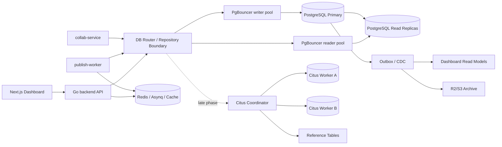

# MPP Progressive Plan for Database Read/write Splitting and Horizontal Partitioning

## 0. Execution Status and Progress Record

This section is the maintenance entry point. Each time a database-specific improvement moves forward, update the status, checklist items, and completion level here first. The later sections explain why to do it, when to do it, and how to do it.

Status definitions:

- `Done`: code, configuration, monitoring, or documentation process is in place and has a verifiable entry point.
- `In progress`: a base capability exists, but key production loops are still missing.
- `Not started`: no clear implementation has been found yet.
- `Deferred`: not recommended for the current business stage; only trigger conditions are retained.

Current overall progress: about `69%`. This number is manually estimated by phase weight and can be adjusted later according to actual completed items.

| Phase | Weight | Current completion | Status | Completed | Not done / next steps |
| ----- | ------ | ------------------ | ------ | --------- | --------------------- |
| Phase 0: Data-layer baseline inventory | 10% | 100% | Done | GORM query observability, `mpp_db_*` metrics, dashboard query-plan audit script, `pg_stat_statements`, database baseline audit script, PostgreSQL exporter table-level health and 24h row-growth panels, and read/write consistency classification | Continue implementing code routing, partitioning, and archiving according to this checklist in later phases |
| Phase 1: Single-database connection pool, indexing, pagination, and lifecycle governance | 15% | 100% | Done | backend/publish-worker/collab-service application connection pools, Redis client connection pool, PgBouncer writer pool, composite indexes, keyset list pagination, list queries avoiding the large `source_content` field, event/session history retention periods, and R2/S3 cold-event archive worker | None; Phase 2 is complete, and later work moves into Phase 3/4 read replicas, partitioning, and recovery flows |
| Phase 2: Read models and cache first | 15% | 100% | Done | Redis and Asynq dependencies are reusable; admin dashboard stats, admin project list, and dashboard account summary have short-TTL Redis cache; stats/project list/account cache misses are merged with singleflight; project, prepublish, publish, and account write paths invalidate the related dashboard cache; `workspace_dashboard_stats` and `project_list_summaries` read models are in place, and APIs prefer read models when coverage is complete; async refresh triggers after project save, platform sync, publish completion, and member changes; admin rebuild API, Asynq queue, and worker support full read-model rebuild | None |
| Phase 3: Read/write splitting | 15% | 100% | Done | Optional `DB_READER_*` connection, application-level DB Router, signed sticky writer, consistency routing for project/stats/workspace/platform_account/publish/prepublish/mediaasset/browser_session/extension, consistency-level inventories for dashboard/publish/collab-service, self-hosted PostgreSQL read replica, managed `postgres-reader` entry point, PgBouncer reader pool, replica lag monitoring and automatic fallback to writer when over threshold | None; Phase 4 continues partitioning, archiving, and recovery flows |
| Phase 4: Single-database partitioning, archiving, and hot/cold tiering | 15% | 85% | In progress | Collaborative editing already has state + update batch + compaction foundation; `collab_document_update_batches` has PostgreSQL `document_id` hash partition target schema; event and terminal-session history already have row-level R2/S3 archive worker; `publish_events`, `extension_execution_events`, `project_activities`, `workspace_activities`, and `remote_browser_sessions` have PostgreSQL monthly partition target schema; the archive worker exports whole cold monthly partitions to R2/S3 before detaching and dropping them | Archive recovery flow |
| Phase 5: Citus preparation | 20% | 5% | Not started | Workspace model, `projects.workspace_id`, and personal workspace ID already exist | Global `workspace_id`, Citus distribution column/colocation design, unique constraint and foreign-key review |
| Phase 6: Citus distributed PostgreSQL operation | 10% | 0% | Deferred | None | Future Citus cluster design, worker/coordinator monitoring and backup, large-tenant isolation strategy |

### 0.1 Progress Update Rules

After completing any database-specific work, update this section in the following order:

1. Check the corresponding task in the phase checklist.
2. Update the capability status matrix columns "what has been done / what is not done / verification entry point".
3. Update the phase progress table columns "current completion, status, completed, not done / next steps".
4. Re-estimate "current overall progress" by phase weight.
5. Record this batch of documentation or code changes with one atomic commit.

Completion calculation:

```text
Current overall progress = Σ(phase weight * phase current completion)
```

Phase completion can be estimated from the checklist, but must be adjusted by acceptance quality:

- Design-only work without code, configuration, scripts, or a verification entry point can count for at most `20%` of that phase.
- Implementation without monitoring or rebuild paths can count for at most `60%` of that phase.
- A phase can be marked `Done` only when implementation, verification entry point, rebuild method where applicable, and documentation status are all updated.
- A `Deferred` phase does not gain completion just because it is intentionally not being done; only trigger conditions are recorded.

Atomic commit guidance:

- Status and checklist updates only: use `docs(database): update scaling plan progress`.
- Executable scripts, configuration, or code: commit code and docs separately, unless the documentation only explains the same implementation.
- Each commit should advance only one phase or one capability, not mix read models, read/write splitting, and Citus design in the same commit.
- After committing, add the verifiable entry point beside the corresponding checklist item instead of only changing percentages.

### 0.2 Capability Status Matrix

| Capability | Current status | What has been done | What is not done | Verification / evidence entry point |
| ---------- | -------------- | ------------------ | ---------------- | ----------------------------------- |
| Application connection pools | Done | backend/publish-worker support `DB_MAX_OPEN_CONNS`, `DB_MAX_IDLE_CONNS`, `DB_CONN_MAX_LIFETIME`, and `DB_CONN_MAX_IDLE_TIME`; collab-service node-postgres pool supports `DB_MAX_OPEN_CONNS`, `DB_CONN_MAX_LIFETIME`, and `DB_CONN_MAX_IDLE_TIME`; Redis client supports `REDIS_POOL_SIZE`, `REDIS_MIN_IDLE_CONNS`, `REDIS_MAX_IDLE_CONNS`, `REDIS_CONN_MAX_IDLE_TIME`, and `REDIS_CONN_MAX_LIFETIME`; Docker Compose and self-hosted Kubernetes reuse PostgreSQL connections through PgBouncer writer pool; GORM PostgreSQL driver uses simple protocol to remain compatible with transaction pooling; self-hosted Kubernetes added PgBouncer reader pool and points app `DB_READER_HOST` to the reader pool | None | `backend/internal/db/db.go`, `backend/internal/redisclient/redisclient.go`, `collab-service/src/config.ts`, `collab-service/src/persistence/document-persistence.ts`, `collab-service/src/persistence/document-persistence.test.ts`, `deploy/docker/docker-compose.yml`, `deploy/kubernetes/data-services/self-hosted/pgbouncer.yaml`, `deploy/kubernetes/app-baseline/app-config.yaml` |
| Query observability | Done | GORM QueryObserver, slow-query logs, `mpp_db_queries_total`, `mpp_db_query_duration_seconds`, `mpp_db_slow_queries_total`, self-hosted PostgreSQL `pg_stat_statements`, PostgreSQL exporter table-level health metrics, Grafana table row count / 24h growth / table size / index size / dead tuples / vacuum panels | Threshold alerts can continue to be added by production baseline in Phase 1/4 | `backend/internal/db/query_observer.go`, `backend/internal/observability/observability.go`, `script/db/audit_database_baseline.sql`, `deploy/docker/observability/postgres-exporter/queries.yml`, `deploy/docker/observability/grafana/dashboards/mpp-observability-baseline.json` |
| Dashboard query audit | Done | Existing audit script covers dashboard Count, list, platform filter, publication preload, account query, and active session query plans | Not yet turned into a periodic CI/ops gate | `script/db/audit_dashboard_query_plans.sql` |
| Tenant boundary | In progress | Existing `workspaces`, `workspace_members`, `projects.workspace_id`, and personal workspace rules | Publish events, collaborative state, media metadata, and other tables do not all explicitly carry `workspace_id` yet | `backend/internal/models/models.go` |
| Dashboard read models | Done | Added `workspace_dashboard_stats` and `project_list_summaries` read models, idempotently recomputed from fact tables by a centralized readmodel service; async refresh is triggered after project save, platform sync, publish completion, and member changes; admin stats and admin project list prefer read models when coverage is complete; admin rebuild API enqueues through Asynq, and API/worker processes can start readmodel workers for full rebuild from fact tables | None | `backend/internal/models/models.go`, `backend/internal/services/readmodel/service.go`, `backend/internal/services/readmodel/queue.go`, `backend/internal/services/readmodel/service_test.go`, `backend/internal/services/readmodel/queue_test.go`, `backend/internal/services/stats/overview.go`, `backend/internal/services/project/lifecycle.go`, `backend/internal/handlers/dashboard.go`, `backend/cmd/api/main.go`, `backend/cmd/publish-worker/main.go` |
| Redis read cache | Done | Redis is already used for queues, locks, OAuth, browser sessions, and short-term coordination; admin dashboard stats, admin project list, and dashboard account summary use 15s TTL cache and bypass scoped/sticky-writer strong-consistency paths; stats/project list/account cache misses use singleflight to prevent process-local stampede; stats and account caches use versioned payloads and semantic validation, and Redis read-error fallback is also merged into one DB computation per key; project create/edit/platform save, prepublish sync/draft update, publish queue/execute/fail, and platform account write paths invalidate the related dashboard cache; full read-model rebuild reuses the Redis/Asynq queue | None | `backend/internal/services/stats/overview.go`, `backend/internal/services/stats/overview_test.go`, `backend/internal/services/project/list_cache.go`, `backend/internal/services/project/list_cache_test.go`, `backend/internal/services/prepublish/drafts.go`, `backend/internal/services/publish/service.go`, `backend/internal/services/publish/queue.go`, `backend/internal/services/publish/publication_flow_test.go`, `backend/internal/services/publish/queue_test.go`, `backend/internal/services/platform_account/account_cache.go`, `backend/internal/services/platform_account/account_cache_test.go`, `backend/internal/services/browser_session/complete.go`, `backend/internal/services/browser_session/service_test.go`, `backend/internal/services/readmodel/queue.go` |
| Read/write splitting | Done | Supports optional `DB_READER_*` read-replica connection, `DefaultRouter`, and signed sticky writer; project/stats/workspace/platform_account/publish/prepublish/mediaasset/browser_session/extension are wired to strong/eventual/writer routing; dashboard, publish, and collab-service consistency-level inventories are complete, with collab-service online path kept writer-only; writer/reader pools are in self-hosted Kubernetes, and managed overlay provides a `postgres-reader` ExternalName entry point; `DB_READER_MAX_REPLICA_LAG` configures the replica lag threshold, eventual/analytics reads automatically fall back to writer when over threshold or lag is unknown, and `mpp_db_replica_lag_seconds` and `mpp_db_replica_healthy` metrics are exposed | None | `backend/internal/db/db.go`, `backend/internal/db/router.go`, `backend/internal/db/replica_lag.go`, `backend/internal/services/publish/service.go`, `backend/internal/services/prepublish/service.go`, `backend/internal/services/mediaasset/service.go`, `backend/internal/services/browser_session/service.go`, `backend/internal/services/extension/service.go`, `backend/internal/app/runtime.go`, `deploy/kubernetes/data-services/self-hosted/postgres.yaml`, `deploy/kubernetes/data-services/self-hosted/pgbouncer.yaml`, `deploy/kubernetes/data-services/managed/services.yaml`, `script/kubernetes/validation/data_services.rb` |
| Event-table partitioning and archiving | In progress | `publish_events`, `extension_execution_events`, `project_activities`, `workspace_activities`, and terminal `remote_browser_sessions` have default retention periods; the `archive` worker can batch-export JSONL to R2/S3 and delete old hot-table rows after successful upload; PostgreSQL schema initialization now creates monthly `created_at` partitions for `publish_events`, `extension_execution_events`, `project_activities`, `workspace_activities`, and `remote_browser_sessions`, with partition-compatible `(id, created_at)` primary keys and rolling partition creation; the archive worker exports whole cold monthly partitions as JSONL to R2/S3, then detaches and drops the partition after successful upload; PostgreSQL browser-session active-row fallback uses a scoped advisory transaction lock because partitioned unique constraints must include the partition key | Archive recovery flow is not implemented | `backend/internal/db/monthly_partitions.go`, `backend/internal/db/db.go`, `backend/internal/models/models.go`, `backend/internal/db/db_test.go`, `backend/internal/services/browser_session/start.go`, `backend/internal/services/browser_session/cleanup.go`, `backend/internal/services/archive/worker.go`, `backend/internal/services/archive/partitions.go`, `backend/internal/services/archive/worker_test.go`, `backend/internal/services/archive/partitions_test.go` |
| Collaboration batch governance | In progress | `collab_document_states`, `collab_document_update_batches`, and compaction/retention foundations exist; PostgreSQL schema initialization creates a 16-way `document_id` hash-partitioned `collab_document_update_batches` target table and migrates existing regular-table rows into it | Cold archiving is not implemented | `backend/internal/db/hash_partitions.go`, `backend/internal/db/db.go`, `backend/internal/models/collab.go`, `backend/internal/db/db_test.go`, `collab-service/src/persistence/document-persistence.ts` |
| Outbox/CDC/event stream | In progress | The publishing queue path has a transactional Outbox: `EnqueuePublishProject` writes `outbox_events` in the same transaction and dispatches immediately after commit; publish worker starts an outbox dispatcher and supports retries for failed/stale processing records; Asynq continues to serve as the task-execution queue, and `PublishEvent` continues to serve as publishing audit | Currently covers only `publish.job_requested`; general business-event outbox, Debezium, and Redpanda/Kafka CDC are not implemented | `backend/internal/services/publish/queue.go`, `backend/internal/services/publish/outbox.go`, `backend/internal/models/models.go` |
| Citus target state | Not started | Confirmed `workspace_id` as the most suitable distribution-column direction | Citus distributed tables, reference tables, and colocation are not implemented | Phase 5/6 in this document |

### 0.3 Phase Checklist

#### Phase 0: Data-layer Baseline Inventory

- [x] Add GORM query observability and `mpp_db_*` metrics.
- [x] Add dashboard query-plan audit script.
- [x] Enable PostgreSQL `pg_stat_statements`.
- [x] Add a baseline audit script for query fingerprints, table sizes, index sizes, and dead tuples.
- [x] Build dashboards for table row count, 24h row growth, table size, index size, dead tuples, vacuum state. Verification entry point: `deploy/docker/observability/postgres-exporter/queries.yml`, `deploy/docker/observability/grafana/dashboards/mpp-observability-baseline.json`.
- [x] Mark DB calls in dashboard, publish, and collab-service with consistency levels. Verification entry point: Phase 0 consistency-level inventory in this document.

#### Phase 1: Single-database Connection Pool, Indexing, Pagination, and Lifecycle Governance

- [x] Keep and verify application-level connection pool configuration for backend, publish-worker, and collab-service.
- [x] Add and verify Redis client connection pool configuration.
- [x] Keep the project-list pagination and composite-index foundation.
- [x] Avoid the large `projects.source_content` field in list queries.
- [x] Introduce PgBouncer writer pool.
- [x] Migrate high-frequency lists from offset pagination to keyset pagination. Verification entry point: `backend/internal/services/project/lifecycle.go`, `backend/internal/services/project/list_cursor.go`, `backend/internal/services/project/lifecycle_test.go`, `frontend/src/lib/dashboard/api/projects.ts`, `frontend/src/lib/dashboard/api/workspaces.ts`.
- [x] Define retention periods for event tables and session history. Verification entry point: `backend/internal/services/archive/config.go`, `contracts/env.schema.yaml`.
- [x] Add archive worker to export cold events to R2/S3. Verification entry point: `backend/internal/services/archive/worker.go`, `backend/internal/services/archive/worker_test.go`, `backend/cmd/publish-worker/main.go`.

#### Phase 2: Read Models and Cache First

- [x] Confirm Redis and Asynq can be reused as cache / async-update infrastructure.
- [x] Add `workspace_dashboard_stats` or an equivalent read model. Verification entry point: `backend/internal/models/models.go`, `backend/internal/services/readmodel/service.go`.
- [x] Add `project_list_summaries` or an equivalent read model. Verification entry point: `backend/internal/models/models.go`, `backend/internal/services/readmodel/service.go`.
- [x] Update read models asynchronously after project save, platform sync, publish completion, and member change. Verification entry point: `backend/internal/services/dashboard/facade.go`, `backend/internal/services/project/lifecycle.go`, `backend/internal/services/prepublish/drafts.go`, `backend/internal/services/publish/service.go`, `backend/internal/services/workspace/management.go`.
- [x] Add Redis TTL cache for admin dashboard stats summary, with singleflight / semantic validation to protect misses and bad payloads.
- [x] Add Redis TTL cache for admin dashboard project list, with singleflight to merge concurrent misses for the same key.
- [x] Add Redis TTL cache for dashboard account summary, with singleflight to merge concurrent misses for the same key.
- [x] Add fine-grained invalidation for dashboard Redis cache.
- [x] Add full read-model rebuild task. Verification entry point: `backend/internal/services/readmodel/service.go`, `backend/internal/services/readmodel/queue.go`, `backend/internal/handlers/dashboard.go`, `backend/cmd/api/main.go`, `backend/cmd/publish-worker/main.go`, `backend/internal/services/readmodel/service_test.go`, `backend/internal/services/readmodel/queue_test.go`.

#### Phase 3: Read/write Splitting

- [x] Deploy PostgreSQL read replica. Verification entry point: `deploy/kubernetes/data-services/self-hosted/postgres.yaml`, `deploy/kubernetes/data-services/managed/services.yaml`, `deploy/kubernetes/overlays/staging-managed/kustomization.yaml`, `deploy/kubernetes/overlays/production-managed/kustomization.yaml`.
- [x] Add optional `DB_READER_*` read-replica configuration; writer continues to use current `DB_*` configuration.
- [x] Introduce application-level reader/writer DB Router.
- [x] Mark `StrongRead`, `EventualRead`, and related consistency paths for project, stats, workspace, and platform_account.
- [x] Add short sticky-writer window after writes to prevent replica lag from making UI state go backward.
- [x] Complete consistency routing for remaining services, including publish, prepublish, mediaasset, browser_session, and extension. Verification entry point: `backend/internal/services/publish`, `backend/internal/services/prepublish`, `backend/internal/services/mediaasset`, `backend/internal/services/browser_session`, `backend/internal/services/extension`.
- [x] Add PgBouncer reader pool and make the self-hosted app baseline use it. Verification entry point: `deploy/kubernetes/data-services/self-hosted/pgbouncer.yaml`, `deploy/kubernetes/app-baseline/app-config.yaml`.
- [x] Monitor replica lag and automatically fall back to writer when delay exceeds the threshold.

#### Phase 4: Single-database Partitioning, Archiving, and Hot/cold Tiering

- [x] Keep collaborative editing state + update batch + compaction foundation.
- [x] Partition `publish_events`, `extension_execution_events`, and activity tables by month. Verification entry point: `backend/internal/db/monthly_partitions.go`, `backend/internal/models/models.go`, `backend/internal/db/db_test.go`.
- [x] Partition `remote_browser_sessions` by time or expiration time. Verification entry point: `backend/internal/db/monthly_partitions.go`, `backend/internal/models/models.go`, `backend/internal/services/browser_session/start.go`, `backend/internal/db/db_test.go`.
- [x] Hash partition `collab_document_update_batches` by `document_id`. Verification entry point: `backend/internal/db/hash_partitions.go`, `backend/internal/db/db.go`, `backend/internal/models/collab.go`, `backend/internal/db/db_test.go`.
- [x] Export cold partitions to R2/S3. Verification entry point: `backend/internal/services/archive/partitions.go`, `backend/internal/services/archive/partitions_test.go`, `backend/internal/services/archive/worker.go`.
- [ ] Write archive recovery procedure.

#### Phase 5: Citus Preparation

- [x] Confirm Workspace as the long-term tenant boundary.
- [x] Confirm `workspace_id` as the preferred Citus distribution column.
- [ ] Complete `workspace_id` or a stable derivation path for project-domain tables.
- [ ] Design Citus distributed tables, reference tables, and colocated table groups.
- [ ] Review unique constraints, foreign keys, and cross-tenant joins.
- [ ] Add `workspace_id` to worker payloads.

#### Phase 6: Citus Distributed PostgreSQL Operation

- [ ] Set up a Citus validation cluster when horizontal scaling is actually needed.
- [ ] Import synthetic or new workspaces for validation.
- [ ] Configure PgBouncer, monitoring, backup, and failure drills for Citus coordinator/workers.
- [ ] Govern worker concurrency by `workspace_id`.
- [ ] Define large-tenant isolation strategy using an independent Citus cluster or independent PostgreSQL.

## 1. Document Positioning

This document focuses on how MPP should progressively implement data-layer architecture after distributed and high-concurrency growth:

- PostgreSQL connection-count governance, connection pools, and PgBouncer.
- Slow queries, indexes, pagination, data lifecycle, and archiving.
- Dashboard read models, cache, read replicas, and read/write splitting.
- Partitioning, compression, and hot/cold tiering for append-only event data.
- Horizontal table partitioning, database splitting, and sharding by `workspace_id` or user-tenant dimension.
- Whether and when to introduce event streams, CDC, Kafka/Redpanda, and similar data middleware.

This document does not recommend immediate database or table sharding at the current stage. A better route for MPP is to first make data-access boundaries explicit and govern hot reads, hot writes, event append, collaborative editing, and audit archiving separately. Only after single-database optimization, read replicas, cache, partitioning, and archiving are all insufficient should the project move into true horizontal splitting.

## 2. Current Architecture Assessment

MPP already has several foundations required for data-layer evolution:

- `backend` and `publish-worker` use Go + Echo + GORM to access PostgreSQL, and business state still uses PostgreSQL as the source of truth.
- `backend` is already mostly stateless; multiple replicas share state through PostgreSQL and Redis.
- Redis already handles the Asynq publishing queue, distributed locks, OAuth state, browser-session temporary state, and stream tokens.
- The data model already shows clear tenant boundaries: `workspaces`, `workspace_members`, `projects.workspace_id`, and personal workspace `PersonalWorkspaceID(userID)`.
- Major high-frequency tables already have composite indexes and pagination foundations, such as `projects(user_id,status,created_at)`, `projects(workspace_id,status,created_at)`, and `project_platform_publications(platform,status)`.
- GORM query observability is wired in and can record SQL hash, table name, operation type, duration, affected rows, and errors.
- `script/db/audit_dashboard_query_plans.sql` already covers dashboard project Count, publication status Count, project list, platform filter, publication preload, account query, and active browser-session query. This shows the project has started constraining dashboard hot reads with query-plan audits.
- Collaborative editing already uses `collab_documents`, `collab_document_states`, and `collab_document_update_batches` to persist Yjs state and update batches.

This means MPP's data-layer evolution should use `workspace_id` as the future tenant routing key, `project_id` and `document_id` as tenant-local lookup keys, and time fields as event-archive and partitioning keys.

## 3. Business Data Access Profile

| Data domain | Representative tables | Current access pattern | High-concurrency risk | Priority governance direction |
| ----------- | --------------------- | ---------------------- | --------------------- | ----------------------------- |
| User and authentication | `users` | Registration, login, JWT user reads | Low write volume but high consistency requirement | Continue using primary database; do not participate in early sharding |
| Workspaces and members | `workspaces`, `workspace_members` | Tenant entry, permission checks, project-list filtering | Every project query depends on permission filtering | Treat as routing and access-control metadata; prioritize indexes and cache |
| Project main data | `projects` | Lists, details, saving source content, status updates | Large `source_content` field, list Count, permission subqueries | List read models, primary/replica routing, Citus distribution by `workspace_id` |
| Platform publishing targets | `project_platform_publications` | Multi-platform drafts per project, publishing status updates | Concentrated status writes during publishing peaks | Colocate with `projects` on the same distribution column; status writes go to primary |
| Publishing events | `publish_events`, `extension_execution_events` | Append-only audit, idempotency, diagnosis | Fast row growth and index bloat | Time partitioning, archiving, CDC if needed |
| Collaborative editing | `collab_document_states`, `collab_document_update_batches` | High-frequency append, batch flush, periodic compaction | Hot-document high write rate and fast batch-table growth | First hash partition by `document_id`, then archive |
| Remote browser sessions | `remote_browser_sessions` | Short-lifecycle state, audit after completion | TTL state mixed with historical audit | Keep hot state in Redis; archive historical rows periodically |
| Media metadata | `media_assets` | Images, covers, object-storage references | Metadata is queryable, files should not enter DB | Metadata belongs to workspace; files remain in R2/S3 |
| Dashboard statistics | Currently aggregate queries | Count, status aggregation, cross-table joins | Frequent home/list access slows primary database | Redis cache and read models before read replicas |

## 4. Overall Target Architecture



Core principles:

- The primary database remains the strongly consistent write source of truth; read replicas and read models serve only reads that can tolerate delay.
- Transactions, idempotency, state-machine advancement, account credential updates, and publication status updates must go to writer.
- Lists, statistics, audit history, and read-only details can go to reader or read models once consistency requirements are satisfied.
- Do single-database partitioning and archiving first, then move into Citus distributed PostgreSQL.
- When entering Citus, projects, publishing targets, project activities, collaborative state, and media metadata must be colocated by `workspace_id` as the distribution column to avoid cross-tenant transactions.

## 5. Technology Stack and Middleware Choices

| Problem | Recommended stack / middleware | Why it fits MPP | Not recommended as first choice |
| ------- | ------------------------------ | --------------- | ------------------------------- |
| DB connection exhaustion | Application-level `DB_MAX_*` pools + PgBouncer transaction pooling | Current Go service replicas and workers all use PostgreSQL; PgBouncer can quickly reduce connection pressure | Starting with Pgpool-II, which makes read/write routing and failover a black box |
| Slow queries and index governance | `pg_stat_statements`, PostgreSQL exporter, existing GORM QueryObserver, Grafana | The project already has Prometheus/Grafana/GORM observability; adding PostgreSQL-side facts closes the loop | Judging SQL performance only from application logs |
| Hot-read cache | Redis cache + singleflight + short TTL | Redis is already in the project and fits dashboard stats, permission metadata, and platform account short cache | Treating Redis as source of truth, or caching strongly consistent publishing status paths |
| Dashboard read models | PostgreSQL read-model tables + Asynq/Outbox updates | Reuse current Redis/Asynq first and avoid introducing Kafka too early | Using ClickHouse/Elasticsearch early for all reads |
| Read/write splitting | Managed PostgreSQL read replica + application-level DB Router + PgBouncer reader/writer pools | GORM call sites can be gradually marked with consistency levels and can handle read-after-write consistency | Transparent SQL proxy that guesses reads/writes automatically; business consistency is hard to control |
| Time-based event growth | PostgreSQL declarative partitioning + optional pg_partman | `publish_events`, activities, and session audit naturally fit monthly partitioning and archiving | Sending events directly into Kafka as a query store before partitioning |
| Collaborative update batch growth | PostgreSQL hash partition by `document_id` + compaction + retention | The unique key of `collab_document_update_batches` contains `document_id`, and document-hash partitioning matches the load path better | Partitioning by `created_at`, which breaks document-local uniqueness and loading efficiency |
| Cold-data archive | R2/S3 + Parquet/JSONL + background archive worker | The project already points toward R2/S3 object storage, and archived data remains traceable offline | Deleting historical events with no recovery path |
| Multi-consumer event stream | Outbox + Debezium + Redpanda/Kafka | Introduce only when notifications, auditing, search, recommendations, and data warehouse all consume events | Introducing Kafka/Pulsar directly at the current publishing-queue stage |
| Horizontal table/database splitting | Citus distributed PostgreSQL + application-level workspace data-access boundary | MPP is tenant-oriented SaaS, `workspace_id` can serve as a stable distribution column, and Citus preserves the PostgreSQL ecosystem while reducing custom shard-routing cost | Rewriting around Vitess/MySQL; ShardingSphere transparent proxy as the first choice |
| Full-text search | Start with PostgreSQL full-text/trigram, later OpenSearch | Early content search can reuse PostgreSQL; split out when search becomes an independent product capability | Adding OpenSearch early for simple title search |
| Schema initialization | GORM AutoMigrate for undeployed/local environments | The project has no production dataset yet, so the current priority is a clean target schema | Keeping startup-time legacy compatibility code and compatibility DDL |

## 6. Progressive Phase Roadmap

### Phase 0: Data-layer Baseline Inventory

When to apply: immediately, as a prerequisite for all later phases.

Goal: do not change the architecture first. Quantify read/write paths, table growth, slow queries, connection counts, and read-after-write consistency requirements.

Work items:

- Classify every dashboard, publish, and collab-service DB call by consistency: `writer`, `read-your-write`, `eventual-read`, `analytics-read`.
- Build table-level growth dashboards: row count, table size, index size, dead tuples, and vacuum state.
- Enable `pg_stat_statements` for PostgreSQL and align SQL hashes with the existing GORM QueryObserver hashes.
- Review whether all high-frequency queries carry stable filters such as `workspace_id`, `user_id`, `project_id`, and `document_id`.
- Keep the target schema clean; before real deployment, prefer direct model/schema changes over compatibility code.

Acceptance criteria:

- The team can list the Top 20 slow queries, Top 20 high-frequency queries, and Top 20 fastest-growing tables.
- Every dashboard query is known to be eligible or ineligible for read replicas.
- Every table that may be sharded later has an explicit tenant key.

Phase 0 observability entry points already in place:

- Docker Compose configures `postgres-exporter`, collecting `pg_stat_user_tables`, `pg_relation_size`, `pg_indexes_size`, and vacuum counters through `deploy/docker/observability/postgres-exporter/queries.yml`.
- Prometheus has added the `postgres-exporter` scrape job; Grafana `MPP Observability Baseline` has panels for table row count, 24h row growth, table/index/total size, dead tuples, dead tuple ratio, vacuum age, and vacuum runs.
- Manual snapshots still use `script/db/audit_database_baseline.sh` to export Top query, largest table, highest dead-tuple table, and largest index summaries before/after releases or during incidents.
- The exporter does not inherit the application `.env`; it only receives `POSTGRES_EXPORTER_DATA_SOURCE_URI`, `POSTGRES_EXPORTER_USER`, and `POSTGRES_EXPORTER_PASSWORD`. New local databases create the `postgres_exporter` monitoring account through `deploy/docker/postgres/init/002_create_postgres_exporter.sh`.
- If managed PostgreSQL does not allow the exporter to use a superuser, the monitoring account must be granted `pg_monitor` or `pg_read_all_stats`; otherwise table-level statistics and vacuum state may be empty or incomplete. When `DB_SSLMODE=verify-ca` or `verify-full`, `POSTGRES_EXPORTER_DATA_SOURCE_URI` uses the form `host:port/db?sslmode=verify-full&sslrootcert=/path/to/ca.crt` without username/password; username and password still come from `POSTGRES_EXPORTER_USER` and `POSTGRES_EXPORTER_PASSWORD`.
- `DB_READER_MAX_REPLICA_LAG` and `DB_READER_LAG_CHECK_INTERVAL` are included in the env contract. When reader is not configured, current writer-only behavior is unchanged; after read replica is configured, these settings are used for replica-lag fallback decisions.

Consistency-level definitions:

| Level | Allowed destination | Use cases | Forbidden misuse |
| ----- | ------------------- | --------- | ---------------- |
| `writer` | Writer only | Writes, transactions, state-machine advancement, `FOR UPDATE`, idempotency claim, credential writes, DDL | Any read replica |
| `read-your-write` | Writer by default; later can use sticky writer or reader after replay LSN confirmation | Details after user save/sync/publish, publishing progress, collaborative document opening, permission checks | Ordinary reader without sticky or replay confirmation |
| `eventual-read` | Prefer reader, fall back to writer when replica lag exceeds threshold | Dashboard global stats, admin lists, read-only display cache miss that can tolerate short delay | Publishing state machine, permissions, and credential paths |
| `analytics-read` | Reader or offline replica, with separate rate limiting if needed | Audit history, trend reports, growth analysis, low-priority full-table scans | Strongly consistent workflows for online requests |

dashboard / publish / collab-service DB-call consistency inventory:

| Service | Call / data path | Consistency level | Current implementation | Code entry |
| ------- | ---------------- | ----------------- | ---------------------- | ---------- |
| dashboard | Admin global stats, unscoped project list, short-TTL dashboard cache miss | `eventual-read` | stats/project list already use DB Router `EventualRead`, and fall back to writer inside sticky-writer windows | `backend/internal/services/stats/overview.go`, `backend/internal/services/project/lifecycle.go` |
| dashboard | User-scoped project list, project details, project publications, collaborators, workspace stats, workspace members/permissions | `read-your-write` | project/stats/workspace already use DB Router `StrongRead`; can later split into true read-your-write after replay LSN matures | `backend/internal/services/project/lifecycle.go`, `backend/internal/services/workspace/management.go`, `backend/internal/services/stats/overview.go` |
| dashboard | Platform account display card Redis hit | `eventual-read` | Used only as dashboard display cache; bypassed in sticky-writer windows | `backend/internal/services/platform_account/account_cache.go` |
| dashboard | Platform account connection state, account grants, account credentials / cookie reads | `read-your-write` | Cache miss and grant checks continue using `StrongRead`; publishing credentials must not use Redis display cache | `backend/internal/services/platform_account/service.go` |
| publish | Pre-publish reads for project, publication, platform account, and media resource availability | `read-your-write` | Uses DB Router `StrongRead`/sticky writer; publishing credentials, media references, and publication state machine do not use replicas | `backend/internal/services/publish/service.go`, `backend/internal/services/publish/media_refs.go` |
| publish | Publish queueing, idempotency checks, publish event, outbox event, publication status update, retry/claim | `writer` | Uses DB Router `Writer`; transactional outbox and state machine must not use reader | `backend/internal/services/publish/queue.go`, `backend/internal/services/publish/outbox.go` |
| publish | Publishing history, low-priority audit reports, growth analysis | `analytics-read` | Not currently a separate read model; can move to reader/archive query after Phase 4/Outbox | `backend/internal/models/models.go` |
| prepublish | Pre-read for project, publication, and draft sync | `read-your-write` | Uses DB Router `StrongRead` to avoid syncing stale content before replica catches up after user save | `backend/internal/services/prepublish/drafts.go` |
| prepublish | Draft sync, publication update, and cache invalidation trigger | `writer` | Uses DB Router `Writer`; transaction reads do not use replicas | `backend/internal/services/prepublish/drafts.go` |
| mediaasset | Upload completion, deletion, object-storage status update | `writer` | Uses DB Router `Writer`; metadata state changes do not use replicas | `backend/internal/services/mediaasset/assets.go` |
| mediaasset | Media read-only parsing and display reads | `eventual-read` | Uses DB Router `EventualRead` and automatically falls back to writer when replica lag is unhealthy | `backend/internal/services/mediaasset/assets.go` |
| browser_session | Live session, stream token, callback state reads, and completion writes | `read-your-write` / `writer` | DB Router pins active-session reads to `StrongRead`; register/complete/cleanup write paths use `Writer` | `backend/internal/services/browser_session/service.go`, `backend/internal/services/browser_session/complete.go` |
| extension | Callback token, handoff creation, execution events, account/session validation | `read-your-write` / `writer` | DB Router sends token/session validation through `StrongRead`, handoff and event writes through `Writer` | `backend/internal/services/extension/handoffs.go` |
| extension | Prepublish candidate list display | `eventual-read` | Uses DB Router `EventualRead`, allows short delay, and is protected by replica-lag fallback | `backend/internal/services/extension/handoffs.go` |
| collab-service | Reading state and update batches when opening a document | `read-your-write` | Current node-postgres pool connects only to writer; before introducing reader, latest flush for the same document must be visible | `collab-service/src/persistence/document-persistence.ts` |
| collab-service | Initialize document state, append update batch, `FOR UPDATE` seq lock, store compacted state, sync project source content, prune compacted batches | `writer` | All currently go to writer; transactions, locks, writes, and compaction forbid reader | `collab-service/src/persistence/document-persistence.ts` |
| collab-service | Offline collaboration batch growth analysis, archive validation, rebuild checks | `analytics-read` | After Phase 4, can execute on reader or archive replica; must not affect online flush | Phase 4 in this document |

Pre-deployment schema rule:

- The project has not been deployed with real customer data yet, so database changes should target the clean desired schema directly.
- Keep startup schema initialization focused on the desired current schema.
- Keep `AutoMigrate` as the local/development schema initializer before real deployment policy exists.

Benefits:

- Avoid premature database/table sharding at low cost.
- Later read/write splitting will not mistakenly send strongly consistent reads to replicas.

Costs:

- Requires adding database-side observability and a small amount of query annotation.
- The team needs discipline to avoid carrying compatibility code before it is needed.

### Phase 1: Single-database Connection Pool, Indexing, Pagination, and Lifecycle Governance

When to apply: API/worker replica counts increase, PostgreSQL connections approach the limit, and list/statistics p95 becomes unstable, but single-primary CPU/IO can still be solved through optimization.

Goal: stabilize the existing single database and prevent connection counts, slow SQL, and event tables without lifecycle management from becoming bottlenecks.

Work items:

- Keep existing `DB_MAX_OPEN_CONNS`, `DB_MAX_IDLE_CONNS`, `DB_CONN_MAX_LIFETIME`, and `DB_CONN_MAX_IDLE_TIME`.
- Introduce PgBouncer when total API + worker connections exceed 60% of the primary database safe connection count.
- Gradually evolve project lists from offset pagination to keyset pagination, especially workspace project lists.
- Continue using `Omit` for large fields such as `projects.source_content` in lists, and avoid reading large fields during aggregate queries.
- Define retention periods for `publish_events`, `extension_execution_events`, `remote_browser_sessions`, and `collab_document_update_batches`.
- Archive low-value historical events first: export to R2/S3, then delete old partitions or old rows from the hot database.

Recommended technology:

- PgBouncer.
- PostgreSQL `pg_stat_statements`, `VACUUM`/`ANALYZE` monitoring.
- GORM AutoMigrate for local/undeployed schema initialization.
- R2/S3 archive.

Benefits:

- Improves stability without changing the broad business-code structure.
- Keeps the target schema straightforward before real deployment.

Costs:

- PgBouncer transaction pooling constrains session-level features, prepared statements, and connection state.
- Keyset pagination changes some API pagination semantics.

### Phase 2: Read Models and Cache First

When to apply: dashboard home, project lists, workspace lists, and publishing statistics become high-frequency read entry points; aggregate Count and multi-table joins clearly consume primary database resources.

Goal: reduce unnecessary real-time aggregation before considering read replicas. Read replicas can split read traffic, but cannot turn inefficient aggregates into low-cost queries.

Work items:

- Build `workspace_dashboard_stats` or a similar read-model table that stores workspace-level project count, successful publish count, failed publish count, and latest activity time.
- Build `project_list_summaries` or a similar read model that pre-aggregates status, platform summary, and latest update time needed by lists.
- Use Outbox or current Asynq tasks to update read models after project save, platform sync, publish completion, and member changes.
- Add Redis TTL cache for statistics that can tolerate short delay; cache keys include `workspace_id` and permission version.
- Add versioned payloads, semantic validation, and singleflight to dashboard project list, statistics, and platform account display cache to avoid cache stampede or bad payloads turning into wrong UI state.
- Platform account display cache only serves dashboard status display; publish worker must still load cookies from PostgreSQL `platform_accounts.cookies` through CookieStore decryption before starting the publishing browser, and Redis display cache must not be used as the source of truth for publishing credentials.
- Add rebuild tasks for read models so they can be generated by replaying fact tables and do not become unrecoverable sources of truth.

Recommended technology:

- PostgreSQL read-model tables.
- Redis cache.
- Asynq scheduled/asynchronous tasks.
- The publishing queue path already uses Outbox Pattern; read-model refresh currently mainly reuses Asynq/service triggers, and later can expand outbox event types by business event.

Benefits:

- Significantly reduces pressure from high-frequency dashboard aggregation on the primary database.
- Creates a clear eventual-read boundary for read/write splitting.

Costs:

- Must handle read-model delay and rebuild.
- Must handle read-model refresh delay, rebuild, and outbox event-type expansion.

### Phase 3: Read/write Splitting

When to apply:

- Read requests account for more than 70% of database load.
- Single-primary CPU/IO is mainly consumed by reads.
- Phase 1 and Phase 2 are complete, but dashboard, list, and historical audit queries still affect write latency.

Goal: introduce read replicas for delay-tolerant reads, while the primary database focuses on strongly consistent writes and transactions.

Work items:

- Deploy PostgreSQL read replicas, preferably managed replicas from the cloud provider.
- Introduce a DB Router inside the application instead of relying on transparent SQL proxies to guess automatically.
- Split configuration into `DB_WRITER_*` and `DB_READER_*`, connecting them to PgBouncer writer pool and reader pool respectively.
- Explicitly declare read consistency at the repository or service layer:
  - `StrongRead`: transactional reads, publishing state advancement, account credentials, and details immediately after save go to writer.
  - `ReadYourWrite`: after a user writes, use writer for a short time or check replica replay LSN.
  - `EventualRead`: project lists, historical events, and statistical read models go to reader.
- Add a short sticky-writer window to frontend polling after save, sync, or publish, so replica lag does not make UI state go backward.
- Monitor replica lag; when it exceeds the threshold, automatically downgrade eventual reads back to writer.

Recommended technology:

- Managed PostgreSQL read replicas.
- PgBouncer reader/writer dual pools.
- GORM DBResolver can be used for read/write connection groups, but business code should still keep explicit consistency parameters.
- Prometheus PostgreSQL exporter for replica lag, xlog replay, and connection-pool monitoring.

Benefits:

- Offloads dashboard, history, read-only details, and statistics reads.
- Reduces the chance that reads and writes compete for primary database IO.

Costs:

- Must handle read-after-write consistency, failover, and replica lag.
- Testing complexity increases because the same query may go to writer or reader.
- Read replicas do not improve write capacity and do not solve single-table index bloat.

Paths that should not use read replicas:

- Login, registration, email verification, and password update.
- Platform account cookie/credential read followed immediately by publishing.
- Publishing state-machine checks and status updates.
- Idempotency-key duplicate checks and persistent state related to distributed locks.
- Collaborative editing flush, compaction, and project source sync.

### Phase 4: Single-database Partitioning, Archiving, and Hot/cold Tiering

When to apply:

- `publish_events`, `extension_execution_events`, activity tables, and browser-session audit rows reach tens of millions.
- `collab_document_update_batches` shows clear index bloat due to collaborative editing.
- vacuum, index scan, and backup/restore windows start growing longer.

Goal: reduce hot-table bloat and historical-data cost while still keeping one database instance.

Work items:

- Partition `publish_events`, `extension_execution_events`, `workspace_activities`, and `project_activities` monthly by `created_at`.
- Partition `remote_browser_sessions` by `created_at` or `expires_at`, and archive completed historical sessions by retention period.
- Prefer hash partitioning `collab_document_update_batches` by `document_id`, because the query path loads by document and sorts by seq.
- Keep compaction for collaborative update batches: `collab_document_states` stores compacted state, and old batches are kept only for the auditable window.
- Build an archive flow: after data leaves the hot window, export it to R2/S3, then delete or detach cold data according to the chosen storage layout.
- Write a clear restore flow for each archived data domain when archived records need inspection.

Recommended technology:

- PostgreSQL declarative partitioning.
- pg_partman for time partition management.
- R2/S3 + Parquet or JSONL archive.
- Background archive worker.

Benefits:

- Hot database indexes become smaller, and vacuum/backup become more controllable.
- Historical audits remain recoverable or available for offline analysis.
- Reduces per-shard data size for future horizontal sharding.

Costs:

- Unique constraints on partitioned tables must include the partition key, so existing unique indexes need redesign.
- GORM AutoMigrate is not suitable for directly managing complex partitioning; design partition DDL separately when this phase becomes real.
- Queries must include time or tenant filters, otherwise they still scan many partitions.

### Phase 5: Citus Preparation

When to apply:

- Read models, read/write splitting, partitioning, and archiving are complete.
- Single-primary write CPU/IO or WAL pressure still becomes a bottleneck.
- One workspace or a few large customers become clear hotspots that affect other tenants.
- Single-database backup/restore time already exceeds the business RTO.

Goal: shape the code and data model so a future Citus deployment is possible without rewriting business logic.

Work items:

- Confirm `workspace_id` is required on all project-domain tables before production schema freezes.
- Use `workspace_id` as the Citus distribution column, and colocate projects, publishing targets, publishing events, project activities, comments, versions, and media metadata as much as possible.
- Revisit unique constraints and foreign keys: unique constraints on distributed tables must include the distribution column, and cross-distribution-column foreign keys and cross-tenant joins must not be core paths.
- Design small tables such as `users`, global configuration, and platform dictionaries as reference tables or keep them in the control domain; whether `workspaces` and `workspace_members` should be reference tables depends on scale and permission-query paths.
- `platform_accounts` is currently user + platform scoped, so first keep it as control-domain data; if accounts later become workspace assets, model them directly in the colocated table group.
- Add `workspace_id` to every asynchronous task payload; workers must not locate data by `project_id` alone.
- Change repository/service DB entry points to `ForWorkspace(ctx, workspaceID)` or an equivalent data-access boundary, so Citus/single-database differences are not scattered through business code.
- Define cross-tenant restrictions: no cross-workspace transactions; global statistics are generated through read models, CDC, or offline warehouse.

Recommended technology:

- Citus coordinator + worker nodes.
- Citus colocated distributed tables, with `workspace_id` preferred as the distribution column.
- Reference tables for small global dimension tables.
- Application-level workspace data-access boundary for expressing tenant context and read/write consistency; it is not the primary sharding implementation.

Benefits:

- Tenant data can scale horizontally within the PostgreSQL ecosystem.
- Avoids custom shard maps, cross-database connection pools, and handwritten routing becoming long-term complexity centers.
- Citus colocation lets projects, publishing, activities, and media metadata within the same workspace keep a query experience close to a single database.

Costs:

- This is the highest-cost phase: distributed-table DDL, unique constraints, foreign keys, backup, monitoring, and failure recovery all become more complex.
- Cross-workspace queries, admin statistics, and admin lists need read models or asynchronous aggregation.
- If a single workspace becomes a super-hotspot, Citus can expand overall multi-tenant capacity but cannot automatically spread one tenant's write hotspot infinitely; large tenants or business hotspots need separate isolation.

### Phase 6: Citus Distributed PostgreSQL Operation

When to apply: after Phase 5 Citus constraint refactoring and task routing are complete, and new growth clearly requires horizontal write capacity.

Goal: operate Citus as a future PostgreSQL-compatible distributed runtime for new or synthetic workspaces first.

Work items:

- Set up a Citus validation cluster when horizontal scaling is actually needed.
- Import synthetic or new workspaces for validation, checking colocated joins, publishing-state transitions, collaborative editing, and dashboard read models.
- Configure PgBouncer, backups, monitoring, capacity thresholds, and failure drills separately for Citus coordinator and worker nodes.
- Apply Asynq worker concurrency limits by `workspace_id` and Citus cluster capacity, so single-tenant tasks do not overwhelm workers or the database.
- Build cross-tenant admin read models: tenant list, project count, publish count, and capacity watermarks.
- Build a large-tenant isolation strategy: when necessary, place large workspaces on an independent Citus cluster or independent PostgreSQL.

Recommended technology:

- Citus coordinator + worker nodes.
- PgBouncer for coordinator/worker access paths.
- Workspace-aware Asynq workers.
- Debezium + Redpanda/Kafka or scheduled aggregation jobs for cross-tenant admin read models.

Benefits:

- Provides true horizontal scalability within the PostgreSQL ecosystem.
- Long-term application complexity is lower than fully custom database/table sharding.

Costs:

- Requires mature PostgreSQL/Citus operational capability.
- Local development, test data, CI, backup, and recovery all need to understand distributed tables and reference tables.

## 7. Key Design Details

### 7.1 Read/write Routing Rules

| Query type | Default route | Example | Notes |
| ---------- | ------------- | ------- | ----- |
| Write transaction | Writer | Create project, save content, sync platform draft, advance publishing state | All reads and writes inside the transaction stay on writer |
| Immediate read after write | Writer or sticky writer | Refresh details after saving a project, poll status after publishing | Avoid stale UI state caused by replica lag |
| Delay-tolerant business read | Reader | Project list, historical publishing events, workspace activities | Must tolerate second-level delay |
| Statistical read | Read model / Reader | dashboard totals, success/failure statistics | Prefer read model, then reader |
| Audit archive read | Archive / offline | Publishing events beyond retention period | Does not query hot tables by default |

### 7.2 Citus Distribution Column

Preferred distribution column: `workspace_id`.

Reasons:

- MPP's long-term product model is Workspace/Team, so workspace is the natural SaaS tenant.
- Projects, publishing, collaboration, activities, and media metadata can all belong to a workspace.
- Project and publishing flows inside one workspace need local transactions; cross-workspace transactions should not become core paths.
- Citus colocated distributed tables require a stable distribution column. Designing around `workspace_id` keeps common joins inside the same workspace within one colocated table group.

Pre-deployment modeling strategy:

- Personal user projects belong to personal workspaces, using `PersonalWorkspaceID(userID)`.
- New project-domain tables should include `workspace_id` from the beginning when they need tenant-local querying.
- `platform_accounts` is currently user + platform scoped and is better kept in the control domain first; if accounts later become workspace assets, model them in a colocated table group distributed by `workspace_id`.

### 7.3 Table Partitioning Recommendations

| Table | Partitioning method | Reason |
| ----- | ------------------- | ------ |
| `publish_events` | Monthly partition by `created_at`, later can add `workspace_id` | Append-only audit data, often archived by time |
| `extension_execution_events` | Monthly partition by `created_at` | External extension callback events, historical reads are weakly consistent |
| `workspace_activities` | Monthly partition by `created_at` or hash by `workspace_id` | Workspace activities can be queried by tenant and time |
| `project_activities` | Monthly partition by `created_at`, follow workspace after sharding | Project activity grows quickly, but queries usually constrain project |
| `remote_browser_sessions` | Monthly partition by `created_at` or `expires_at` | Completed/expired sessions can be archived |
| `collab_document_update_batches` | Hash partition by `document_id` | Load path reads by document, and the unique key also contains document |
| `projects` | Do not partition early; keep as a normal table before sharding | Project master data needs stable transactions and indexes |
| `project_platform_publications` | Do not partition early; follow project after sharding | Strongly associated with project and suitable for colocated sharding |

### 7.4 Outbox and CDC Evolution

At the current stage, the publishing queue does not need to replace Kafka. MPP already has transactional outbox in the publishing queue path:

1. `EnqueuePublishProject` updates fact tables such as publication, publish event, and project activity in the business transaction.
2. The same transaction writes `outbox_events`; the current event type is `publish.job_requested`.
3. After transaction commit, dispatch is attempted immediately. If it fails, the outbox record is kept and marked failed; later the publish worker's outbox dispatcher scans failed/stale processing records and retries.
4. Later, more read-model refresh, notification, audit, and archive events can be added to outbox. When consumer count and event scale grow significantly, push outbox to Redpanda/Kafka through Debezium.

Trigger conditions for introducing Redpanda/Kafka:

- The same business event has at least three independent consumer types, such as notification, audit, search, recommendation, and data warehouse.
- Event throughput exceeds the comfortable range for Redis/Asynq as a business queue.
- Events need long-term cross-service retention and replay.

## 8. Benefits and Cost Overview

| Phase | Main benefits | Main costs | Risks |
| ----- | ------------- | ---------- | ----- |
| Phase 0 | See real bottlenecks and avoid mistaken decomposition | Add monitoring and classification | Metrics definitions are inconsistent |
| Phase 1 | Improve single-database stability and control connections/slow SQL | PgBouncer and lifecycle discipline | Misconfigured connection pool causes cascading failure |
| Phase 2 | Significantly reduce high-frequency dashboard read pressure | Read-model delay and rebuild logic | Read model briefly inconsistent with fact tables |
| Phase 3 | Horizontally scale read traffic | Complex read-after-write consistency | Replica lag makes UI state stale |
| Phase 4 | Reduce hot-table and index bloat | Partition DDL and archive flow | Wrong partition key makes queries slower |
| Phase 5 | Data model becomes Citus-ready | Distribution column, constraints, testing complexity | Cross-tenant transactions enter core paths accidentally |
| Phase 6 | Horizontal scaling within PostgreSQL ecosystem | Highest Citus operational cost | Distributed-table operation and global statistics are complex |

## 9. Recommended Execution Order

Short term:

1. Build database observability and query classification.
2. Add PostgreSQL-side metrics and `pg_stat_statements`.
3. Keep schema initialization clean and remove legacy compatibility paths before deployment.
4. Design dashboard read models and Redis cache strategy.
5. Define retention and archive strategy for event tables and collaborative update batches.

Medium term:

1. PgBouncer writer pool.
2. Dashboard read-model tables.
3. PostgreSQL read replicas and explicit DB Router.
4. Expand Outbox from `publish.job_requested` to more read-model, notification, and archive events.
5. Time partition event tables and hash partition collaborative batches.

Long term:

1. Complete `workspace_id` across all domains.
2. Design Citus distributed tables and reference tables.
3. Workspace-aware worker concurrency governance.
4. Validate Citus with synthetic or new workspaces before any real tenant data exists.
5. Decide whether Citus production operation is still justified.
