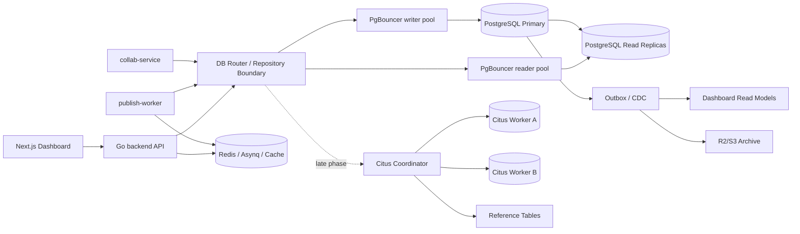

# MPP 数据库读写分离与水平分表渐进式方案

## 0. 执行状态与进度记录

本节是后续维护入口。每推进一次数据库专项改造，优先更新这里的状态、勾选项和完成度；后面的章节用于解释为什么这么做、什么时候做、怎么做。

状态口径：

- `完成`：代码、配置、监控或文档流程已经落地，并且有可验证入口。
- `进行中`：已有基础能力，但还缺关键生产闭环。
- `未开始`：尚未发现明确实现。
- `暂缓`：当前业务阶段不建议投入，只保留触发条件。

当前总体进度：约 `49%`。这个数字按阶段权重人工估算，后续可按实际完成项调整。

| 阶段                                         | 权重 | 当前完成度 | 状态   | 已完成                                                                         | 未完成/下一步                                                                          |
| -------------------------------------------- | ---- | ---------- | ------ | ------------------------------------------------------------------------------ | -------------------------------------------------------------------------------------- |
| 阶段 0：数据层基线盘点                       | 10%  | 100%       | 完成   | GORM 查询观测、`mpp_db_*` 指标、dashboard 查询计划审计脚本、`pg_stat_statements`、数据库基线审计脚本、PostgreSQL exporter 表级健康与 24h 行数增长面板、读写一致性分类、复杂 DDL 版本化迁移规范 | 后续阶段按本节清单继续实现代码路由、迁移执行器、分区和归档                            |
| 阶段 1：单库连接池、索引、分页和生命周期治理 | 15%  | 100%       | 完成   | backend/publish-worker/collab-service 应用层连接池、Redis 客户端连接池、PgBouncer writer pool、组合索引、keyset 列表分页、列表避开 `source_content` 大字段、事件/会话历史保留期、R2/S3 冷事件归档 worker | 无；后续进入阶段 2 dashboard 读模型和阶段 4 分区/恢复流程                             |
| 阶段 2：读模型与缓存优先                     | 15%  | 80%        | 进行中 | Redis、Asynq 基础依赖可复用；admin dashboard stats、admin project list、dashboard account 摘要已有短 TTL Redis 缓存；stats/project list/account 缓存 miss 已用 singleflight 合并；项目、预发布、发布和账号写路径已清理对应 dashboard 缓存；`workspace_dashboard_stats` 与 `project_list_summaries` 读模型已落地，并已在项目保存、平台同步、发布完成、成员变更后触发异步刷新 | 读模型全量重建任务                                                                     |
| 阶段 3：读写分离                             | 15%  | 60%        | 进行中 | `DB_READER_*` 可选连接、应用层 DB Router、签名 sticky writer、project/stats/workspace/platform_account 一致性路由、dashboard/publish/collab-service 一致性等级清单、replica lag 监控与超阈值回退 writer | 生产 read replica、PgBouncer reader pool、按清单补齐 publish/collab-service 实际路由   |
| 阶段 4：单库分区、归档和冷热分层             | 15%  | 15%        | 进行中 | 协作编辑已有 state + update batch + compaction 基础；事件与终端会话历史已有行级 R2/S3 归档 worker | 事件表时间分区、协作 batch hash 分区、冷分区导出、恢复流程                             |
| 阶段 5：Citus 化准备                         | 20%  | 5%         | 未开始 | Workspace 模型、`projects.workspace_id`、个人工作区 ID 已存在                  | 全域 `workspace_id`、Citus 分布列/colocation 设计、唯一约束与外键复审、迁移演练        |
| 阶段 6：Citus 分布式 PostgreSQL 运行         | 10%  | 0%         | 暂缓   | 无                                                                             | Citus 影子集群、小租户迁移演练、worker/coordinator 监控备份、大租户隔离策略            |

### 0.1 进度更新规则

每完成一个数据库专项工作，都按下面顺序更新本节：

1. 在阶段 Checklist 勾选对应任务。
2. 更新能力状态矩阵中的“已经做了什么 / 还没做什么 / 验证入口”。
3. 更新阶段进度表中的“当前完成度、状态、已完成、未完成/下一步”。
4. 按阶段权重重新估算“当前总体进度”。
5. 用一个原子提交记录这一批同一意图的文档或代码变化。

完成度计算口径：

```text
当前总体进度 = Σ(阶段权重 * 阶段当前完成度)
```

阶段完成度可以按 checklist 估算，但必须结合验收质量调整：

- 只写设计但没有代码、配置、脚本或验证入口，最多记到该阶段的 `20%`。
- 有实现但没有监控、回滚或重建路径，最多记到该阶段的 `60%`。
- 有实现、验证入口、回滚/重建方式，并已更新文档状态，才可记为 `完成`。
- `暂缓` 阶段不因为“暂时不做”而增加完成度，只记录触发条件。

原子提交口径：

- 只更新计划状态和 checklist：使用 `docs(database): update scaling plan progress`。
- 增加可执行脚本、配置或代码：代码和文档分开提交，除非文档只是在解释同一实现。
- 每个提交只推进一个阶段或一个能力，不把读模型、读写分离、Citus 设计混在同一个提交里。
- 提交后在对应 checklist 旁边补充可验证入口，而不是只改百分比。

### 0.2 能力状态矩阵

| 能力               | 当前状态 | 已经做了什么                                                                                                          | 还没做什么                                                            | 验证/证据入口                                                                                 |
| ------------------ | -------- | --------------------------------------------------------------------------------------------------------------------- | --------------------------------------------------------------------- | --------------------------------------------------------------------------------------------- |
| 应用层连接池       | 完成     | backend/publish-worker 支持 `DB_MAX_OPEN_CONNS`、`DB_MAX_IDLE_CONNS`、`DB_CONN_MAX_LIFETIME`、`DB_CONN_MAX_IDLE_TIME`；collab-service 的 node-postgres pool 支持 `DB_MAX_OPEN_CONNS`、`DB_CONN_MAX_LIFETIME`、`DB_CONN_MAX_IDLE_TIME`；Redis 客户端支持 `REDIS_POOL_SIZE`、`REDIS_MIN_IDLE_CONNS`、`REDIS_MAX_IDLE_CONNS`、`REDIS_CONN_MAX_IDLE_TIME`、`REDIS_CONN_MAX_LIFETIME`；Docker Compose 和自托管 Kubernetes 已通过 PgBouncer writer pool 复用 PostgreSQL 连接，GORM PostgreSQL driver 使用 simple protocol 兼容 transaction pooling | PgBouncer reader pool 还未引入                                         | `backend/internal/db/db.go`、`backend/internal/redisclient/redisclient.go`、`collab-service/src/config.ts`、`collab-service/src/persistence/document-persistence.ts`、`collab-service/src/persistence/document-persistence.test.ts`、`deploy/docker/docker-compose.yml`、`deploy/kubernetes/data-services/self-hosted/pgbouncer.yaml` |
| 查询观测           | 完成     | GORM QueryObserver、慢查询日志、`mpp_db_queries_total`、`mpp_db_query_duration_seconds`、`mpp_db_slow_queries_total`、自托管 PostgreSQL `pg_stat_statements`、PostgreSQL exporter 表级健康指标、Grafana 表行数/24h 增长/表大小/索引大小/dead tuples/vacuum 面板 | 阈值告警可在阶段 1/4 按生产基线继续补充                                | `backend/internal/db/query_observer.go`、`backend/internal/observability/observability.go`、`script/db/audit_database_baseline.sql`、`deploy/docker/observability/postgres-exporter/queries.yml`、`deploy/docker/observability/grafana/dashboards/mpp-observability-baseline.json` |
| Dashboard 查询审计 | 完成     | 已有 dashboard Count、列表、平台过滤、publication preload、账号查询、活跃会话查询计划审计脚本                         | 还未形成定期 CI/运维门禁                                              | `script/db/audit_dashboard_query_plans.sql`                                                   |
| 租户边界           | 进行中   | 已有 `workspaces`、`workspace_members`、`projects.workspace_id`、个人工作区规则                                       | 发布事件、协作状态、媒体元数据等还没有全部显式带 `workspace_id`       | `backend/internal/models/models.go`                                                           |
| Dashboard 读模型   | 进行中   | 已新增 `workspace_dashboard_stats` 与 `project_list_summaries` 读模型，并由集中 readmodel service 从事实表幂等重算；项目保存、平台同步、发布完成、成员变更后已触发异步刷新 | 全量重建任务未实现；现有 API 查询尚未切换到读模型表                  | `backend/internal/models/models.go`、`backend/internal/services/readmodel/service.go`、`backend/internal/services/readmodel/service_test.go` |
| Redis 读缓存       | 进行中   | Redis 已用于队列、锁、OAuth、browser session 等短期协调；admin dashboard stats、admin project list 与 dashboard account 摘要已接入 15s TTL 缓存，并绕过 scoped/sticky writer 强一致路径；stats/project list/account 缓存 miss 已用 singleflight 做进程内防击穿；stats 和 account 缓存使用版本化 payload 和语义校验，Redis 读错误 fallback 也会合并为同 key 单次 DB 计算；项目创建/编辑/平台保存、预发布同步/草稿更新、发布排队/执行/失败和平台账号写路径已清理对应 dashboard 缓存 | 读模型全量重建任务未实现                                        | `backend/internal/services/stats/overview.go`、`backend/internal/services/stats/overview_test.go`、`backend/internal/services/project/list_cache.go`、`backend/internal/services/project/list_cache_test.go`、`backend/internal/services/prepublish/drafts.go`、`backend/internal/services/publish/service.go`、`backend/internal/services/publish/queue.go`、`backend/internal/services/publish/publication_flow_test.go`、`backend/internal/services/publish/queue_test.go`、`backend/internal/services/platform_account/account_cache.go`、`backend/internal/services/platform_account/account_cache_test.go`、`backend/internal/services/browser_session/complete.go`、`backend/internal/services/browser_session/service_test.go` |
| 读写分离           | 进行中   | 已支持 `DB_READER_*` 可选读副本连接、`DefaultRouter`、签名 sticky writer；project/stats/workspace/platform_account 已接入 strong/eventual 路由和 stale replica 回归测试；dashboard、publish、collab-service 已完成一致性等级清单；writer pool 已在 Docker Compose 和自托管 Kubernetes 落地；`DB_READER_MAX_REPLICA_LAG` 可配置 replica lag 阈值，超阈值或 lag 未知时 eventual/analytics read 自动回退 writer，并暴露 `mpp_db_replica_lag_seconds`、`mpp_db_replica_healthy` 指标 | 生产 read replica、PgBouncer reader pool、publish/collab-service 按清单接入实际 DB Router | `backend/internal/db/db.go`、`backend/internal/db/router.go`、`backend/internal/db/replica_lag.go`、`backend/internal/observability/observability.go`、`backend/internal/middleware/sticky_writer.go`、`deploy/kubernetes/data-services/self-hosted/pgbouncer.yaml`、本文阶段 0 一致性等级清单 |
| 事件表分区与归档   | 进行中   | `publish_events`、`extension_execution_events`、`project_activities`、`workspace_activities` 和终端 `remote_browser_sessions` 已制定默认保留期；`archive` worker 可按批导出 JSONL 到 R2/S3，成功上传后删除热表旧行 | 时间分区、冷分区导出、恢复流程未实现                                   | `backend/internal/services/archive/config.go`、`backend/internal/services/archive/worker.go`、`backend/internal/services/archive/worker_test.go` |
| 协作批次治理       | 进行中   | `collab_document_states`、`collab_document_update_batches`、compaction/retention 基础已存在                           | `document_id` hash 分区、冷归档未实现                                 | `backend/internal/models/collab.go`、`collab-service/src/persistence/document-persistence.ts` |
| Outbox/CDC/事件流  | 未开始   | Asynq 已承担发布任务队列；`PublishEvent` 已承担发布审计                                                               | 事务 Outbox、Debezium、Redpanda/Kafka CDC 未实现                      | `backend/internal/services/publish/queue.go`、`backend/internal/models/models.go`             |
| Citus 目标态       | 未开始   | 已确认 `workspace_id` 是最合适的分布列方向                                                                            | Citus 分布式表、reference table、colocation、迁移演练未实现           | 本文阶段 5/6                                                                                  |
| 复杂 DDL 迁移规范  | 完成     | 已制定版本化迁移规范，明确复杂 DDL 的触发条件、脚本命名、expand/contract 流程、回滚和验证要求                         | 后续首次复杂 DDL 需要选择并落地 `goose` 或 Atlas 执行器               | 本文阶段 0 复杂 DDL 版本化迁移规范                                                            |

### 0.3 阶段 Checklist

#### 阶段 0：数据层基线盘点

- [x] 接入 GORM 查询观测和 `mpp_db_*` 指标。
- [x] 增加 dashboard 查询计划审计脚本。
- [x] 开启 PostgreSQL `pg_stat_statements`。
- [x] 增加查询指纹、表大小、索引大小、dead tuple 基线审计脚本。
- [x] 建立表行数、24h 行数增长、表大小、索引大小、dead tuples、vacuum 状态面板。验证入口：`deploy/docker/observability/postgres-exporter/queries.yml`、`deploy/docker/observability/grafana/dashboards/mpp-observability-baseline.json`。
- [x] 给 dashboard、publish、collab-service 的 DB 调用标注一致性等级。验证入口：本文阶段 0 一致性等级清单。
- [x] 制定复杂 DDL 的版本化迁移规范。验证入口：本文阶段 0 复杂 DDL 版本化迁移规范。

#### 阶段 1：单库连接池、索引、分页和生命周期治理

- [x] 保留并验证 backend、publish-worker 和 collab-service 的应用层连接池配置。
- [x] 增加并验证 Redis 客户端连接池配置。
- [x] 保留项目列表分页和组合索引基础。
- [x] 列表查询避开 `projects.source_content` 大字段。
- [x] 引入 PgBouncer writer pool。
- [x] 将高频列表从 offset pagination 迁移到 keyset pagination。验证入口：`backend/internal/services/project/lifecycle.go`、`backend/internal/services/project/list_cursor.go`、`backend/internal/services/project/lifecycle_test.go`、`frontend/src/lib/dashboard/api/projects.ts`、`frontend/src/lib/dashboard/api/workspaces.ts`。
- [x] 制定事件表和会话历史保留期。验证入口：`backend/internal/services/archive/config.go`、`contracts/env.schema.yaml`。
- [x] 增加归档 worker，把冷事件导出到 R2/S3。验证入口：`backend/internal/services/archive/worker.go`、`backend/internal/services/archive/worker_test.go`、`backend/cmd/publish-worker/main.go`。

#### 阶段 2：读模型与缓存优先

- [x] 确认 Redis 和 Asynq 可复用为缓存/异步更新基础设施。
- [x] 新增 `workspace_dashboard_stats` 或等价读模型。验证入口：`backend/internal/models/models.go`、`backend/internal/services/readmodel/service.go`。
- [x] 新增 `project_list_summaries` 或等价读模型。验证入口：`backend/internal/models/models.go`、`backend/internal/services/readmodel/service.go`。
- [x] 在项目保存、平台同步、发布完成、成员变更后异步更新读模型。验证入口：`backend/internal/services/dashboard/facade.go`、`backend/internal/services/project/lifecycle.go`、`backend/internal/services/prepublish/drafts.go`、`backend/internal/services/publish/service.go`、`backend/internal/services/workspace/management.go`。
- [x] 为 admin dashboard stats 摘要增加 Redis TTL 缓存，并用 singleflight/语义校验保护 miss 和坏 payload。
- [x] 为 admin dashboard project list 增加 Redis TTL 缓存，并用 singleflight 合并同 key 并发 miss。
- [x] 为 dashboard account 摘要增加 Redis TTL 缓存，并用 singleflight 合并同 key 并发 miss。
- [x] 为 dashboard Redis 缓存增加精细失效策略。
- [ ] 增加读模型全量重建任务。

#### 阶段 3：读写分离

- [ ] 部署 PostgreSQL read replica。
- [x] 增加 `DB_READER_*` 可选读副本配置；writer 当前继续沿用 `DB_*` 配置。
- [x] 引入应用层 reader/writer DB Router。
- [x] 为 project、stats、workspace、platform_account 标注 `StrongRead`、`EventualRead` 等一致性路径。
- [x] 写后短窗口 sticky writer，避免副本延迟造成状态倒退。
- [ ] 补齐 publish、prepublish、mediaasset、browser_session、extension 等剩余服务的一致性路由。
- [x] 监控 replica lag，并在延迟超阈值时自动回退 writer。

#### 阶段 4：单库分区、归档和冷热分层

- [x] 保留协作编辑 state + update batch + compaction 基础。
- [ ] `publish_events`、`extension_execution_events`、活动表按月分区。
- [ ] `remote_browser_sessions` 按时间或过期时间分区。
- [ ] `collab_document_update_batches` 按 `document_id` hash 分区。
- [ ] 冷分区导出到 R2/S3。
- [ ] 编写归档恢复流程。

#### 阶段 5：Citus 化准备

- [x] 确认 Workspace 是长期租户边界。
- [x] 确认 `workspace_id` 是 Citus 首选分布列。
- [ ] 补齐项目域表的 `workspace_id` 或稳定推导路径。
- [ ] 设计 Citus distributed tables、reference tables 和 colocated table groups。
- [ ] 复审唯一约束、外键和跨租户 join。
- [ ] 为 worker payload 补充 `workspace_id`。
- [ ] 写从单库 PostgreSQL 到 Citus 的影子迁移和回滚流程。

#### 阶段 6：Citus 分布式 PostgreSQL 运行

- [ ] 搭建 Citus 影子集群。
- [ ] 导入测试工作区或新工作区验证。
- [ ] 迁移一个低风险老工作区演练。
- [ ] 配置 Citus coordinator/worker 的 PgBouncer、监控、备份和故障演练。
- [ ] 按 `workspace_id` 做 worker 并发治理。
- [ ] 制定大租户独立集群或独立 PostgreSQL 隔离策略。

## 1. 文档定位

本文主要讲 MPP 在分布式和高并发增长后如何渐进式落地：

- PostgreSQL 连接数治理、连接池和 PgBouncer。
- 慢查询、索引、分页、数据生命周期和归档。
- Dashboard 读模型、缓存、读副本和读写分离。
- 追加型事件数据的分区、压缩和冷热分层。
- 按 `workspace_id` 或用户租户维度做水平分表、分库和分片。
- 事件流、CDC、Kafka/Redpanda 等数据中间件是否以及何时引入。

本文不建议当前阶段立即做分库分表。更适合 MPP 的路线是：先把数据访问边界显式化，把热读、热写、事件追加、协作编辑、审计归档拆开治理；当单库优化、读副本、缓存、分区和归档都不足以后，再进入真正的水平拆分。

## 2. 当前架构判断

MPP 当前已经具备做数据层演进的几个基础条件：

- `backend` 和 `publish-worker` 以 Go + Echo + GORM 访问 PostgreSQL，业务状态仍由 PostgreSQL 作为系统事实源。
- `backend` 已经基本无状态化，多副本通过 PostgreSQL 和 Redis 共享状态。
- Redis 已承担 Asynq 发布队列、分布式锁、OAuth 状态、browser session 临时状态和 stream token。
- 数据模型已经出现明显租户边界：`workspaces`、`workspace_members`、`projects.workspace_id`、个人工作区 `PersonalWorkspaceID(userID)`。
- 主要高频表已经有组合索引和分页基础，例如 `projects(user_id,status,created_at)`、`projects(workspace_id,status,created_at)`、`project_platform_publications(platform,status)`。
- GORM 查询观测已经接入，可记录 SQL hash、表名、操作类型、耗时、影响行数和错误。
- `script/db/audit_dashboard_query_plans.sql` 已覆盖 dashboard 项目 Count、发布状态 Count、项目列表、平台过滤、publication preload、账号查询和活跃浏览器会话查询，说明项目已经开始用查询计划审计约束 dashboard 热读。
- 协作编辑已经使用 `collab_documents`、`collab_document_states`、`collab_document_update_batches` 持久化 Yjs 状态和更新批次。

这意味着 MPP 的数据层演进应该以 `workspace_id` 作为未来租户路由键，以 `project_id`、`document_id` 作为租户内局部定位键，以时间字段作为事件归档和分区键。

## 3. 业务数据访问画像

| 数据域         | 代表表                                                     | 当前访问特征                              | 高并发风险                                      | 优先治理方向                                          |
| -------------- | ---------------------------------------------------------- | ----------------------------------------- | ----------------------------------------------- | ----------------------------------------------------- |
| 用户与认证     | `users`                                                    | 注册、登录、JWT 用户读取                  | 写入量小，但一致性要求高                        | 继续走主库，不参与早期分片                            |
| 工作区与成员   | `workspaces`、`workspace_members`                          | 租户入口、权限判断、项目列表过滤          | 所有项目查询都会依赖权限过滤                    | 作为路由和访问控制元数据，优先补全索引与缓存          |
| 项目主数据     | `projects`                                                 | 列表、详情、保存 source content、状态更新 | `source_content` 大字段、列表 Count、权限子查询 | 列表读模型、主从路由、按 `workspace_id` 做 Citus 分布 |
| 平台发布目标   | `project_platform_publications`                            | 每个项目多平台草稿、发布状态更新          | 发布高峰时状态写集中                            | 与 `projects` 同分布列 colocate，状态写走主库         |
| 发布事件       | `publish_events`、`extension_execution_events`             | 追加型审计、幂等、排查                    | 行数增长快，索引膨胀                            | 时间分区、归档、必要时 CDC                            |
| 协作编辑       | `collab_document_states`、`collab_document_update_batches` | 高频追加、批量 flush、定期 compaction     | 热文档高写入、批次表增长快                      | 先按 `document_id` hash 分区，再做归档                |
| 远程浏览器会话 | `remote_browser_sessions`                                  | 短生命周期状态、完成后审计                | TTL 状态与历史审计混杂                          | 热状态继续 Redis，历史行定期归档                      |
| 媒体元数据     | `media_assets`                                             | 图片、封面、对象存储引用                  | 元数据可查，文件不应进入 DB                     | 元数据按工作区归属，文件继续 R2/S3                    |
| Dashboard 统计 | 当前为聚合查询                                             | Count、状态聚合、跨表 join                | 首页/列表高频访问拖慢主库                       | Redis 缓存和读模型优先于读副本                        |

## 4. 总体目标架构



核心原则：

- 主库仍是强一致写入事实源，读副本和读模型只承载可容忍延迟的读。
- 事务、幂等、状态机推进、账号凭据更新、发布状态更新必须走 writer。
- 列表、统计、审计历史、只读详情可以在满足一致性要求后走 reader 或读模型。
- 先做单库内分区和归档，再进入 Citus 分布式 PostgreSQL。
- 进入 Citus 时，项目、发布目标、项目活动、协作状态、媒体元数据必须按 `workspace_id` 作为分布列 colocate，避免跨租户事务。

## 5. 技术栈与中间件选择

| 问题             | 推荐技术栈/中间件                                                               | 为什么适合 MPP                                                                                           | 不建议优先选型                                         |
| ---------------- | ------------------------------------------------------------------------------- | -------------------------------------------------------------------------------------------------------- | ------------------------------------------------------ |
| DB 连接耗尽      | 应用层 `DB_MAX_*` 连接池 + PgBouncer transaction pooling                        | 当前 Go 服务多副本和 worker 都走 PostgreSQL，PgBouncer 可快速降低连接数压力                              | 一开始就上 Pgpool-II；它会把读写路由和故障切换变成黑盒 |
| 慢查询和索引治理 | `pg_stat_statements`、PostgreSQL exporter、现有 GORM QueryObserver、Grafana     | 项目已有 Prometheus/Grafana/GORM 观测，补 PostgreSQL 侧事实即可闭环                                      | 只靠应用日志判断 SQL 性能                              |
| 热读缓存         | Redis cache + singleflight + 短 TTL                                             | Redis 已在项目中，适合 dashboard stats、权限元数据、平台账号状态短缓存                                   | 把 Redis 当成事实源，或缓存发布状态强一致路径          |
| Dashboard 读模型 | PostgreSQL 读模型表 + Asynq/Outbox 更新                                         | 先复用当前 Redis/Asynq，避免过早引入 Kafka                                                               | 早期直接上 ClickHouse/Elasticsearch 承担所有读         |
| 读写分离         | Managed PostgreSQL read replica + 应用层 DB Router + PgBouncer reader/writer 池 | GORM 调用点可逐步标注一致性等级，能处理读后写一致性                                                      | 透明 SQL 代理自动猜读写；难以控制业务一致性            |
| 时间型事件膨胀   | PostgreSQL declarative partitioning + pg_partman 可选                           | `publish_events`、活动、会话审计天然适合按月分区和归档                                                   | 未分区前直接把事件塞进 Kafka 当查询库                  |
| 协作更新批次膨胀 | PostgreSQL hash partition by `document_id` + compaction + 保留期                | `collab_document_update_batches` 的唯一键包含 `document_id`，按文档 hash 分区更贴合加载路径              | 按 `created_at` 分区破坏文档局部唯一约束和加载效率     |
| 冷数据归档       | R2/S3 + Parquet/JSONL + 后台 archive worker                                     | 项目已有 R2/S3 对象存储方向，归档后还能离线追溯                                                          | 删除历史事件后无恢复通道                               |
| 多消费者事件流   | Outbox + Debezium + Redpanda/Kafka                                              | 当通知、审计、搜索、推荐、数据仓库都消费事件时再引入                                                     | 当前发布队列阶段直接引入 Kafka/Pulsar                  |
| 水平分表/分库    | Citus distributed PostgreSQL + 应用层 workspace 数据访问边界                    | MPP 是租户型 SaaS，`workspace_id` 可作为稳定分布列；Citus 可以保留 PostgreSQL 生态并降低自研分片路由成本 | Vitess/MySQL 迁移；ShardingSphere 透明代理作为第一选择 |
| 全文搜索         | PostgreSQL full-text/trigram 起步，后期 OpenSearch                              | 内容搜索初期可复用 PostgreSQL，搜索成为独立产品能力后再拆                                                | 早期为简单标题搜索上 OpenSearch                        |
| 在线迁移治理     | 版本化迁移工具 `goose` 或 Atlas + `CREATE INDEX CONCURRENTLY`                   | 当前 GORM AutoMigrate 适合早期，分区/分片/在线索引需要显式迁移脚本                                       | 继续依赖 AutoMigrate 管复杂 DDL                        |

## 6. 渐进式阶段路线图

### 阶段 0：数据层基线盘点

适用时机：立即执行，作为后续所有阶段的前置条件。

目标：不要先改架构，先把读写路径、表增长速度、慢查询、连接数、读后写一致性要求量化。

工作项：

- 给所有 dashboard、publish、collab-service 的 DB 调用按一致性分类：`writer`、`read-your-write`、`eventual-read`、`analytics-read`。
- 建立表级增长面板：行数、表大小、索引大小、dead tuples、vacuum 状态。
- 为 PostgreSQL 开启 `pg_stat_statements`，把 SQL hash 与现有 GORM QueryObserver 的 hash 对齐。
- 梳理所有高频查询是否带 `workspace_id`、`user_id`、`project_id`、`document_id` 等稳定过滤条件。
- 制定版本化迁移规范；复杂 DDL 不再只依赖 GORM AutoMigrate。

验收标准：

- 能列出 Top 20 慢查询、Top 20 高频查询、Top 20 增长最快表。
- 每条 dashboard 查询都知道能否走读副本。
- 每张未来可能分片的表都明确租户键。

阶段 0 已落地观测入口：

- Docker Compose 已配置 `postgres-exporter`，通过 `deploy/docker/observability/postgres-exporter/queries.yml` 采集 `pg_stat_user_tables`、`pg_relation_size`、`pg_indexes_size` 和 vacuum 计数。
- Prometheus 已增加 `postgres-exporter` scrape job；Grafana `MPP Observability Baseline` 已增加表行数、24h 行数增长、表/索引/总大小、dead tuples、dead tuple ratio、vacuum age、vacuum runs 面板。
- 手工快照仍使用 `script/db/audit_database_baseline.sh`，用于发布前后或事故期间导出 Top query、最大表、dead tuple 最高表和最大索引。
- exporter 不继承应用 `.env`，只接收 `POSTGRES_EXPORTER_DATA_SOURCE_URI`、`POSTGRES_EXPORTER_USER`、`POSTGRES_EXPORTER_PASSWORD`；本地新库通过 `deploy/docker/postgres/init/002_create_postgres_exporter.sh` 创建 `postgres_exporter` 监控账号。
- 托管 PostgreSQL 如果不允许 exporter 使用超级用户，监控账号必须授予 `pg_monitor` 或 `pg_read_all_stats`；否则表级统计和 vacuum 状态可能为空或不完整。`DB_SSLMODE=verify-ca` 或 `verify-full` 时，`POSTGRES_EXPORTER_DATA_SOURCE_URI` 使用不含用户名密码的 `host:port/db?sslmode=verify-full&sslrootcert=/path/to/ca.crt` 形式；用户名和密码仍由 `POSTGRES_EXPORTER_USER`、`POSTGRES_EXPORTER_PASSWORD` 提供。
- `DB_READER_MAX_REPLICA_LAG` 和 `DB_READER_LAG_CHECK_INTERVAL` 已纳入 env contract；未配置 reader 时不改变当前 writer-only 行为，配置 read replica 后用于 replica lag 回退判断。

一致性等级定义：

| 等级 | 允许走向 | 使用场景 | 禁止误用 |
| ---- | -------- | -------- | -------- |
| `writer` | 只走主库 writer | 写入、事务、状态机推进、`FOR UPDATE`、幂等 claim、凭据写入、DDL | 任何读副本 |
| `read-your-write` | 默认 writer；后续可用 sticky writer 或确认 replay LSN 后走 reader | 用户刚保存/同步/发布后的详情、发布进度、协作文档打开、权限判断 | 无 sticky 或无 replay 确认的普通 reader |
| `eventual-read` | reader 优先，副本 lag 超阈值回退 writer | 可容忍短延迟的 dashboard 全局统计、管理端列表、只读展示缓存 miss | 发布状态机、权限和凭据路径 |
| `analytics-read` | reader 或离线副本；必要时单独限流 | 审计历史、趋势报表、增长分析、低优先级全表扫描 | 在线请求的强一致工作流 |

dashboard / publish / collab-service DB 调用一致性清单：

| 服务 | 调用/数据路径 | 一致性等级 | 当前落地情况 | 代码入口 |
| ---- | ------------- | ---------- | ------------ | -------- |
| dashboard | 管理端全局 stats、无 scope 的项目列表、短 TTL dashboard 缓存 miss | `eventual-read` | stats/project list 已通过 DB Router 走 `EventualRead`，sticky writer 窗口内回退 writer | `backend/internal/services/stats/overview.go`、`backend/internal/services/project/lifecycle.go` |
| dashboard | 用户 scope 的项目列表、项目详情、项目 publications、协作者、workspace stats、workspace 成员/权限 | `read-your-write` | project/stats/workspace 已通过 DB Router 走 `StrongRead`；后续可在 replay LSN 成熟后细分为 true read-your-write | `backend/internal/services/project/lifecycle.go`、`backend/internal/services/workspace/management.go`、`backend/internal/services/stats/overview.go` |
| dashboard | 平台账号展示卡片 Redis 命中 | `eventual-read` | 只作为 dashboard 展示缓存；sticky writer 窗口内绕过缓存 | `backend/internal/services/platform_account/account_cache.go` |
| dashboard | 平台账号连接状态、账号授权、账号凭据/ Cookie 读取 | `read-your-write` | cache miss 和授权检查继续走 `StrongRead`；发布凭据不能使用 Redis 展示缓存 | `backend/internal/services/platform_account/service.go` |
| publish | 发布前读取项目、publication、平台账号、媒体资源可用性 | `read-your-write` | 当前仍走 writer `s.db`；阶段 3 接入 Router 时必须保持 writer/sticky 语义 | `backend/internal/services/publish/service.go`、`backend/internal/services/publish/media_refs.go` |
| publish | 发布排队、幂等检查、publish event、outbox event、publication 状态更新、retry/claim | `writer` | 当前写路径均走 writer；事务 outbox 和状态机不得走 reader | `backend/internal/services/publish/queue.go`、`backend/internal/services/publish/outbox.go` |
| publish | 发布历史、低优先级审计报表、增长分析 | `analytics-read` | 当前不是独立读模型；阶段 4/Outbox 后可迁移到 reader/归档查询 | `backend/internal/models/models.go` |
| collab-service | 文档打开时读取 state 和 update batches | `read-your-write` | 当前 node-postgres pool 只连 writer；引入 reader 前必须保证同一文档最新 flush 可见 | `collab-service/src/persistence/document-persistence.ts` |
| collab-service | 初始化文档 state、append update batch、`FOR UPDATE` seq 锁、store compacted state、sync project source content、prune compacted batches | `writer` | 当前全部走 writer；涉及事务、锁、写入和 compaction，禁止 reader | `collab-service/src/persistence/document-persistence.ts` |
| collab-service | 离线协作批次增长分析、归档校验、重建演练 | `analytics-read` | 阶段 4 后可在 reader 或归档副本执行；不能影响在线 flush | 本文阶段 4 |

复杂 DDL 版本化迁移规范：

| 规则 | 要求 |
| ---- | ---- |
| 触发条件 | 只要涉及分区、表/列重命名、列类型重写、非空/唯一/外键约束、批量 backfill、`CREATE INDEX CONCURRENTLY`、大表删除/归档、Citus 分布列或 colocate 变更，就必须使用版本化迁移，不能只依赖 GORM AutoMigrate。 |
| 工具与目录 | 阶段 0 完成规范制定；首次复杂 DDL 前在 `goose` 或 Atlas 中二选一，并把脚本放入统一迁移目录。命名使用 `YYYYMMDDHHMMSS_<domain>_<intent>.up.sql` / `.down.sql` 或对应工具的等价格式。 |
| expand/contract | 默认拆成 expand、backfill、verify、contract。expand 只做向后兼容新增；backfill 分批限速并可恢复；contract 必须等所有应用版本不再读取旧结构后执行。 |
| 锁与超时 | 每个迁移显式设置 `lock_timeout` 和 `statement_timeout`；大表索引用 `CREATE INDEX CONCURRENTLY`；PostgreSQL `CONCURRENTLY` 语句不得放在事务块内。 |
| 约束上线 | 大表约束优先 `NOT VALID`，验证通过后再 `VALIDATE CONSTRAINT`；`NOT NULL` 先 backfill，再加检查约束或维护窗口内收紧。 |
| 幂等与回滚 | 脚本必须包含存在性检查或可重复执行保护；`.down.sql` 至少能回滚元数据变更。不可逆的数据删除必须先归档到 R2/S3 并在迁移说明中声明恢复路径。 |
| 验证入口 | 迁移 PR 必须附 `EXPLAIN` 或 `script/db/audit_dashboard_query_plans.sh` 结果、`script/db/audit_database_baseline.sh` 前后摘要、预估锁时间、回滚计划。 |
| AutoMigrate 边界 | AutoMigrate 只保留给早期简单模型同步和本地开发；生产复杂 DDL 由版本化迁移先执行，应用启动迁移不得承担大表 rewrite、分区、并发索引和危险约束。 |

收益：

- 用低成本避免过早分库分表。
- 后续读写分离不会误把强一致读打到副本。

成本：

- 需要补充数据库侧观测和少量查询标注。
- 团队需要形成迁移脚本纪律。

### 阶段 1：单库连接池、索引、分页和生命周期治理

适用时机：API/worker 副本数增加、PostgreSQL 连接数接近上限、列表和统计 p95 开始不稳定，但单主库 CPU/IO 仍可通过优化解决。

目标：把现有单库用稳，不让连接数、慢 SQL 和无生命周期事件表成为瓶颈。

工作项：

- 保留现有 `DB_MAX_OPEN_CONNS`、`DB_MAX_IDLE_CONNS`、`DB_CONN_MAX_LIFETIME`、`DB_CONN_MAX_IDLE_TIME`。
- 当 API + worker 总连接数超过主库安全连接数的 60% 时，引入 PgBouncer。
- 对项目列表从 offset 分页逐步演进到 keyset pagination，尤其是 workspace project list。
- 对 `projects.source_content` 这种大字段继续在列表中 `Omit`，并避免聚合查询回表读取大字段。
- 为 `publish_events`、`extension_execution_events`、`remote_browser_sessions`、`collab_document_update_batches` 制定保留期。
- 对低价值历史事件先做归档 worker：导出到 R2/S3，再删除热库旧分区或旧行。

推荐技术：

- PgBouncer。
- PostgreSQL `pg_stat_statements`、`VACUUM`/`ANALYZE` 监控。
- `goose` 或 Atlas 管理复杂迁移。
- R2/S3 归档。

收益：

- 在不改变业务代码大结构的情况下提升稳定性。
- 降低后续读写分离和分片的迁移风险。

成本：

- PgBouncer transaction pooling 对 session 级特性、prepared statement 和连接状态有约束。
- keyset pagination 会改变部分 API 翻页语义。

### 阶段 2：读模型与缓存优先

适用时机：Dashboard 首页、项目列表、工作区列表、发布统计成为高频读取入口；聚合 Count 和多表 join 明显占用主库资源。

目标：先减少不必要的实时聚合，再考虑读副本。读副本只能分担读流量，不能把低效聚合变成低成本查询。

工作项：

- 建立 `workspace_dashboard_stats` 或同类读模型表，保存工作区维度的项目数、发布成功数、失败数、最近活动时间。
- 建立 `project_list_summaries` 或同类读模型，预聚合列表需要的状态、平台摘要和最近更新时间。
- 用 Outbox 或当前 Asynq 任务在项目保存、平台同步、发布完成、成员变更后更新读模型。
- 对短期可容忍延迟的统计加 Redis TTL 缓存，缓存键包含 `workspace_id` 和权限版本。
- 对 dashboard 项目列表、统计和平台账号展示缓存增加版本化 payload、语义校验和 singleflight，避免缓存击穿或坏 payload 变成错误 UI 状态。
- 平台账号展示缓存只服务 dashboard 状态展示；发布 Worker 仍必须从 PostgreSQL 的 `platform_accounts.cookies` 经 CookieStore 解密加载 Cookie，再启动发布浏览器，不能把 Redis 展示缓存作为发布凭据事实源。
- 给读模型补重建任务：可以从事实表全量重放生成，避免读模型成为不可恢复事实源。

推荐技术：

- PostgreSQL 读模型表。
- Redis cache。
- Asynq 定时/异步任务。
- 后期可升级为 Outbox Pattern。

收益：

- 大幅降低 dashboard 高频聚合对主库的压力。
- 为读写分离提供清晰的 eventual-read 边界。

成本：

- 需要处理读模型延迟和重建。
- 需要在写路径增加事件或 outbox 记录。

### 阶段 3：读写分离

适用时机：

- 读请求占数据库负载 70% 以上。
- 单主库 CPU/IO 主要被读消耗。
- 阶段 1 和阶段 2 已完成，但 dashboard、列表、历史审计查询仍影响写入延迟。

目标：引入读副本承载可延迟读，主库专注强一致写入和事务。

工作项：

- 部署 PostgreSQL read replica，优先选择云厂商 managed replica。
- 在应用内引入 DB Router，而不是依赖透明 SQL 代理自动判断。
- 拆分配置：`DB_WRITER_*`、`DB_READER_*`，并分别接 PgBouncer writer pool 和 reader pool。
- Repository 或 service 层显式声明读取一致性：
  - `StrongRead`：事务内读取、发布状态推进、账号凭据、刚保存后的详情读取，走 writer。
  - `ReadYourWrite`：用户刚写完后短时间走 writer 或检查副本 replay LSN。
  - `EventualRead`：项目列表、历史事件、统计读模型，走 reader。
- 对前端保存、同步、发布后的轮询设置短时间 sticky writer 窗口，避免副本延迟导致状态倒退。
- 监控 replica lag；超过阈值时自动把 eventual-read 降级回 writer。

推荐技术：

- Managed PostgreSQL read replicas。
- PgBouncer reader/writer 双池。
- GORM DBResolver 可用于读写连接分组，但业务仍应保留显式一致性参数。
- Prometheus PostgreSQL exporter 监控 replica lag、xlog replay、连接池。

收益：

- 分担 dashboard、历史记录、只读详情和统计读取。
- 降低主库读写互相抢 IO 的概率。

成本：

- 需要处理读后写一致性、故障切换和副本延迟。
- 测试复杂度增加：同一个查询可能走 writer 或 reader。
- 读副本不能提升写入能力，也不能解决单表索引膨胀。

不应该走读副本的路径：

- 登录、注册、邮箱验证和密码更新。
- 平台账号 cookie/credential 读取后立即发布。
- 发布状态机检查和状态更新。
- 幂等键查重和分布式锁相关持久状态。
- 协作编辑 flush、compaction 和 project source sync。

### 阶段 4：单库分区、归档和冷热分层

适用时机：

- `publish_events`、`extension_execution_events`、活动表、browser session 审计行达到千万级。
- `collab_document_update_batches` 因协作编辑产生明显索引膨胀。
- vacuum、index scan、备份恢复窗口开始变长。

目标：在仍然保持单数据库实例的前提下，降低热表膨胀和历史数据成本。

工作项：

- `publish_events`、`extension_execution_events`、`workspace_activities`、`project_activities` 按 `created_at` 做月分区。
- `remote_browser_sessions` 按 `created_at` 或 `expires_at` 分区，并按保留期归档完成态历史。
- `collab_document_update_batches` 优先按 `document_id` 做 hash 分区，因为查询路径是按 document 加载并按 seq 排序。
- 对协作更新批次保持 compaction：`collab_document_states` 保存压缩状态，旧 batch 只保留可审计窗口。
- 建立归档流程：分区冻结后导出到 R2/S3，再 detach/drop 分区。
- 为每个归档数据域写清恢复流程：从对象存储导回临时表，不直接污染热表。

推荐技术：

- PostgreSQL declarative partitioning。
- pg_partman 管理时间分区。
- R2/S3 + Parquet 或 JSONL 归档。
- 后台 archive worker。

收益：

- 热库索引更小，vacuum 和备份更可控。
- 历史审计仍可恢复或离线分析。
- 为未来水平分片降低单分片数据量。

成本：

- 分区表唯一约束必须包含分区键，现有唯一索引需要重新设计。
- GORM AutoMigrate 不适合直接管理复杂分区，需要显式迁移。
- 查询必须带时间或租户过滤条件，否则仍会扫多分区。

### 阶段 5：Citus 化准备

适用时机：

- 已完成读模型、读写分离、分区和归档。
- 单主库写入 CPU/IO 或 WAL 压力仍然成为瓶颈。
- 单个工作区或少数大客户出现明显热点，影响其他租户。
- 单库备份恢复时间已经超过业务 RTO。

目标：先让代码和数据模型满足 Citus 分布式表约束，再真正进入分布式 PostgreSQL。

工作项：

- 确认 `workspace_id` 是所有项目域表的必备字段；没有的表需要补齐或能从 `project_id` 稳定推导。
- 以 `workspace_id` 作为 Citus distribution column，项目、发布目标、发布事件、项目活动、评论、版本、媒体元数据尽量 colocate。
- 重新审视唯一约束和外键：分布式表唯一约束必须包含分布列，跨分布列外键和跨租户 join 不能作为核心路径。
- 把 `users`、全局配置、平台字典等小表设计为 reference table 或继续留在控制域；`workspaces`、`workspace_members` 是否 reference 化取决于规模和权限查询路径。
- `platform_accounts` 当前是用户 + 平台维度，先作为控制域数据；如果后期账号成为工作区资产，再补 `workspace_id` 并纳入 colocated 表组。
- 所有异步任务 payload 增加 `workspace_id`，worker 不能只靠 `project_id` 查定位。
- 把 repository/service 的 DB 入口改成 `ForWorkspace(ctx, workspaceID)` 或等价数据访问边界，不在业务代码里散落 Citus/单库差异。
- 明确跨租户限制：不做跨工作区事务；全局统计通过读模型、CDC 或离线仓库生成。
- 制定从单库 PostgreSQL 到 Citus 的迁移流程：影子集群、复制数据、校验行数和 checksum、灰度只读、冻结写入、最终切换、保留回滚窗口。

推荐技术：

- Citus coordinator + worker nodes。
- Citus colocated distributed tables，分布列优先使用 `workspace_id`。
- Reference tables 承载小型全局维表。
- 应用层 workspace 数据访问边界，用于表达租户上下文、读写一致性和迁移灰度；它不是主要分片实现。

收益：

- 租户数据可以在 PostgreSQL 生态内水平扩展。
- 避免自研 shard map、跨库连接池和手写路由成为长期复杂度中心。
- Citus 的 colocation 能让同一工作区内的项目、发布、活动和媒体元数据保留接近单库的查询体验。

成本：

- 这是最高成本阶段：分布式表 DDL、唯一约束、外键、迁移、备份、监控、故障恢复都会变复杂。
- 跨工作区查询、后台统计、管理员列表都需要读模型或异步汇总。
- 如果某个单工作区成为超级热点，Citus 只能扩展多租户总体容量，不能自动把单租户写热点无限摊开，需要单独隔离大租户或拆业务热点。

### 阶段 6：Citus 分布式 PostgreSQL 运行

适用时机：阶段 5 的 Citus 约束改造、任务路由、迁移工具和回滚演练完成后，再迁移第一个非核心小租户。

目标：从单库 PostgreSQL 逐步进入 Citus coordinator + worker nodes 的分布式 PostgreSQL 运行形态。

工作项：

- 先搭建 Citus 影子集群，导入一批新工作区或测试工作区。
- 选择一个低风险老工作区做迁移演练，验证 colocated join、发布状态流转、协作编辑和 dashboard 读模型。
- 为 Citus coordinator 和 worker nodes 分别配置 PgBouncer、备份、监控、容量阈值和故障演练。
- Asynq worker 按 `workspace_id` 和 Citus 集群容量做并发限额，避免单租户任务冲垮 worker 或数据库。
- 建立跨租户管理端读模型：租户列表、项目数量、发布数量、容量水位。
- 建立大租户隔离策略：必要时把大工作区迁移到独立 Citus 集群或独立 PostgreSQL。

推荐技术：

- Citus coordinator + worker nodes。
- PgBouncer for coordinator/worker access path。
- Workspace-aware Asynq worker。
- Debezium + Redpanda/Kafka 或定时汇总任务，用于跨租户管理读模型。

收益：

- 在 PostgreSQL 生态内具备真正水平扩展能力。
- 应用层长期复杂度低于完全自研分库分片。

成本：

- 需要成熟的 PostgreSQL/Citus 运维能力。
- 本地开发、测试数据、CI、备份恢复都要理解分布式表和 reference table。

## 7. 关键设计细节

### 7.1 读写路由规则

| 查询类型     | 默认路由                | 示例                                           | 说明                         |
| ------------ | ----------------------- | ---------------------------------------------- | ---------------------------- |
| 写事务       | Writer                  | 创建项目、保存内容、同步平台草稿、发布状态推进 | 事务内所有读写都留在 writer  |
| 写后立即读   | Writer 或 sticky writer | 保存项目后刷新详情、发布后轮询状态             | 避免副本延迟造成 UI 状态倒退 |
| 可延迟业务读 | Reader                  | 项目列表、历史发布事件、工作区活动             | 需要能接受秒级延迟           |
| 统计读       | Read model / Reader     | dashboard totals、成功失败统计                 | 优先读模型，其次 reader      |
| 审计归档读   | Archive / offline       | 超过保留期的发布事件                           | 默认不查热库                 |

### 7.2 Citus 分布列

首选分布列：`workspace_id`。

原因：

- MPP 的长期产品模型是 Workspace/Team，工作区天然是 SaaS 租户。
- 项目、发布、协作、活动、媒体元数据都能归属到工作区。
- 一个工作区内的项目和发布流程需要本地事务，跨工作区事务不应成为核心路径。
- Citus colocated distributed tables 需要稳定分布列；围绕 `workspace_id` 设计可以让同一工作区内的常见 join 留在同一 colocated 表组。

兼容策略：

- 个人用户项目归入个人工作区，使用 `PersonalWorkspaceID(userID)`。
- 历史只有 `user_id` 的表，在迁移前通过项目或个人工作区回填 `workspace_id`。
- `platform_accounts` 当前是用户 + 平台维度，更适合先留在控制域；后期若账号变成工作区资产，再迁移到以 `workspace_id` 分布的 colocated 表组。

### 7.3 表分区建议

| 表                               | 分区方式                                     | 原因                                      |
| -------------------------------- | -------------------------------------------- | ----------------------------------------- |
| `publish_events`                 | `created_at` 月分区，后期可加 `workspace_id` | 审计追加型数据，常按时间归档              |
| `extension_execution_events`     | `created_at` 月分区                          | 外部扩展回调事件，历史查询弱一致          |
| `workspace_activities`           | `created_at` 月分区或 `workspace_id` hash    | 工作区活动可按租户和时间查询              |
| `project_activities`             | `created_at` 月分区，分片后跟随 workspace    | 项目活动增长快，但查询通常限定项目        |
| `remote_browser_sessions`        | `created_at` 或 `expires_at` 月分区          | 完成/过期会话可归档                       |
| `collab_document_update_batches` | `document_id` hash 分区                      | 加载路径按文档读取，唯一键也包含 document |
| `projects`                       | 不急于分区，分片前保持普通表                 | 项目主数据需要稳定事务和索引              |
| `project_platform_publications`  | 不急于分区，分片后跟随 project               | 与项目强关联，适合同分片                  |

### 7.4 Outbox 与 CDC 演进

当前阶段不需要为发布队列替换 Kafka。MPP 已经使用 Asynq 管发布任务，更适合先做事务内 outbox：

1. 业务事务更新事实表。
2. 同事务写 `outbox_events`。
3. Asynq 或独立 dispatcher 读取 outbox，更新读模型、发通知、写审计、触发归档。
4. 当消费者数量和事件规模明显增长，再把 outbox 通过 Debezium 推到 Redpanda/Kafka。

引入 Redpanda/Kafka 的触发条件：

- 同一个业务事件至少有 3 类独立消费者，例如通知、审计、搜索、推荐、数仓。
- 事件吞吐超过 Redis/Asynq 作为业务队列的舒适区。
- 需要跨服务长期保留和回放事件。

## 8. 收益与成本总览

| 阶段   | 主要收益                          | 主要成本                     | 风险                           |
| ------ | --------------------------------- | ---------------------------- | ------------------------------ |
| 阶段 0 | 看清真实瓶颈，避免误拆            | 补监控、补分类               | 指标口径不统一                 |
| 阶段 1 | 单库稳定性提升，连接和慢 SQL 可控 | PgBouncer 与迁移纪律         | 连接池配置不当造成雪崩         |
| 阶段 2 | 高频 dashboard 读显著降压         | 读模型延迟和重建逻辑         | 读模型与事实表短暂不一致       |
| 阶段 3 | 读流量横向扩展                    | 读后写一致性复杂             | 副本延迟导致 UI 状态倒退       |
| 阶段 4 | 热表和索引膨胀下降                | 分区 DDL 和归档流程          | 分区键设计错误导致查询更慢     |
| 阶段 5 | 数据模型具备 Citus 化能力         | 分布列、约束、迁移、测试复杂 | 跨租户事务误入核心路径         |
| 阶段 6 | PostgreSQL 生态内水平扩展         | Citus 运维成本最高           | 分布式表迁移回滚和全局统计复杂 |

## 9. 推荐执行顺序

短期先做：

1. 建立数据库观测和查询分类。
2. 补充 PostgreSQL 侧指标和 `pg_stat_statements`。
3. 将复杂 DDL 从 GORM AutoMigrate 中拆到版本化迁移。
4. 设计 dashboard 读模型和 Redis 缓存策略。
5. 为事件表和协作 update batch 制定保留期与归档策略。

中期再做：

1. PgBouncer writer pool。
2. Dashboard 读模型表。
3. Outbox dispatcher。
4. PostgreSQL read replica 和显式 DB Router。
5. 事件表时间分区、协作批次 hash 分区。

长期才做：

1. `workspace_id` 全域补齐。
2. Citus 分布式表和 reference table 设计。
3. Workspace-aware worker 并发治理。
4. 小租户迁移演练。
5. Citus 生产集群切换。
