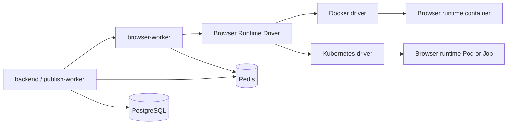

# Docker Decoupling and Kubernetes Deployment Plan

## Goal

Decouple MPP's runtime implementation from Docker-specific deployment assumptions
so the same application services can run under Docker Compose or Kubernetes.

Docker Compose should remain the local development and production-style smoke
test path. Kubernetes should become the supported production orchestration path
for teams that need stronger scheduling, rolling deployment, autoscaling, and
runtime isolation.

The main implementation target is the remote browser runtime. Today,
`browser-worker` creates browser runtime containers directly through the Docker
SDK. The target model is a runtime orchestration boundary where Docker is one
driver and Kubernetes is another driver.

## Current State

The repository already has a working containerized deployment baseline:

- Docker Compose starts the full stack behind Traefik.
- Service Dockerfiles exist for frontend, backend, browser-worker,
  collab-service, ai-service, and content-pipeline-service.
- PostgreSQL and Redis are provisioned by Compose for local and
  production-style deployments.
- Readiness endpoints exist for the main long-running services.
- `browser-worker` owns browser session lifecycle and creates one disposable
  browser runtime container per session.
- The browser runtime image packages Chromium, Xvfb, Openbox, x11vnc, noVNC,
  websockify, and a CDP proxy.

The current Docker-specific coupling points are:

| Coupling Point | Current Behavior | Impact |
| --- | --- | --- |
| Browser runtime orchestration | `browser-worker` initializes a Docker manager directly. | Kubernetes cannot start browser sessions without replacing application code. |
| Docker socket dependency | `browser-worker` mounts `/var/run/docker.sock`. | Production deployment requires privileged host runtime access. |
| Runtime identity | Browser sessions are tracked by Docker container IDs. | Session references are not portable across orchestrators. |
| Runtime networking | Compose attaches services to the `browser-runtime` network. | Kubernetes needs Pod DNS, Services, NetworkPolicy, and runtime endpoint discovery. |
| Gateway routing | Traefik Docker labels define HTTP routing. | Kubernetes needs Ingress or Gateway API resources. |
| Configuration | Compose `.env` files are the main deployment contract. | Kubernetes needs ConfigMaps, Secrets, and environment-specific values. |
| Observability | Alloy uses Docker discovery for logs. | Kubernetes needs Pod, namespace, and label discovery. |
| Browser runtime image startup | Compose has a `browser-runtime-image` service to build the image. | Kubernetes should pull images from a registry instead of using a dummy service. |

## Target Architecture

MPP should separate application behavior from runtime orchestration.

The browser runtime boundary should expose orchestration intent instead of
Docker details:

- start a runtime session
- return a stable runtime session reference
- return internal CDP and stream endpoints
- stop a runtime session
- inspect or recover a runtime session
- read the browser DevTools active port information when needed

Docker-specific concepts such as container IDs, Docker networks, Docker host
ports, and Docker socket paths should stay inside the Docker driver.
Kubernetes-specific concepts such as Pod names, namespaces, labels, Services,
Jobs, and NetworkPolicies should stay inside the Kubernetes driver.

## Decoupling Principles

- Keep Docker Compose as a supported deployment path.
- Treat Docker and Kubernetes as deployment/runtime drivers, not business logic.
- Keep browser session state in Redis and durable audit state in PostgreSQL.
- Use environment-driven runtime selection, for example
  `BROWSER_RUNTIME_DRIVER=docker|kubernetes`.
- Do not expose raw CDP endpoints to the frontend in either runtime.
- Keep runtime session cleanup idempotent because workers, Pods, and containers
  can disappear independently.
- Use Kubernetes-native health, readiness, rollout, and discovery mechanisms
  instead of translating Compose behavior literally.
- Prefer managed PostgreSQL and Redis in production Kubernetes environments,
  while keeping optional in-cluster manifests for self-hosted deployments.

## Required Work

### 1. Runtime Orchestration Boundary

- Define a `BrowserRuntimeManager` interface in `browser-worker`.
- Replace direct Docker manager construction in `main.go` with a small factory
  selected by environment configuration.
- Introduce a runtime-neutral session reference type that can store driver,
  runtime ID, endpoint metadata, and cleanup labels.
- Update session state to store runtime-neutral worker references instead of
  assuming Docker container IDs.
- Ensure shutdown and TTL cleanup call the runtime interface rather than a
  Docker-specific method.

### 2. Docker Driver Extraction

- Move the existing Docker SDK logic behind the new runtime interface.
- Keep existing Compose behavior unchanged for local development.
- Preserve support for `BROWSER_RUNTIME_IMAGE`,
  `BROWSER_RUNTIME_NETWORK`, `BROWSER_RUNTIME_BIND_IP`, and
  `BROWSER_RUNTIME_HOST`.
- Keep Docker-specific tests focused on Docker port mapping, runtime network IP
  lookup, and container cleanup.

### 3. Kubernetes Runtime Driver

- Add a Kubernetes driver in `browser-worker`.
- Use Kubernetes client-go or an equivalent Go Kubernetes client.
- Start one browser runtime Pod or Job per browser session.
- Apply session labels such as app, component, session ID, owner hash, and
  expiration timestamp.
- Configure CPU and memory requests/limits equivalent to the Docker runtime
  defaults.
- Discover the runtime endpoint through Pod IP or a per-session Service.
- Wait for runtime readiness before returning the stream endpoint.
- Delete the Pod or Job on success, cancel, failure, or TTL expiry.
- Make cleanup idempotent when the Pod or Job is already gone.
- Read DevTools active port information through an HTTP endpoint or Kubernetes
  exec/copy strategy that does not require Docker APIs.

### 4. Kubernetes Application Deployment

- Create Kubernetes manifests or a Helm/Kustomize package for:
  - frontend
  - backend API
  - publish-worker
  - browser-worker
  - collab-service
  - ai-service
  - content-pipeline-service
  - PostgreSQL, if self-hosted
  - Redis, if self-hosted
- Define Deployments for long-running stateless services.
- Define a worker Deployment for `publish-worker` with no HTTP readiness probe
  unless a worker health endpoint is added.
- Define Services for internal service discovery.
- Configure liveness and readiness probes for HTTP services.
- Configure a gRPC readiness strategy for content-pipeline-service or add an
  HTTP health endpoint.
- Define resource requests and limits for each service.
- Define PodDisruptionBudgets for production-critical services.
- Define HorizontalPodAutoscaler resources where metrics are available and safe.

### 5. Kubernetes Networking and Gateway

- Replace Traefik Docker labels with Kubernetes Ingress or Gateway API
  resources.
- Route frontend traffic to the Next.js service.
- Route `/collab` WebSocket traffic to collab-service.
- Route backend dashboard APIs according to the frontend/backend proxy model.
- Configure TLS through cert-manager, cloud load balancer certificates, or a
  manual Secret.
- Define NetworkPolicies that allow only required service-to-service traffic.
- Restrict browser runtime CDP access to browser-worker.
- Restrict browser runtime stream access to the authenticated backend or
  browser-worker proxy path.
- Block browser runtime access to internal cluster services where practical.

### 6. Configuration and Secrets

- Convert Compose `.env` deployment settings into Kubernetes ConfigMaps and
  Secrets.
- Keep secrets out of ConfigMaps and source control.
- Define required Secret keys for JWT, internal collaboration tokens, cookie
  encryption, database credentials, Redis credentials, OAuth credentials, and
  LLM provider credentials.
- Support external secret managers through documented integration points.
- Document environment variable parity between Compose and Kubernetes.
- Validate required settings at service startup with clear error messages.

### 7. Data Services

- Support two Kubernetes data-service modes:
  - managed PostgreSQL and managed Redis
  - self-hosted PostgreSQL and Redis for small installations or test clusters
- Add connection configuration for managed services.
- Document backup, restore, retention, and maintenance expectations.
- Ensure migration or schema initialization remains a backend responsibility,
  not a Kubernetes manifest side effect.

### 8. Observability

- Replace Docker log discovery with Kubernetes Pod discovery for Kubernetes
  deployments.
- Preserve Docker discovery for Compose deployments.
- Add common labels for service, environment, version, namespace, and runtime.
- Scrape service metrics through Kubernetes ServiceMonitor, PodMonitor, or
  equivalent scrape configs.
- Add browser runtime metrics for active sessions, startup failures, cleanup
  failures, TTL expirations, and runtime driver errors.
- Add alerts for browser runtime cleanup lag, Redis connectivity failures,
  backend readiness failures, and high publish-worker retry rates.

### 9. Image Build and Release

- Push production images to a registry instead of relying on local Compose
  builds.
- Tag images by immutable Git SHA and optionally by release version.
- Publish the browser runtime image as a normal deployable artifact.
- Add CI checks that build all service images.
- Add a Kubernetes manifest validation step with kubeconform, kubeval, Helm
  lint, or Kustomize build validation.
- Document image promotion from development to staging to production.

### 10. Deployment Documentation

- Add a Kubernetes production setup guide.
- Document required cluster prerequisites.
- Document managed database and Redis setup.
- Document TLS setup.
- Document runtime driver selection.
- Document operational runbooks for deploy, rollback, browser session cleanup,
  secret rotation, and service scaling.
- Update the tech stack documentation once Kubernetes is implemented.

## Kubernetes Deployment Model

### Services

| Service | Kubernetes Resource | Notes |
| --- | --- | --- |
| frontend | Deployment + Service | Public web entrypoint through Ingress or Gateway. |
| backend | Deployment + Service | API role with HTTP readiness and Redis/PostgreSQL dependencies. |
| publish-worker | Deployment | Worker role; should use Redis and PostgreSQL; no public Service required. |
| browser-worker | Deployment + Service + RBAC | Needs permission to create, watch, and delete browser runtime Pods or Jobs. |
| browser runtime | Pod or Job per session | Short-lived runtime created by browser-worker. |
| collab-service | Deployment + Service | WebSocket-capable routing under `/collab`. |
| ai-service | Deployment + Service | Internal HTTP service. |
| content-pipeline-service | Deployment + Service | Internal gRPC service. |
| PostgreSQL | Managed service or StatefulSet | Managed service recommended for production. |
| Redis | Managed service or StatefulSet | Managed service recommended for production. |

### Browser Runtime Pod Model

The Kubernetes browser runtime should start as one short-lived Pod or Job per
session. The recommended first implementation is a Pod managed directly by
browser-worker because session lifecycle is already owned by browser-worker and
the runtime must be deleted immediately after success, cancel, or expiry.

Each runtime Pod should include:

- browser runtime image
- session ID label
- owner hash label, not raw user ID
- expiration timestamp annotation
- resource requests and limits
- readiness probe for stream/CDP availability
- restricted security context
- no mounted service account token unless required
- NetworkPolicy allowing only required ingress from browser-worker

If direct Pod management becomes hard to operate, the driver can move to Jobs
with TTL cleanup after the initial Kubernetes support is proven.

### RBAC

`browser-worker` needs a scoped ServiceAccount that can:

- create browser runtime Pods or Jobs in the configured namespace
- get/list/watch runtime Pods or Jobs with MPP labels
- delete runtime Pods or Jobs with MPP labels
- optionally create/delete per-session Services if the endpoint model uses
  Services instead of Pod IPs
- read Pod status and events for diagnostics

It should not receive broad cluster-admin privileges.

## Progress Tracker

| ID | Work Item | Area | Status | Progress | Owner | Evidence / Notes |
| --- | --- | --- | --- | ---: | --- | --- |
| K8S-001 | Keep Docker Compose deployment working | Deployment baseline | Done | 100% | DevOps | `deploy/docker/docker-compose.yml` and setup docs exist. |
| K8S-002 | Service Dockerfiles for app services | Image baseline | Done | 100% | DevOps | Service Dockerfiles exist for the main modules. |
| K8S-003 | HTTP health and readiness endpoints | Operations | Done | 100% | Backend / Services | Main HTTP services expose readiness, and `deploy/kubernetes/app-baseline` configures content-pipeline-service with Kubernetes gRPC readiness and liveness probes. |
| K8S-004 | Identify Docker coupling points | Architecture | Done | 100% | Architecture | Coupling points are listed in this document. |
| K8S-005 | Define browser runtime manager interface | Runtime decoupling | Done | 100% | Backend | `browser-worker/internal/runtime` defines the runtime manager interface and session reference. |
| K8S-006 | Extract existing Docker logic into Docker driver | Runtime decoupling | Done | 100% | Backend | Docker manager now implements the runtime interface while preserving existing Compose behavior. |
| K8S-007 | Keep Docker runtime tests after extraction | Runtime quality | Done | 100% | Backend | Existing Docker helper tests still pass; runtime boundary tests cover stable references. |
| K8S-008 | Add runtime driver factory and env selection | Runtime decoupling | Done | 100% | Backend | `BROWSER_RUNTIME_DRIVER` selects Docker by default and rejects unsupported drivers. |
| K8S-009 | Add Kubernetes runtime driver | Runtime orchestration | Done | 100% | Backend | Kubernetes driver creates per-session Pods, waits for Pod readiness and Pod IP endpoints, sets active deadlines, and reaps expired runtime Pods after worker restarts. |
| K8S-010 | Add Kubernetes runtime RBAC | Security | Done | 100% | DevOps | `deploy/kubernetes/browser-runtime-control` defines dedicated system/runtime namespaces, browser-worker ServiceAccount, runtime Pod Role/RoleBinding, and admission guardrails, including list/watch for cleanup reconciliation. |
| K8S-011 | Add browser runtime NetworkPolicy | Security | Done | 100% | DevOps | `deploy/kubernetes/browser-runtime-control` defaults runtime namespace traffic to deny, permits CDP/stream ingress only from browser-worker, and restricts runtime DNS egress to cluster DNS. |
| K8S-012 | Define Kubernetes service manifests | Kubernetes deployment | Partially Done | 98% | DevOps | `deploy/kubernetes/app-baseline` defines renderable Deployment/Service bases, PDBs, HPAs, restricted workload security contexts, and app namespace default-deny plus public/internal ingress allowlist NetworkPolicies; `deploy/kubernetes/observability` owns trusted metrics namespace L4 port allowlists; `deploy/kubernetes/overlays/staging-self-hosted`, `deploy/kubernetes/overlays/staging-managed`, and `deploy/kubernetes/overlays/production-managed` combine the app baseline with runtime controls and data services as renderable environment starters; provider-specific hardening remains future work. |
| K8S-013 | Define Kubernetes ingress or gateway | Kubernetes deployment | Done | 100% | DevOps | `deploy/kubernetes/app-baseline/ingress.yaml` routes `/collab` WebSocket traffic to collab-service and all remaining public traffic to frontend. |
| K8S-014 | Define Kubernetes ConfigMaps and Secrets | Configuration | Partially Done | 92% | DevOps | `deploy/kubernetes/app-baseline/app-config.yaml` captures non-secret config placeholders, including PostgreSQL TLS policy; app workloads now reference required browser-worker, AI, and content-pipeline internal-token Secret keys; `deploy/kubernetes/validation/app-baseline` supplies fake CI-only Secret material; staging overlays supply renderable ConfigMaps and example Secret generators for managed and self-hosted data modes; `deploy/kubernetes/external-secrets` defines a provider-neutral External Secrets Operator contract for production `mpp-app-secrets`; `deploy/kubernetes/overlays/production-managed` renders that ExternalSecret while rejecting checked-in raw Secrets; `script/kubernetes/render-app-secret.rb` renders a validated one-time `mpp-app-secrets` manifest from temporary env material. |
| K8S-015 | Support managed PostgreSQL configuration | Data services | Partially Done | 88% | DevOps / Backend | `deploy/kubernetes/data-services/managed` provides PostgreSQL managed-service guidance, backend/collab-service support `DB_SSLMODE` and `DB_SSLROOTCERT`, `deploy/kubernetes/overlays/staging-managed` validates provider-host `DB_HOST` with `DB_SSLMODE=verify-full`, and `deploy/kubernetes/overlays/production-managed` adds a renderable production managed PostgreSQL starter; provider-specific overlays remain future work. |
| K8S-016 | Support managed Redis configuration | Data services | Partially Done | 88% | DevOps / Backend | `deploy/kubernetes/data-services/managed` provides a Redis ExternalName, app config supports `REDIS_TLS`, managed overlays validate that TLS Redis addresses use the provider hostname instead of the in-cluster alias, and `deploy/kubernetes/overlays/production-managed` adds a renderable production managed Redis starter; provider-specific overlays remain future work. |
| K8S-017 | Add optional in-cluster PostgreSQL manifests | Data services | Partially Done | 85% | DevOps | `deploy/kubernetes/data-services/self-hosted` includes a restricted PostgreSQL StatefulSet, PgBouncer writer pool, NetworkPolicy limited to app/PgBouncer/backup clients, and a `postgres-backup` CronJob that writes retained custom-format dumps to `mpp-data-backups`; TLS overlays and external backup export remain future work. |
| K8S-018 | Add optional in-cluster Redis manifests | Data services | Partially Done | 85% | DevOps | `deploy/kubernetes/data-services/self-hosted` includes a restricted Redis StatefulSet, NetworkPolicy limited to Redis-dependent app/backup clients, and a `redis-backup` CronJob that writes retained RDB snapshots to `mpp-data-backups`; production hardening overlays and external backup export remain future work. |
| K8S-019 | Add Kubernetes observability discovery | Observability | Done | 100% | DevOps | `deploy/kubernetes/observability` adds Alloy Kubernetes Pod log discovery plus PodMonitor metric discovery for MPP workloads. |
| K8S-020 | Add runtime session metrics and alerts | Observability | Done | 100% | Backend / DevOps | `browser-worker` exposes runtime lifecycle metrics; `publish-worker` exposes publish job outcome metrics; `deploy/kubernetes/observability` defines runtime, readiness, Redis-dependent readiness, and publish-worker job failure alerts. |
| K8S-021 | Publish images to a registry | Release | Partially Done | 90% | DevOps | `.github/workflows/container-images.yml` publishes all service and browser runtime images to GHCR on `main`, `v*` tags, and manual dispatches with immutable `sha-<full-git-sha>` tags; pull requests build every image without pushing when service image inputs change; `script/kubernetes/pin-overlay-images.rb` pins app and browser runtime images in environment overlays to one promoted Git SHA; provider-specific promotion automation remains future work. |
| K8S-022 | Add manifest validation in CI | Release quality | Done | 100% | DevOps | CI detects `deploy/kubernetes` changes, builds every Kustomize package, runs a split Ruby policy validator for app images, workload security, probes, resources, Services, Ingress, browser runtime RBAC/NetworkPolicy/admission policy, observability rules, data-service package shape, and environment overlay invariants, and runs strict kubeconform schema validation for built-in Kubernetes APIs through stdin so temporary render files are parsed; deployable overlay validation can reject example hosts, all-zero image tags, example model values, and example Secret values where Secrets are rendered. |
| K8S-023 | Add Kubernetes production setup guide | Documentation | Partially Done | 94% | Documentation | `doc/setup-kubernetes.md` documents prerequisites, overlays, secrets, data services, self-hosted backup starters, runtime selection, ingress namespace labeling, app NetworkPolicy boundaries, trusted metrics namespace L4 boundaries, observability, validation, staging-managed, staging-self-hosted, production-managed strict validation, and deployment flow; provider-specific overlays remain future work. |
| K8S-024 | Add Kubernetes operations runbooks | Operations | Done | 100% | Documentation / DevOps | `doc/kubernetes-operations-runbook.md` covers incident triage, deploys, rollback, readiness alerts, Redis/PostgreSQL, publish-worker, browser runtime, collaboration, AI/content pipeline, observability, NetworkPolicy/RBAC, secret rotation, scaling, image promotion, and postmortems. |
| K8S-025 | Run end-to-end Kubernetes smoke test | Verification | Done | 100% | QA / DevOps | `script/kubernetes/smoke-test` adds a Go live-cluster smoke harness for rollout status, Service endpoints, config and Secret shape, internal readiness, publish-worker dependencies, runtime RBAC, runtime cleanup metadata, runtime Pod security/resources/ports, public Ingress route contracts, app NetworkPolicy contracts, browser-worker Kubernetes runtime configuration, runtime admission policy shape, public frontend readiness, authenticated dashboard/project probes, collaboration session probes, and remote browser session start/cancel; `--full-e2e` requires the public URL, smoke auth token, project ID, user-flow probes, and browser-session lifecycle probe; authenticated API probes preserve 3xx redirects instead of following them to a 200 login or frontend page and validate contract-level JSON fields so 200 HTML fallbacks fail, with regression coverage for both behaviors; failed smoke runs collect app/runtime Pod summaries, namespace events, and browser-worker Deployment diagnostics with configurable output length; JSON and JUnit reports provide CI artifacts; `.github/workflows/kubernetes-smoke.yml` runs the full E2E profile against a protected GitHub environment with kubeconfig and smoke credentials; `script/ci/kubernetes.sh` verifies the smoke harness dry-run and report generation path. |

## Phased Execution Plan

### Phase 1: Runtime Boundary

Goal: make Docker an implementation detail without changing current Compose
behavior.

- Add the runtime manager interface.
- Add the runtime-neutral session reference.
- Move Docker SDK logic behind the Docker driver.
- Add runtime driver selection by environment variable.
- Keep Docker Compose behavior and tests passing.

Exit criteria:

- Docker Compose can still start browser sessions.
- `browser-worker` no longer hardcodes Docker manager construction in the main
  application path.
- Docker-specific types do not leak outside the Docker driver boundary.

### Phase 2: Kubernetes Runtime Driver

Goal: let `browser-worker` create browser runtime sessions without Docker.

- Implement Kubernetes Pod-based runtime creation.
- Add driver configuration for namespace, image, labels, resources, and cleanup.
- Add readiness polling and endpoint discovery.
- Add runtime deletion and orphan cleanup.
- Add RBAC and NetworkPolicy manifests for browser runtime sessions.

Exit criteria:

- A browser session can start and stop in Kubernetes.
- CDP and stream endpoints remain private.
- Expired sessions are cleaned up even if a service restarts.

### Phase 3: Kubernetes Service Deployment

Goal: run all long-running MPP services under Kubernetes.

- Add manifests or Helm/Kustomize package for all services.
- Add Services, probes, resource limits, ConfigMaps, and Secrets.
- Add Ingress or Gateway API routing.
- Add managed PostgreSQL and Redis configuration.
- Add optional in-cluster PostgreSQL and Redis manifests for non-production or
  small deployments.

Exit criteria:

- Frontend, backend, workers, collaboration, AI, content pipeline, Redis, and
  PostgreSQL dependencies are deployable in Kubernetes.
- Public web and WebSocket routes work through Kubernetes ingress.
- Service-to-service discovery uses Kubernetes DNS.

### Phase 4: Observability, CI, and Operations

Goal: make the Kubernetes deployment operable.

- Add Kubernetes log and metrics discovery.
- Add runtime session metrics and alerts.
- Push immutable images to a registry.
- Validate manifests in CI.
- Document deployment, rollback, scaling, cleanup, backup, restore, and secret
  rotation.

Exit criteria:

- A staging cluster can deploy from CI-built images.
- Operators can see service health, runtime session failures, and cleanup lag.
- Rollback and cleanup procedures are documented and tested.

## Acceptance Criteria

Kubernetes support is complete when:

- Docker Compose remains functional for local development and smoke testing.
- `browser-worker` supports both Docker and Kubernetes runtime drivers.
- Kubernetes can deploy all long-running services from registry images.
- Browser runtime sessions can start, stream, complete, expire, and clean up in
  Kubernetes.
- Raw CDP and VNC ports are not exposed publicly.
- Kubernetes ingress supports web traffic and collaboration WebSocket traffic.
- Configuration and secrets are managed through Kubernetes-native resources or
  an external secret manager.
- Logs and metrics are discoverable in Kubernetes.
- CI validates image builds and Kubernetes manifests.
- Documentation explains setup, rollback, cleanup, scaling, and secret rotation.

## Risks and Mitigations

| Risk | Impact | Mitigation |
| --- | --- | --- |
| Browser runtime Pods leak after worker crashes. | Resource waste and possible stale sessions. | Store session TTL in Redis, label Pods with expiration, and run idempotent cleanup. |
| CDP endpoint becomes reachable from unrelated Pods. | Security boundary failure. | Use NetworkPolicy and bind access to browser-worker only. |
| Kubernetes driver diverges from Docker behavior. | Bugs appear only in one deployment mode. | Keep shared runtime contract tests and driver-specific integration tests. |
| Managed Redis or PostgreSQL settings differ by cloud. | Deployment friction. | Keep database and Redis configuration environment-driven and document required variables. |
| Ingress WebSocket behavior differs across controllers. | Collaboration or browser streaming failures. | Document tested ingress controllers and include WebSocket smoke tests. |
| Direct Pod management is too low-level. | More code to maintain. | Start with direct Pods for control; move to Jobs if operations require Kubernetes-owned lifecycle semantics. |

## Assumptions

- Kubernetes support targets production and staging deployments first.
- Docker Compose remains the recommended local development workflow.
- The first Kubernetes browser runtime implementation will use short-lived Pods
  managed by `browser-worker`.
- Managed PostgreSQL and Redis are recommended for production Kubernetes.
- Self-hosted PostgreSQL and Redis manifests are optional support assets, not
  the preferred production data platform.
- This plan does not require introducing a service mesh.
- This plan does not require replacing Traefik in Compose.
- Kubernetes manifests may be implemented as raw manifests, Kustomize overlays,
  or Helm charts, but the implementation should pick one packaging strategy
  before the Kubernetes deployment work starts.
