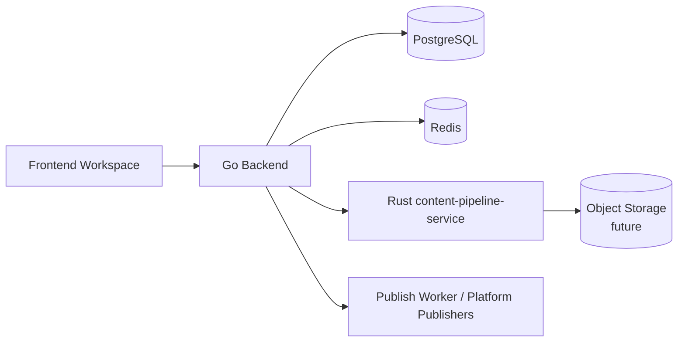

# Rust Media Asset and Platform Draft Compiler Plan

## 1. Decision

Introduce a Rust-backed content processing layer for two business capabilities:

- Media asset processing and platform asset adaptation.
- Platform draft compilation.

This plan does not propose rewriting the Go backend. The Go backend should continue to own authentication, user scope, project state, publication state, account credentials, queue orchestration, and database transactions. Rust should be introduced only where it provides a stronger fit than Go for the business workload: deterministic content transformation, binary media processing, strict schema validation, and bounded resource execution.

The first Rust service should be a small internal service, tentatively named `content-pipeline-service`.



## 2. Why These Capabilities Fit Rust

Most backend modules in MPP are orchestration-heavy and remain a good fit for Go. These two modules are different.

Media processing deals with untrusted external bytes, large memory buffers, image decoding, resizing, compression, MIME detection, and platform-specific asset constraints. Rust gives this workload precise memory ownership, predictable resource cleanup, strong error types, and a mature ecosystem for safe binary processing.

Draft compilation deals with deterministic transformations from source content into platform-specific payloads. It benefits from strong enums, explicit error variants, strict schema versions, exhaustive matching, and highly testable pure transformation pipelines. Rust can make platform rules feel closer to a compiler than scattered helper functions.

## 3. Scope

| Capability | Included | Notes |
| --- | --- | --- |
| Image download | Yes | Fetch remote images with size, timeout, MIME, and redirect limits. |
| Data URL decoding | Yes | Decode inline images safely with maximum payload limits. |
| Image validation | Yes | Detect MIME, dimensions, byte size, and unsupported formats. |
| Image resizing/compression | Yes | Generate platform-compliant images, especially for WeChat covers and inline assets. |
| Platform asset adaptation | Yes | Convert source assets into platform-ready asset descriptors. |
| Draft compilation | Yes | Compile source project content into platform draft payloads. |
| Draft schema validation | Yes | Validate input and output against versioned platform draft schemas. |
| Object storage upload | Future | Keep an interface ready, but do not require it for the first implementation. |
| Platform API publishing | No | Publishing execution remains in Go for this phase. |
| Browser automation | No | Browser-based publishing stays in `browser-worker`. |
| User permissions | No | Go backend remains the permission boundary. |
| Database ownership | No | Rust should not directly mutate publication state in this phase. |

## 4. Current Code Touchpoints

The current Go backend already contains the natural seams for these modules:

- `backend/internal/pkg/media/compressor.go` downloads and compresses images for platform constraints.
- `backend/internal/pkg/html/processor.go` scans HTML and replaces image sources.
- `backend/internal/publisher/platforms/wechat/wechat.go` processes inline images and cover images before creating a WeChat draft.
- `backend/internal/publisher/platforms/x/x.go` contains X text extraction, URL weighting, and truncation rules.
- `backend/internal/publisher/platforms/zhihu/zhihu.go` compiles source HTML into Markdown.
- `backend/internal/publisher/platforms/douyin/douyin.go` extracts plain text and prepares image-based publishing input.

These are business-specific transformations. They are not merely infrastructure utilities.

## 5. Module 1: Media Asset Processing and Platform Asset Adaptation

### 5.1 Responsibility

This module turns source media references into platform-ready assets.

Inputs:

- Remote image URL.
- Data URL.
- Existing MPP asset reference.
- Optional platform key.
- Optional usage kind, such as `cover`, `inline_image`, `thumbnail`, or `gallery_image`.

Outputs:

- Normalized asset metadata.
- Processed bytes or temporary object reference.
- MIME type.
- Width and height.
- Byte size.
- Hash.
- Platform compliance status.
- Structured warnings and errors.

### 5.2 Platform Rules

The first platform rules should be deliberately small:

| Platform | Usage | Rule |
| --- | --- | --- |
| WeChat | cover | Must produce an uploadable image under the configured size limit. |
| WeChat | inline image | Must produce uploadable bytes and preserve HTML replacement metadata. |
| Douyin | cover/image post | Must produce a local or object-backed image reference suitable for upload automation. |
| Generic | all | Reject unsupported MIME types, oversized inputs, and unsafe URLs. |

Rules should live in Rust as versioned platform profiles:

```text
wechat@v1
douyin@v1
generic@v1
```

### 5.3 Proposed Interface

Start with an internal HTTP API. gRPC can be introduced later if there is enough traffic or if streaming payloads become important.

```http
POST /internal/media/process
Content-Type: application/json
```

```json
{
  "request_id": "uuid",
  "platform": "wechat",
  "usage": "cover",
  "source": {
    "type": "url",
    "value": "https://example.com/cover.jpg"
  },
  "constraints": {
    "max_bytes": 2097152,
    "preferred_mime_types": ["image/jpeg", "image/png"]
  }
}
```

Response:

```json
{
  "asset": {
    "content_ref": "inline-bytes-or-object-ref",
    "mime_type": "image/jpeg",
    "byte_size": 732145,
    "width": 1200,
    "height": 675,
    "sha256": "hex"
  },
  "status": "ready",
  "warnings": []
}
```

For the first version, returning bytes as base64 is acceptable for small assets. Once object storage is introduced, the service should return an object reference instead.

### 5.4 Why This Should Not Stay in Go Long Term

Go is good enough for the current implementation, but media processing has different pressure points:

- Large byte buffers can increase Go heap pressure.
- Image decoding and resizing benefit from tight memory control.
- Asset processing should be isolated from request handlers and publishing orchestration.
- Platform asset rules will grow independently from publication state rules.
- The module can be tested with golden files and property-style constraints.

Rust gives better leverage here without forcing distributed business transactions.

## 6. Module 2: Platform Draft Compiler

### 6.1 Responsibility

This module turns a canonical MPP source project into platform-specific draft payloads.

Inputs:

- Project title.
- Source content.
- Source content format.
- Platform key.
- Optional platform config.
- Optional asset references.
- Compiler profile version.

Outputs:

- Versioned platform draft payload.
- Human-readable summary.
- Extracted text.
- Platform-specific warnings.
- Validation errors.
- Asset processing requests, if assets must be normalized before publishing.

### 6.2 Draft Compilation Targets

Initial platform targets:

| Platform | Draft Format | Example Rules |
| --- | --- | --- |
| WeChat | HTML | Preserve rich text, normalize images, prepare cover and inline assets. |
| Zhihu | Markdown | Convert source HTML to Markdown, preserve headings and links. |
| X | Text | Extract text, apply weighted length rules, truncate safely. |
| Douyin | Text + image assets | Extract concise text and prepare image publishing inputs. |

### 6.3 Proposed Interface

```http
POST /internal/drafts/compile
Content-Type: application/json
```

```json
{
  "request_id": "uuid",
  "project": {
    "id": "uuid",
    "title": "Post title",
    "source_format": "html",
    "source_content": "<h1>Hello</h1><p>World</p>"
  },
  "targets": [
    {
      "platform": "wechat",
      "profile": "wechat@v1",
      "config": {
        "cover_image_url": "https://example.com/cover.jpg"
      }
    },
    {
      "platform": "x",
      "profile": "x@v1"
    }
  ]
}
```

Response:

```json
{
  "drafts": [
    {
      "platform": "wechat",
      "profile": "wechat@v1",
      "status": "compiled",
      "adapted_content": {
        "schema_version": 1,
        "format": "html",
        "html": "<h1>Hello</h1><p>World</p>"
      },
      "summary": "Hello World",
      "warnings": []
    },
    {
      "platform": "x",
      "profile": "x@v1",
      "status": "compiled",
      "adapted_content": {
        "schema_version": 1,
        "format": "text",
        "text": "Hello\n\nWorld"
      },
      "summary": "Hello World",
      "warnings": []
    }
  ]
}
```

### 6.4 Compiler Design

The compiler should be organized around explicit stages:

1. Parse source content into an internal document model.
2. Normalize whitespace, links, headings, images, and unsupported nodes.
3. Apply platform profile rules.
4. Emit versioned adapted content.
5. Validate the emitted payload against the target schema.
6. Return warnings for lossy transformations.

The internal document model does not need to be a full editor schema. It only needs enough structure to produce platform drafts consistently.

### 6.5 Why This Should Not Stay in Go Long Term

The current platform adapters mix draft adaptation and publishing behavior. As platforms grow, that will make publication code harder to reason about. A Rust compiler module can keep platform transformation rules:

- Pure.
- Deterministic.
- Exhaustively tested.
- Versioned by platform profile.
- Independent from publication execution.

This is a better fit for Rust than Go because the core work is not HTTP orchestration. It is schema-driven transformation.

## 7. Go Backend Responsibilities After Extraction

The Go backend remains the business authority.

It should still own:

- User authentication.
- Project ownership checks.
- Publication record creation and updates.
- Platform account credentials.
- Queue enqueueing.
- Publish locks.
- Publication status transitions.
- Persisting `adapted_content` into PostgreSQL.
- Calling platform publishers or publish workers.

The Rust service should not decide whether a user may publish a project. It should only process content it receives from the trusted backend.

## 8. Data Ownership

The first Rust implementation should be stateless.

| Data | Owner |
| --- | --- |
| Users | Go backend / PostgreSQL |
| Projects | Go backend / PostgreSQL |
| Publications | Go backend / PostgreSQL |
| Platform accounts | Go backend / PostgreSQL |
| Draft compiler profiles | Rust service code |
| Media processing profiles | Rust service code |
| Temporary processed media | Rust service memory or temp storage |
| Durable assets | Future object storage |

Avoid giving the Rust service direct database write access in the first phase. This keeps the migration reversible.

## 9. Migration Plan

### Phase 1: Extract Media Processing Behind an Adapter

Goal: replace the current in-process media processing path with an internal service call.

Deliverables:

- Rust `POST /internal/media/process`.
- Go client wrapper in the existing media package.
- Feature flag to switch between Go implementation and Rust implementation.
- Golden tests comparing output constraints, not exact bytes.
- Metrics for input size, output size, duration, failures, and platform usage.

Acceptance:

- WeChat cover images remain under the required size limit.
- Inline image replacement still works for WeChat drafts.
- Unsafe or oversized inputs fail with structured errors.
- Go fallback can be re-enabled without schema changes.

### Phase 2: Extract Platform Draft Compilation

Goal: move platform-specific draft adaptation out of publisher implementations.

Deliverables:

- Rust `POST /internal/drafts/compile`.
- Go compiler client used by prepublish sync.
- Platform profiles for WeChat, Zhihu, X, and Douyin.
- Contract tests for each platform profile.
- Snapshot tests for representative source documents.

Acceptance:

- Existing platform draft responses preserve the same public API shape.
- X text still respects weighted length behavior.
- Zhihu Markdown output is stable across repeated compilation.
- WeChat HTML output preserves supported rich content.
- Unsupported source structures return warnings instead of silent corruption.

### Phase 3: Add Object Storage Integration

Goal: prevent large media bytes from moving repeatedly through the Go backend.

Deliverables:

- Object storage abstraction in Rust.
- Signed or internal object references returned to Go.
- Asset hash and deduplication support.
- Expiration policy for temporary objects.

Acceptance:

- Large processed images no longer need to be stored in publication JSON.
- Publishing code can fetch or pass object references without exposing private URLs to the frontend.

### Phase 4: Expand Platform Profiles

Goal: make platform changes safer and easier to review.

Deliverables:

- Profile versioning policy.
- Compatibility tests for old adapted content.
- Per-platform fixtures.
- Changelog for platform profile changes.

Acceptance:

- Adding a new platform does not require editing existing platform compilers except shared utilities.
- Profile changes are visible in tests and release notes.

## 10. Failure Model

The Rust service must return structured errors.

Recommended error classes:

| Error | Meaning |
| --- | --- |
| `invalid_input` | The backend sent malformed content or config. |
| `unsupported_format` | The source or output format is not supported. |
| `unsafe_source` | URL, redirect, MIME, or payload failed safety checks. |
| `resource_limit_exceeded` | Size, dimensions, timeout, or memory guard rejected the request. |
| `compile_failed` | Draft compilation failed for a platform-specific reason. |
| `transient_failure` | External fetch or temporary infrastructure failure. |

The Go backend should translate these into existing user-facing errors and persist enough context for debugging.

## 11. Observability

The Rust service should expose:

- `/health`
- `/ready`
- `/metrics`

Metrics:

| Metric | Purpose |
| --- | --- |
| `mpp_content_pipeline_requests_total` | Count requests by route, platform, status, and error class. |
| `mpp_content_pipeline_duration_seconds` | Track processing and compilation latency. |
| `mpp_media_input_bytes` | Track media input size. |
| `mpp_media_output_bytes` | Track processed media size. |
| `mpp_draft_compile_warnings_total` | Track lossy or partial platform transformations. |

Logs should include request ID, platform, profile, usage, duration, and error class. Do not log raw content, raw image bytes, credentials, cookies, or signed URLs.

## 12. Security Requirements

Media processing must treat all external sources as untrusted.

Required controls:

- Maximum response size.
- Maximum decoded image size.
- Download timeout.
- Redirect limit.
- Allowed schemes: `https` and controlled `data` URLs only.
- Private network and localhost blocking for remote URLs.
- MIME sniffing, not only trusting response headers.
- Temporary file cleanup.
- No raw source URL logging when it may contain secrets.

Draft compilation must treat source content as untrusted HTML.

Required controls:

- Avoid script execution.
- Normalize or drop unsupported nodes.
- Preserve only supported attributes.
- Return warnings for lossy transformations.
- Keep platform compiler output schema-validated.

## 13. Non-goals

This plan does not include:

- Rewriting Go backend APIs in Rust.
- Moving publication state transitions to Rust.
- Moving queue workers to Rust.
- Rewriting `browser-worker`.
- Rewriting `collab-service`.
- Replacing the AI service.
- Introducing Kafka, Kubernetes, or service mesh.
- Giving Rust direct ownership of user credentials or platform cookies.

## 14. Risks and Mitigations

| Risk | Mitigation |
| --- | --- |
| The service boundary adds latency. | Batch draft compilation by project and targets; keep media processing async where possible. |
| Byte payloads become expensive over HTTP. | Use object references after Phase 3; keep base64 only for small initial cases. |
| Draft output changes unexpectedly. | Use fixtures, golden tests, and profile versioning. |
| Platform rules duplicate Go logic during migration. | Keep Go fallback temporarily, then delete old adapter logic once contract tests pass. |
| Rust service failure blocks prepublish sync. | Add feature flag and fallback path during rollout. |

## 15. Success Criteria

The extraction is successful when:

- Media processing can be scaled independently from Go API replicas.
- Platform draft compilation is deterministic and covered by platform fixtures.
- Go publisher implementations no longer contain most draft transformation logic.
- WeChat and X rules are easier to change without touching queue or database code.
- Large media processing does not increase Go backend memory pressure.
- The Rust service can be disabled without corrupting publication state.

## 16. Recommended First Milestone

Start with media processing, not draft compilation.

Reason:

- It has the clearest Rust advantage over Go.
- It has a small input/output contract.
- It is easy to feature-flag.
- It does not require changing publication state semantics.
- It creates immediate isolation for the most resource-sensitive content path.

After that, move X and WeChat draft compilation into Rust because they are the easiest profiles to validate with deterministic fixtures.
