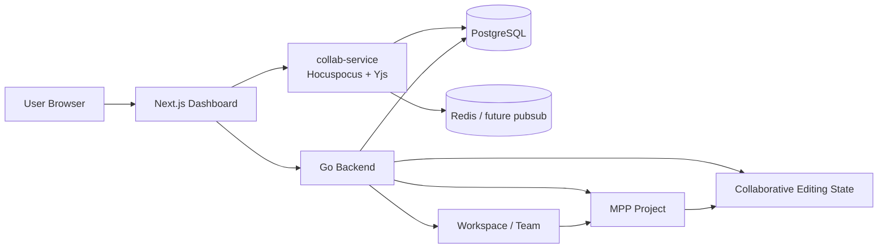
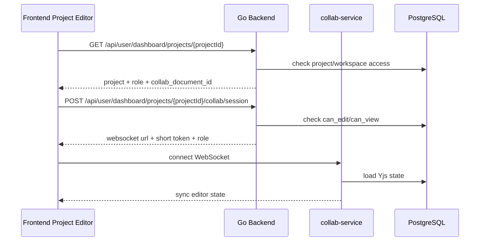

# MPP Workspace and Team Collaboration Architecture Plan

## 1. Product Direction

The merged collaborative editor work provides the real-time editing foundation,
but the current standalone "collaborative document" page is not the final
product model.

The product should move toward a WPS/Notion-like collaboration model:

1. Users can share an existing MPP Project with other users.
2. Users can create a Workspace, invite team members, and let members access the
   Projects that belong to that Workspace.

The standalone collaborative document experience should be treated as a
technical foundation and temporary entry point. Long term, collaboration belongs
inside the user's actual content workflow: Projects, prepublish drafts, platform
settings, publishing permissions, and team ownership.

## 2. Current Merged State

### 2.1 Completed Foundation

| Area | Status | Evidence |
| --- | --- | --- |
| Backend collaborative document model | Done | `backend/internal/models/collab.go` defines documents, collaborators, Yjs states, and update batches. |
| Backend collaborative document APIs | Done | Create/list/get/rename/session APIs exist under `backend/internal/handlers/collab_doc.go` and `backend/internal/services/collabdoc/service.go`. |
| Session token issuing | Done | Backend issues short-lived JWTs with user, document, role, purpose, expiry, and session limits. |
| Realtime collab service | Done | `collab-service` runs Hocuspocus/Yjs WebSocket sessions and validates collab tokens. |
| PostgreSQL Yjs persistence | Done | `collab-service/src/persistence/document-persistence.ts` loads snapshots, appends update batches, stores compacted state, and prunes compacted batches. |
| Frontend collab API client | Done | `frontend/src/lib/dashboard/api/collab.ts` wraps document and session APIs. |
| Frontend standalone collab editor | Done | `frontend/src/features/collab-editor/` supports list/create/open/rename, TipTap/Yjs editing, toolbar, status, presence/cursors, and read-only role handling. |
| Auth expiry handling | Done | Dashboard API client clears expired sessions and returns users to login instead of leaving stale JWT errors in-page. |

### 2.2 Current Product Limitation

The current UI asks users to create a separate collaborative document. This is
technically useful, but product-wise it is disconnected from MPP's main unit of
work: a Project.

Problems with the current model:

- It does not let a user share an existing Project.
- It does not create a team/workspace boundary.
- It does not answer "who owns this Project?" once multiple people can edit it.
- It has no workspace member list, invite flow, or role management.
- It cannot yet control publishing permissions separately from editing
  permissions.
- It risks becoming a second content system beside Projects instead of a
  collaboration layer over Projects.

## 3. Target Collaboration Model

MPP should support two collaboration entry points.

### 3.1 Project Sharing

Project sharing is the smaller and more direct next step.

A user opens an existing Project and shares it with another user or team. The
recipient can access that Project according to a role.

Recommended roles:

| Role | Project Access | Publishing Access |
| --- | --- | --- |
| owner | Full control, can delete/share/manage settings. | Can publish and manage platform settings. |
| editor | Can edit source content and prepublish drafts. | Cannot publish unless explicitly granted. |
| commenter | Can comment/review later. | Cannot publish. |
| viewer | Read-only access. | Cannot publish. |

Initial MVP can implement only `owner`, `editor`, and `viewer`.

Project sharing should answer the WPS-like use case: "I have this document or
project; I want someone else to help me edit it."

### 3.2 Workspace and Team

Workspace is the stronger long-term model.

A Workspace owns Projects. Users are Workspace members. Members can access
workspace Projects through workspace-level roles and optional project-specific
overrides.

Workspace should answer the Notion-like use case: "This team works together in
one space, and all team Projects live there."

Recommended workspace roles:

| Role | Capability |
| --- | --- |
| owner | Manage workspace, billing later, members, roles, all projects. |
| admin | Manage members and projects, cannot transfer ownership. |
| member | Create/edit workspace projects depending on policy. |
| viewer | Read workspace projects unless a project override grants more. |

## 4. Revised Architecture

The existing collab-service remains valid. The change is in ownership and access
control.



Key shift:

- Before: `collab_documents.owner_user_id` is the main ownership boundary.
- Next: Project or Workspace access becomes the ownership boundary.
- The Yjs document becomes an implementation detail for collaborative editing,
  not the primary product object.

## 5. Data Model Direction

### 5.1 Keep Current Collab Tables

Keep these tables as the editing substrate:

- `collab_documents`
- `collab_document_collaborators`
- `collab_document_states`
- `collab_document_update_batches`

They already solve session, role, Yjs state, and persistence concerns.

### 5.2 Add Project Sharing

```sql
CREATE TABLE project_collaborators (
  project_id uuid NOT NULL REFERENCES projects(id) ON DELETE CASCADE,
  user_id uuid NOT NULL REFERENCES users(id) ON DELETE CASCADE,
  role text NOT NULL CHECK (role IN ('editor', 'viewer')),
  created_by uuid NOT NULL REFERENCES users(id),
  created_at timestamptz NOT NULL DEFAULT now(),
  PRIMARY KEY (project_id, user_id)
);

CREATE INDEX idx_project_collaborators_user
  ON project_collaborators(user_id, role);
```

Access rules:

- Project owner has implicit full access.
- `project_collaborators` grants project-specific access.
- Later, workspace membership can grant access before project-specific overrides.

### 5.3 Link Projects to Collaborative Editing State

```sql
ALTER TABLE projects
  ADD COLUMN collab_document_id uuid REFERENCES collab_documents(id);

CREATE UNIQUE INDEX ux_projects_collab_document
  ON projects(collab_document_id)
  WHERE collab_document_id IS NOT NULL;
```

Notes:

- A Project may lazily create a `collab_document` when collaboration is first
  enabled.
- The Project remains the product object; the collab document stores realtime
  editor state.
- Saving/compaction should synchronize the canonical source content back to the
  Project at safe boundaries.

### 5.4 Add Workspace and Team

```sql
CREATE TABLE workspaces (
  id uuid PRIMARY KEY,
  owner_user_id uuid NOT NULL REFERENCES users(id),
  name text NOT NULL,
  slug text,
  status text NOT NULL DEFAULT 'active',
  created_at timestamptz NOT NULL DEFAULT now(),
  updated_at timestamptz NOT NULL DEFAULT now(),
  deleted_at timestamptz
);

CREATE TABLE workspace_members (
  workspace_id uuid NOT NULL REFERENCES workspaces(id) ON DELETE CASCADE,
  user_id uuid NOT NULL REFERENCES users(id) ON DELETE CASCADE,
  role text NOT NULL CHECK (role IN ('owner', 'admin', 'member', 'viewer')),
  invited_by uuid REFERENCES users(id),
  joined_at timestamptz,
  created_at timestamptz NOT NULL DEFAULT now(),
  PRIMARY KEY (workspace_id, user_id)
);

ALTER TABLE projects
  ADD COLUMN workspace_id uuid REFERENCES workspaces(id);

CREATE INDEX idx_projects_workspace_status_created
  ON projects(workspace_id, status, created_at DESC);
```

Migration strategy:

1. Create a personal workspace for each existing user.
2. Backfill existing Projects into the user's personal workspace.
3. Keep `projects.user_id` as creator/legacy owner until the migration is
   stable.
4. Gradually switch project listing and access checks to workspace-aware
   policies.

## 6. Access Policy

Access should be checked in this order:

1. Project owner or legacy `projects.user_id`.
2. Project collaborator override.
3. Workspace role on the Project's workspace.
4. Future public/share-link policy.

Editing and publishing should be separated.

```text
can_view_project
can_edit_project_content
can_edit_project_settings
can_manage_project_collaborators
can_publish_project
can_manage_workspace_members
```

This prevents a common collaboration mistake: giving someone text editing access
also accidentally gives them publishing authority.

## 7. API Direction

### 7.1 Project Sharing APIs

| API | Purpose |
| --- | --- |
| `GET /api/user/dashboard/projects/{id}/collaborators` | List project collaborators. |
| `POST /api/user/dashboard/projects/{id}/collaborators` | Invite or add a collaborator. |
| `PATCH /api/user/dashboard/projects/{id}/collaborators/{userId}` | Change collaborator role. |
| `DELETE /api/user/dashboard/projects/{id}/collaborators/{userId}` | Remove collaborator. |
| `POST /api/user/dashboard/projects/{id}/collab/session` | Issue collab session for the Project's editing state. |

### 7.2 Workspace APIs

| API | Purpose |
| --- | --- |
| `POST /api/workspaces` | Create a workspace. |
| `GET /api/workspaces` | List workspaces the user can access. |
| `GET /api/workspaces/{id}` | Read workspace metadata and role. |
| `PATCH /api/workspaces/{id}` | Update workspace metadata. |
| `GET /api/workspaces/{id}/members` | List workspace members. |
| `POST /api/workspaces/{id}/members` | Invite/add workspace member. |
| `PATCH /api/workspaces/{id}/members/{userId}` | Change member role. |
| `DELETE /api/workspaces/{id}/members/{userId}` | Remove member. |
| `GET /api/workspaces/{id}/projects` | List workspace projects. |
| `POST /api/workspaces/{id}/projects` | Create project inside workspace. |

### 7.3 Existing Collab APIs

Current standalone APIs remain useful internally:

| API | Keep? | Future Role |
| --- | --- | --- |
| `POST /api/collab/documents` | Yes | Internal/lab creation, or lazy Project collab state creation. |
| `GET /api/collab/documents` | Maybe | Useful for debugging/lab only. Not primary product navigation. |
| `GET /api/collab/documents/{id}` | Yes | Metadata lookup for editor/session. |
| `PATCH /api/collab/documents/{id}` | Yes | Internal title update or future doc metadata edit. |
| `POST /api/collab/documents/{id}/session` | Yes | Can be reused by Project session endpoint after access is resolved. |

## 8. Frontend Direction

### 8.1 Current UI

Current page:

```text
/dashboard/collab
```

It supports standalone collaborative documents. Keep it temporarily as an
engineering/lab page while the system is still being hardened.

### 8.2 Desired Project Sharing UI

Add sharing to existing Project screens:

```text
/dashboard/content/{projectId}
  Share button
  Collaborators dialog
  Role selector
  Realtime editor status
```

Project editor behavior:

- Owner can share the Project.
- Editors can edit source content collaboratively.
- Viewers can open read-only mode.
- Publishing controls stay visible only to roles with publish permission.
- Prepublish drafts should be workspace/project scoped, not personal-only.

### 8.3 Desired Workspace UI

Add workspace navigation:

```text
Workspace switcher
  Personal
  Team A
  Team B

/dashboard/workspaces/{workspaceId}
/dashboard/workspaces/{workspaceId}/projects
/dashboard/workspaces/{workspaceId}/settings/members
```

The dashboard should eventually be workspace-scoped:

```text
/dashboard/{workspaceSlug}/content
/dashboard/{workspaceSlug}/content/{projectId}
/dashboard/{workspaceSlug}/auth
/dashboard/{workspaceSlug}/settings/members
```

Use a compatibility redirect while migrating existing routes.

## 9. Realtime Editing Integration

The current collab editor uses a standalone `collab_document_id`. For Project
sharing, the flow should become:



Save semantics:

- Yjs is the realtime state of the editor.
- Project source content must be synchronized from Yjs snapshots at controlled
  boundaries.
- Prepublish sync should read from the latest safe Project content snapshot.
- The UI must explain whether content is synced, saving, or offline.

## 10. Security Boundaries

Mandatory:

- Never trust frontend role state; backend must resolve roles for every API.
- Collab session tokens must be short-lived and scoped to one document/project.
- `viewer` roles must be rejected from sending update payloads.
- Project editing permission must not imply publishing permission.
- Workspace membership changes must be audited.
- Logs must not print content, Yjs update binaries, or tokens.

Delayed:

- Public share links.
- Domain allowlists.
- SSO workspace membership.
- Billing/seat limits.
- External guest expiration.

## 11. Implementation Roadmap

### Phase 0: Realtime Collaboration Foundation - Done

Delivered:

- Backend collab document metadata APIs.
- Short-lived collab session tokens.
- Hocuspocus/Yjs collab-service.
- PostgreSQL Yjs snapshot and update-batch persistence.
- Frontend standalone collaborative editor.
- Presence/cursor UI and status toolbar.
- Frontend tests for API and provider helpers.

Remaining hardening:

- Confirm database migration strategy for collab tables.
- Add operational metrics dashboards and alerts.
- Validate multi-user editing under realistic load.

### Phase 1: Project Sharing MVP - Next

Deliverables:

- `project_collaborators` model.
- Project collaborator list/add/update/remove APIs.
- Project detail/list APIs include current user's role.
- Existing Project editor accepts collaborator access.
- Project-level collab session endpoint.
- Share dialog in Project editor.

Acceptance:

- Owner shares a Project with another user.
- Editor opens the same Project and edits content collaboratively.
- Viewer opens the Project in read-only mode.
- Non-collaborator cannot access the Project.
- Publishing controls are hidden/disabled for roles without publish permission.

### Phase 2: Project-Collab State Integration

Deliverables:

- `projects.collab_document_id`.
- Lazy creation of Project collab document.
- Migration path from existing `source_content` to Yjs state.
- Controlled snapshot sync from Yjs back to Project source content.
- Prepublish sync reads from latest safe Project content.

Acceptance:

- Existing Projects can enter realtime editing without creating a separate doc.
- Refresh/restart preserves Project editor state.
- Prepublish generation uses collaborative content, not stale owner-local state.

### Phase 3: Workspace and Team MVP

Deliverables:

- `workspaces` and `workspace_members`.
- Personal workspace backfill for existing users.
- Workspace switcher.
- Workspace-scoped Project list and create flow.
- Member management screen.
- Workspace-aware access checks in Project APIs.

Acceptance:

- A user creates a workspace and invites a member.
- Workspace members can access Projects in that workspace by role.
- Project owner/collaborator overrides still work.
- Existing personal Projects remain accessible after migration.

### Phase 4: Collaboration Experience

Deliverables:

- Comments/review mode.
- Activity feed for Project changes and member actions.
- Version history from collab snapshots/update batches.
- Better conflict/offline messaging.
- Optional share links.

Acceptance:

- Teams can review, edit, and publish Projects with clear accountability.
- Users can inspect recent changes and recover prior content.

### Phase 5: Distributed Readiness

Deliverables:

- Redis pub/sub or Hocuspocus Redis extension.
- Traefik `/collab` WebSocket routing validation.
- Multi-instance collab-service test.
- Prometheus/Grafana dashboards.
- Load test scripts.

Acceptance:

- Two collab-service instances can synchronize active documents.
- Metrics show connection count, active documents, update flush latency, and auth
  denials.
- No data loss under restart tests.

## 12. Completion Tracking

| Area | Status | Next Action |
| --- | --- | --- |
| Standalone collaborative editor | Done | Keep as temporary/lab surface. |
| Backend collab document APIs | Done | Reuse for Project collab session flow. |
| Collab service token auth | Done | Keep short-lived project-scoped tokens. |
| Yjs PostgreSQL persistence | Done | Add migration confirmation and ops dashboards. |
| Presence/cursor UI | Done | Reuse inside Project editor. |
| Project sharing | Not Started | Add `project_collaborators` and share dialog. |
| Project-collab linking | Not Started | Add `projects.collab_document_id` and lazy state creation. |
| Workspace/team model | Not Started | Add `workspaces`, `workspace_members`, workspace switcher. |
| Workspace-scoped project access | Not Started | Refactor dashboard project queries and policies. |
| Publishing permission split | Not Started | Separate edit permission from publish permission. |
| Comments/activity/version UX | Not Started | Build after Project/workspace access is stable. |
| Distributed collab-service | Not Started | Validate Redis pub/sub and multi-instance routing. |

## 13. Open Decisions

1. Should Project sharing ship before Workspace, or should Workspace be created
   first and all sharing happen through Workspace membership?
2. Should personal accounts automatically get a default personal workspace?
3. Should Project collaborators support external guests before workspace members
   exist?
4. Should publishing permission be a separate boolean/capability or a role such
   as `publisher`?
5. Should standalone `/dashboard/collab` remain visible after Project sharing
   lands, or become an internal/debug route?

## 14. Recommended Next Slice

Build Project sharing first.

Reason:

- It fixes the current product mismatch fastest.
- It uses existing Projects as the user's mental model.
- It reuses the completed collab infrastructure.
- It creates the access policy concepts needed by Workspace later.

Smallest useful slice:

1. Add `project_collaborators`.
2. Let Project owner share with another existing user by user ID/email.
3. Include role in Project detail responses.
4. Allow shared users to open the Project editor.
5. Gate source editing and publishing controls by role.
6. Add Project collab session endpoint that maps Project access to collab
   document access.

Then add Workspace/team as the next structural layer.

## 15. References

- [Yjs Document Updates](https://docs.yjs.dev/api/document-updates)
- [Yjs Awareness](https://docs.yjs.dev/getting-started/adding-awareness)
- [Hocuspocus Documentation](https://tiptap.dev/docs/hocuspocus/introduction)
- [TipTap Collaboration Extension](https://tiptap.dev/docs/editor/extensions/functionality/collaboration)
- [Redis Pub/Sub](https://redis.io/docs/latest/develop/pubsub/)
