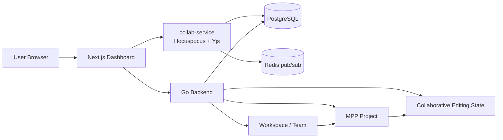
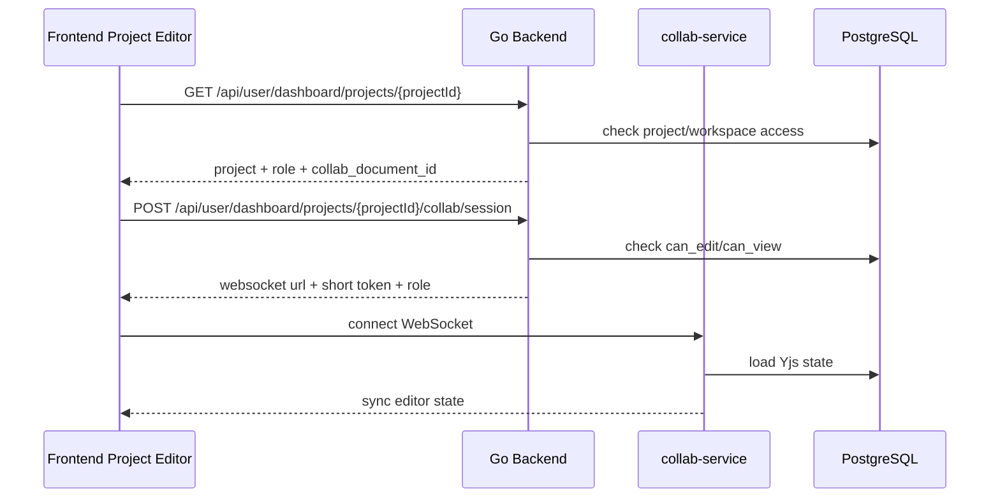

# MPP Workspace and Team Collaboration Architecture Plan

## 1. Product Direction

The merged collaborative editor work provides the real-time editing foundation,
but the current standalone "collaborative document" page is not the final
product model.

The product should move toward a WPS/Notion-like collaboration model:

1. Users can share an existing MPP Project with other users.
2. Users can create a Workspace, invite team members, and let members access the
   Projects that belong to that Workspace.

The standalone collaborative document experience should be treated as a
technical foundation and temporary entry point. Long term, collaboration belongs
inside the user's actual content workflow: Projects, prepublish drafts, platform
settings, publishing permissions, and team ownership.

## 2. Current Merged State

### 2.1 Completed Foundation

| Area | Status | Evidence |
| --- | --- | --- |
| Backend collaborative document model | Done | `backend/internal/models/collab.go` defines documents, collaborators, Yjs states, and update batches. |
| Backend collaborative document APIs | Done | Create/list/get/rename/session APIs exist under `backend/internal/handlers/collab_doc.go` and `backend/internal/services/collabdoc/service.go`. |
| Session token issuing | Done | Backend issues short-lived JWTs with user, document, role, purpose, expiry, and session limits. |
| Realtime collab service | Done | `collab-service` runs Hocuspocus/Yjs WebSocket sessions and validates collab tokens. |
| PostgreSQL Yjs persistence | Done | `collab-service/src/persistence/document-persistence.ts` loads snapshots, appends update batches, stores compacted state, and prunes compacted batches. |
| Frontend collab API client | Done | `frontend/src/lib/dashboard/api/collab.ts` wraps document and session APIs. |
| Frontend standalone collab editor | Done | `frontend/src/features/collab-editor/` supports list/create/open/rename, TipTap/Yjs editing, toolbar, status, presence/cursors, and read-only role handling. |
| Auth expiry handling | Done | Dashboard API client clears expired sessions and returns users to login instead of leaving stale JWT errors in-page. |
| Project collaboration editor wiring | Done | Project editor uses project-scoped collab sessions, role-aware editing, shared status styling, and Yjs snapshot synchronization. |
| Workspace API foundation | Done | Workspace create/list/detail/member/project APIs and workspace-aware project access are present in backend and frontend API clients. |
| Workspace dashboard flow | Done | Dashboard users can switch/create workspaces, scope project list/create flows, manage members, and review workspace activity. |
| Publishing permission boundary | Done | Publish entry points share a centralized owner-only project publish policy while editor/viewer collaboration roles remain non-publishers. |

### 2.2 Current Product Limitation

The standalone collaborative document UI still exists. It is technically
useful, but product-wise it is disconnected from MPP's main unit of work: a
Project.

Remaining gaps in the current model:

- `/dashboard/collab` remains a lab-style surface beside the Project editor.
- Project and Workspace access now exist, but the URL model is still using
  compatibility dashboard routes instead of first-class workspace routes.
- Workspace member management exists, but the next accountability gap is Project
  activity, comments, and version recovery.
- It does not fully answer "who changed what in this Project?" once multiple
  people can edit it.
- It has an owner-only publishing boundary, but not explicit publisher roles.
- It risks becoming a second content system beside Projects instead of a
  collaboration layer over Projects.

## 3. Target Collaboration Model

MPP should support two collaboration entry points.

### 3.1 Project Sharing

Project sharing is the smaller and more direct next step.

A user opens an existing Project and shares it with another user or team. The
recipient can access that Project according to a role.

Recommended roles:

| Role | Project Access | Publishing Access |
| --- | --- | --- |
| owner | Full control, can delete/share/manage settings. | Can publish and manage platform settings. |
| editor | Can edit source content and prepublish drafts. | Cannot publish unless explicitly granted. |
| commenter | Can comment/review later. | Cannot publish. |
| viewer | Read-only access. | Cannot publish. |

Initial MVP can implement only `owner`, `editor`, and `viewer`.

Project sharing should answer the WPS-like use case: "I have this document or
project; I want someone else to help me edit it."

### 3.2 Workspace and Team

Workspace is the stronger long-term model.

A Workspace owns Projects. Users are Workspace members. Members can access
workspace Projects through workspace-level roles and optional project-specific
overrides.

Workspace should answer the Notion-like use case: "This team works together in
one space, and all team Projects live there."

Recommended workspace roles:

| Role | Capability |
| --- | --- |
| owner | Manage workspace, billing later, members, roles, all projects. |
| admin | Manage members and projects, cannot transfer ownership. |
| member | Create/edit workspace projects depending on policy. |
| viewer | Read workspace projects unless a project override grants more. |

## 4. Revised Architecture

The existing collab-service remains valid. The change is in ownership and access
control.



Key shift:

- Before: `collab_documents.owner_user_id` is the main ownership boundary.
- Next: Project or Workspace access becomes the ownership boundary.
- The Yjs document becomes an implementation detail for collaborative editing,
  not the primary product object.

## 5. Data Model Direction

### 5.1 Keep Current Collab Tables

Keep these tables as the editing substrate:

- `collab_documents`
- `collab_document_collaborators`
- `collab_document_states`
- `collab_document_update_batches`

They already solve session, role, Yjs state, and persistence concerns.

### 5.2 Add Project Sharing

```sql
CREATE TABLE project_collaborators (
  project_id uuid NOT NULL REFERENCES projects(id) ON DELETE CASCADE,
  user_id uuid NOT NULL REFERENCES users(id) ON DELETE CASCADE,
  role text NOT NULL CHECK (role IN ('editor', 'viewer')),
  created_by uuid NOT NULL REFERENCES users(id),
  created_at timestamptz NOT NULL DEFAULT now(),
  PRIMARY KEY (project_id, user_id)
);

CREATE INDEX idx_project_collaborators_user
  ON project_collaborators(user_id, role);
```

Access rules:

- Project owner has implicit full access.
- `project_collaborators` grants project-specific access.
- Later, workspace membership can grant access before project-specific overrides.

### 5.3 Link Projects to Collaborative Editing State

```sql
ALTER TABLE projects
  ADD COLUMN collab_document_id uuid REFERENCES collab_documents(id);

CREATE UNIQUE INDEX ux_projects_collab_document
  ON projects(collab_document_id)
  WHERE collab_document_id IS NOT NULL;
```

Notes:

- A Project may lazily create a `collab_document` when collaboration is first
  enabled.
- The Project remains the product object; the collab document stores realtime
  editor state.
- Saving/compaction should synchronize the canonical source content back to the
  Project at safe boundaries.

### 5.4 Add Workspace and Team

```sql
CREATE TABLE workspaces (
  id uuid PRIMARY KEY,
  owner_user_id uuid NOT NULL REFERENCES users(id),
  name text NOT NULL,
  slug text,
  status text NOT NULL DEFAULT 'active',
  created_at timestamptz NOT NULL DEFAULT now(),
  updated_at timestamptz NOT NULL DEFAULT now(),
  deleted_at timestamptz
);

CREATE TABLE workspace_members (
  workspace_id uuid NOT NULL REFERENCES workspaces(id) ON DELETE CASCADE,
  user_id uuid NOT NULL REFERENCES users(id) ON DELETE CASCADE,
  role text NOT NULL CHECK (role IN ('owner', 'admin', 'member', 'viewer')),
  invited_by uuid REFERENCES users(id),
  joined_at timestamptz,
  created_at timestamptz NOT NULL DEFAULT now(),
  PRIMARY KEY (workspace_id, user_id)
);

CREATE TABLE workspace_activities (
  id uuid PRIMARY KEY,
  workspace_id uuid NOT NULL REFERENCES workspaces(id) ON DELETE CASCADE,
  actor_user_id uuid NOT NULL REFERENCES users(id) ON DELETE CASCADE,
  target_user_id uuid REFERENCES users(id) ON DELETE SET NULL,
  event_type text NOT NULL CHECK (
    event_type IN (
      'workspace_created',
      'workspace_updated',
      'member_added',
      'member_role_changed',
      'member_removed'
    )
  ),
  metadata jsonb NOT NULL DEFAULT '{}'::jsonb,
  created_at timestamptz NOT NULL DEFAULT now()
);

CREATE INDEX idx_workspace_activities_workspace_created_at
  ON workspace_activities(workspace_id, created_at DESC);

ALTER TABLE projects
  ADD COLUMN workspace_id uuid REFERENCES workspaces(id);

CREATE INDEX idx_projects_workspace_status_created
  ON projects(workspace_id, status, created_at DESC);
```

Migration strategy:

1. Create a personal workspace for each existing user.
2. Backfill existing Projects into the user's personal workspace.
3. Keep `projects.user_id` as creator/legacy owner until the migration is
   stable.
4. Gradually switch project listing and access checks to workspace-aware
   policies.

## 6. Access Policy

Access should be checked in this order:

1. Project owner or legacy `projects.user_id`.
2. Project collaborator override.
3. Workspace role on the Project's workspace.
4. Future public/share-link policy.

Editing and publishing should be separated.

```text
can_view_project
can_edit_project_content
can_edit_project_settings
can_manage_project_collaborators
can_publish_project
can_manage_workspace_members
```

This prevents a common collaboration mistake: giving someone text editing access
also accidentally gives them publishing authority.

## 7. API Direction

### 7.1 Project Sharing APIs

| API | Purpose |
| --- | --- |
| `GET /api/user/dashboard/projects/{id}/collaborators` | List project collaborators. |
| `POST /api/user/dashboard/projects/{id}/collaborators` | Invite or add a collaborator. |
| `PATCH /api/user/dashboard/projects/{id}/collaborators/{userId}` | Change collaborator role. |
| `DELETE /api/user/dashboard/projects/{id}/collaborators/{userId}` | Remove collaborator. |
| `POST /api/user/dashboard/projects/{id}/collab/session` | Issue collab session for the Project's editing state. |

### 7.2 Workspace APIs

| API | Purpose |
| --- | --- |
| `POST /api/workspaces` | Create a workspace. |
| `GET /api/workspaces` | List workspaces the user can access. |
| `GET /api/workspaces/{id}` | Read workspace metadata and role. |
| `PATCH /api/workspaces/{id}` | Update workspace metadata. |
| `GET /api/workspaces/{id}/members` | List workspace members. |
| `POST /api/workspaces/{id}/members` | Invite/add workspace member. |
| `PATCH /api/workspaces/{id}/members/{userId}` | Change member role. |
| `DELETE /api/workspaces/{id}/members/{userId}` | Remove member. |
| `GET /api/workspaces/{id}/activity` | List manager-only workspace audit events. |
| `GET /api/workspaces/{id}/projects` | List workspace projects. |
| `POST /api/workspaces/{id}/projects` | Create project inside workspace. |

### 7.3 Existing Collab APIs

Current standalone APIs remain useful internally:

| API | Keep? | Future Role |
| --- | --- | --- |
| `POST /api/collab/documents` | Yes | Internal/lab creation, or lazy Project collab state creation. |
| `GET /api/collab/documents` | Maybe | Useful for debugging/lab only. Not primary product navigation. |
| `GET /api/collab/documents/{id}` | Yes | Metadata lookup for editor/session. |
| `PATCH /api/collab/documents/{id}` | Yes | Internal title update or future doc metadata edit. |
| `POST /api/collab/documents/{id}/session` | Yes | Can be reused by Project session endpoint after access is resolved. |

## 8. Frontend Direction

### 8.1 Current UI

Current page:

```text
/dashboard/collab
```

It supports standalone collaborative documents. Keep it temporarily as an
engineering/lab page while the system is still being hardened.

### 8.2 Desired Project Sharing UI

Add sharing to existing Project screens:

```text
/dashboard/content/{projectId}
  Share button
  Collaborators dialog
  Role selector
  Realtime editor status
```

Project editor behavior:

- Owner can share the Project.
- Editors can edit source content collaboratively.
- Viewers can open read-only mode.
- Publishing controls stay visible only to roles with publish permission.
- Prepublish drafts should be workspace/project scoped, not personal-only.

### 8.3 Desired Workspace UI

Add workspace navigation:

```text
Workspace switcher
  Personal
  Team A
  Team B

/dashboard/workspaces/{workspaceId}
/dashboard/workspaces/{workspaceId}/projects
/dashboard/workspaces/{workspaceId}/settings/members
```

The dashboard should eventually be workspace-scoped:

```text
/dashboard/{workspaceSlug}/content
/dashboard/{workspaceSlug}/content/{projectId}
/dashboard/{workspaceSlug}/auth
/dashboard/{workspaceSlug}/settings/members
```

Use a compatibility redirect while migrating existing routes.

## 9. Realtime Editing Integration

The current collab editor uses a standalone `collab_document_id`. For Project
sharing, the flow should become:



Save semantics:

- Yjs is the realtime state of the editor.
- Project source content must be synchronized from Yjs snapshots at controlled
  boundaries.
- Prepublish sync should read from the latest safe Project content snapshot.
- The UI must explain whether content is synced, saving, or offline.

## 10. Security Boundaries

Mandatory:

- Never trust frontend role state; backend must resolve roles for every API.
- Collab session tokens must be short-lived and scoped to one document/project.
- `viewer` roles must be rejected from sending update payloads.
- Project editing permission must not imply publishing permission.
- Workspace membership changes must be audited.
- Logs must not print content, Yjs update binaries, or tokens.

Delayed:

- Public share links.
- Domain allowlists.
- SSO workspace membership.
- Billing/seat limits.
- External guest expiration.

## 11. Implementation Roadmap

### Phase 0: Realtime Collaboration Foundation - Done

Delivered:

- Backend collab document metadata APIs.
- Short-lived collab session tokens.
- Hocuspocus/Yjs collab-service.
- PostgreSQL Yjs snapshot and update-batch persistence.
- Frontend standalone collaborative editor.
- Presence/cursor UI and status toolbar.
- Frontend tests for API and provider helpers.

Remaining hardening:

- [x] Confirm database migration strategy for collab tables.
- [ ] Add operational metrics dashboards and alerts.
- [ ] Validate multi-user editing under realistic load.

### Phase 1: Project Sharing MVP - Done

Deliverables:

- [x] `project_collaborators` model.
- [x] Project collaborator list/add/update/remove APIs.
- [x] Project detail/list APIs include current user's role.
- [x] Existing Project editor accepts collaborator access.
- [x] Project-level collab session endpoint.
- [x] Share dialog in Project editor.

Acceptance:

- [x] Owner shares a Project with another user.
- [x] Editor opens the same Project and edits content collaboratively from the
  Project editor.
- [x] Viewer opens the Project in read-only mode.
- [x] Non-collaborator cannot access the Project.
- [x] Publishing controls are hidden/disabled for roles without publish
  permission.

### Phase 2: Project-Collab State Integration - Done

Deliverables:

- [x] `projects.collab_document_id`.
- [x] Lazy creation of Project collab document.
- [x] Migration path from existing `source_content` to Yjs state.
- [x] Controlled snapshot sync from Yjs back to Project source content.
- [x] Prepublish sync reads from latest safe Project content.

Acceptance:

- [x] Existing Projects can enter realtime editing from the Project editor
  without creating a separate doc.
- [x] Refresh/restart preserves Project editor realtime state.
- [x] Prepublish generation uses collaborative content, not stale owner-local
  state.

### Phase 3: Workspace and Team MVP - Done

Deliverables:

- [x] `workspaces` and `workspace_members`.
- [x] Personal workspace backfill for existing users.
- [x] Workspace switcher.
- [x] Workspace-scoped Project list and create APIs.
- [x] Workspace-scoped Project list and create UI flow.
- [x] Member management screen.
- [x] Workspace activity/audit feed for management events.
- [x] Workspace-aware access checks in Project APIs.

Acceptance:

- [x] A user creates a workspace and invites a member through the dashboard UI.
- [x] Workspace members can access Projects in that workspace by role.
- [x] Workspace managers can inspect recent member and workspace management
  changes.
- [x] Project owner/collaborator overrides still work.
- [x] Existing personal Projects remain accessible after migration.

### Phase 4: Collaboration Experience - Done

Deliverables:

- [x] Comments/review mode.
- [x] Project activity feed for content, publishing, and collaborator changes.
- [x] Version history from collab snapshots/update batches.
- [x] Better conflict/offline messaging.
- [x] Optional share links.

Acceptance:

- [x] Teams can review, edit, and publish Projects with clear accountability.
- [x] Users can inspect recent changes and recover prior content.

### Phase 5: Distributed Readiness - Done

Deliverables:

- [x] Redis pub/sub between active collab-service documents.
- [x] Traefik `/collab` WebSocket routing validation script.
- [x] Multi-instance collab-service synchronization test.
- [x] Prometheus scrape config and Grafana dashboard panels.
- [x] Load test scripts for two collab-service endpoints.

Acceptance:

- [x] Two collab-service instances can synchronize active documents.
- [x] Metrics show connection count, active documents, update flush latency, and auth
  denials.
- [x] No data loss under restart tests.

## 12. Completion Tracking

| Area | Status | Next Action |
| --- | --- | --- |
| Standalone collaborative editor | Done | Keep as temporary/lab surface. |
| Backend collab document APIs | Done | Reuse for Project collab session flow. |
| Collab service token auth | Done | Keep short-lived project-scoped tokens. |
| Yjs PostgreSQL persistence | Done | Add ops dashboards and realistic multi-user load validation. |
| Presence/cursor UI | Done | Reuse inside Project editor. |
| Project sharing | Done | Harden edge cases and keep standalone collab as lab-only surface. |
| Project-collab linking | Done | Monitor snapshot sync reliability under multi-user editing. |
| Workspace/team model | Done | Harden edge cases and move toward first-class workspace URLs. |
| Workspace-scoped project access | Done | Continue hardening route/query policy coverage. |
| Publishing permission split | Partial | Extend the centralized owner-only policy when explicit publisher roles are introduced. |
| Comments/activity/version UX | Done | Project comments, activity, version recovery, offline messaging, and optional share-link management are available in the Project editor. |
| Distributed collab-service | Done | Redis pub/sub, routing validation, metrics dashboard, load scripts, and restart-safe flush coverage are in place. |

## 13. Open Decisions

1. Should Project collaborators support external guests before workspace members
   exist?
2. Should publishing permission be a separate boolean/capability or a role such
   as `publisher`?
3. Should standalone `/dashboard/collab` remain visible after Project sharing
   lands, or become an internal/debug route?

## 14. Recommended Next Slice

Harden distributed collaboration under production-like load.

Reason:

- Project-level accountability, review comments, version recovery, share-link
  management, and clearer offline messaging are now in the Project editor.
- Redis pub/sub, routing validation, and observability now cover the first
  scale-out readiness slice.
- The next risk is higher-volume production behavior: longer sessions, noisy
  reconnects, restart windows, and database pressure.

Next useful slice:

1. Run the distributed load script against a real two-instance deployment and
   record baseline connection, active document, flush latency, and auth denial
   ranges.
2. Add alert thresholds for sustained auth denials, stalled flush latency, and
   zero active document metrics during expected traffic.
3. Exercise rolling restart windows under sustained edit load and capture any
   database lock or reconnect pressure.
4. Decide whether awareness state needs Redis fan-out in addition to durable
   Yjs update synchronization.

## 15. References

- [Yjs Document Updates](https://docs.yjs.dev/api/document-updates)
- [Yjs Awareness](https://docs.yjs.dev/getting-started/adding-awareness)
- [Hocuspocus Documentation](https://tiptap.dev/docs/hocuspocus/introduction)
- [TipTap Collaboration Extension](https://tiptap.dev/docs/editor/extensions/functionality/collaboration)
- [Redis Pub/Sub](https://redis.io/docs/latest/develop/pubsub/)
